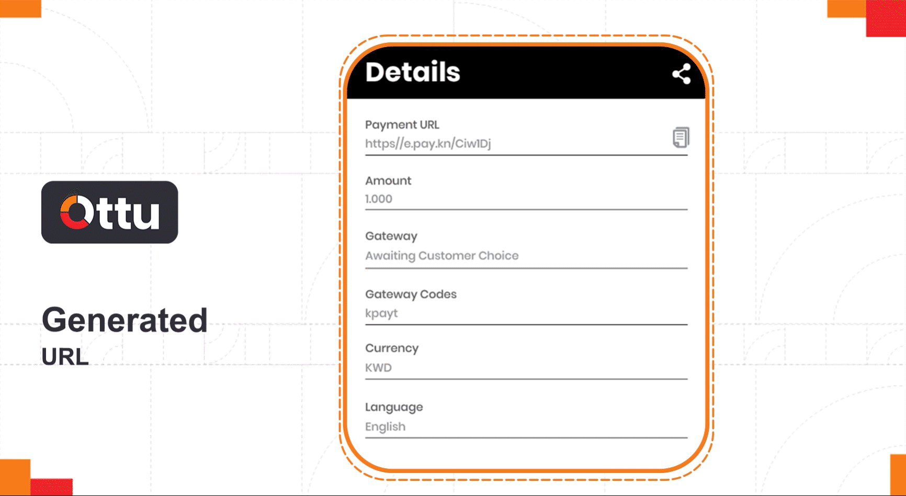

# Getting Started

Welcome to Ottu, the ultimate online payment management system (OPMS) that focuses on ensuring secure financial transactions. Let us help you grow and thrive in today's digital economy.

We understand that electronic payment is a necessity for people, and we continuously strive to provide the latest and most recent technology that meets the evolving needs of our users, including merchants, developers, IT professionals, and technicians. We also understand that in today's world, financial security is a top concern, so we are here to provide a reliable solution and help you navigate this landscape easily. Our goal is to help our clients and enable merchants to protect and enhance their businesses and achieve sustainable growth and expansion by providing them with customized tools tailored to meet their specific needs. At Ottu, clients can pay with their preferred currency and payment method. We prioritize client satisfaction, and we are always evolving to ensure that we are adapted to meet the demands of every client across multiple platforms, environments, and industries. We integrate with our users' businesses, infrastructure, and other systems without the need for restructuring or reinstalling, ensuring a seamless transition to our platform.\
\
With Ottu, you are choosing an innovative online payment technology that puts your needs first and helps you take control of your business. You can have peace of mind knowing that your financial transactions are secure and seamless, built with fintech expertise, making us a leading player in the fintech industry.

## [Ottu Architecture](./#ottu-architecture)

<figure><figcaption></figcaption></figure>

## [Quick start](./#quick-start)

Our commitment to simplicity means you can start with Ottu quickly and efficiently without any unnecessary hurdles or complications. Making your first online payment through Ottu is a breeze, **taking only three simple steps.**

* Firstly, subscribe to Ottu and sign the agreement.
* Then, you can easily choose a bank payment gateway (PG).
* Lastly, you can connect your online business and bank account smoothly with the Ottu system.

Our user-friendly interface ensures a smooth and seamless experience, making online payments faster and more convenient. With Ottu, you can take your business to new heights easily and efficiently.

### [Ottu Subscription](./#ottu-subscription)

At Ottu, we believe that keeping the subscription process simple is crucial. We aim to make the process of starting an Ottu agreement as straightforward as possible. All that is required is the following:

* Ottu agreement paperwork.
* Confirmation of the associated name of the online business domain: `www.<ottu-url>.com.`
* You will also have the option to select your e-payment subdomain name, such as `online.com` or `pay.com`.
* Lastly, we will ask for essential information about your current business platform to ensure seamless integration with Ottu's payment services.

### [Bank Payment Gateway Subscription](./#bank-payment-gateway-subscription)

We understand that choosing the appropriate payment method or gateway (PG) can be a challenging task. That is why we offer our clients expert advice and free consultations to help them make informed decisions. The Ottu team is always there to provide expert guidance, helping clients choose the most suitable payment methods and services based on their business needs and the platforms they operate on. Our clients have only to do the following:

* Subscribe to the payment gateway.
* Choose the best payment method for your business needs and running platform(s).
* And it is time to share your payment gateway. At this stage, you can rest assured that we follow stringent security protocols and standards to protect your information and confidentiality.


This process is done in total security to keep our clients’ confidentiality and meet their expectations with awareness to the secretness of the information.


## [Creating Payment Request](./#creating-payment-request)

In today's fast-paced digital world, efficiency and simplicity in payment processing are more crucial than ever.&#x20;

Ottu empowers merchants with the ability to swiftly generate payment request links directly from the Ottu dashboard. This streamlined process not only facilitates a smoother transaction experience but also ensures that you, as a merchant, can efficiently manage and track payment requests with ease.

The merchant just needs to navigate to the **Payment Request** section within Ottu dashboard and select the **Create** option to unveils a comprehensive form. This form serves as the cornerstone of your payment request creation, requiring specific details to tailor the request to your needs and those of your customers. The [subsequent section](./#payment-request-form-fields) will delve deeper into each component of the form, offering step-by-step guidance to ensure you are well-equipped to utilize this powerful feature effectively.&#x20;

By following this process, you can enhance customer satisfaction through a seamless payment experience, thereby reinforcing the reliability and professionalism of your services. Stay tuned for detailed insights that will navigate you through each step of creating a payment request, setting the stage for a successful transaction journey.

### [Payment Request Form Fields](./#payment-request-form-fields)

#### Fill in the form, the following fields are required.

<table data-header-hidden><thead><tr><th></th><th></th><th data-hidden></th></tr></thead><tbody><tr><td><mark style="color:blue;"><strong>Field</strong></mark></td><td><mark style="color:blue;"><strong>Input</strong></mark></td><td></td></tr><tr><td>Amount:</td><td>10 KWD</td><td></td></tr><tr><td>Currency:</td><td>Kuwaiti Dinar (KWD)</td><td></td></tr><tr><td>Gateway:</td><td>KNET (purchase)</td><td></td></tr><tr><td>Language:</td><td>English</td><td></td></tr><tr><td>Email:</td><td>developer@&#x3C;ottu-url>.com</td><td></td></tr><tr><td>First name:</td><td>first name</td><td></td></tr><tr><td>Last name:</td><td>family name</td><td></td></tr></tbody></table>

After completing the required fields as demonstrated in the table above, the merchant can proceed by submitting the form. Following submission, a payment URL will be generated, as illustrated in the figure below.

The generated URL can be shared with the customer, enabling him to proceed to the checkout page and complete the payment.

<figure><figcaption></figcaption></figure>

Once the customer clicks on the **Pay Now** button, he will be redirected to the bank's page, where he can enter his card details and submit his payment.

Congratulations! Your first transaction using Ottu has been completed successfully! It's that easy!

<figure><figcaption></figcaption></figure>

## [Some Typical Characteristics of Ottu](./#some-typical-characteristics-of-ottu)

## [Third party Integration](./#third-party-integration)

Ottu is designed to revolutionize your online payment experience. We acknowledge the growing need for direct connecting and full integration with e-commerce platforms. Our cutting-edge system seamlessly integrates with all leading e-commerce platforms, offering a hassle-free and direct payment gateway that ensures a smooth transaction process. Whether you are running a small business or a large corporation, say goodbye to complex payment processes and embrace the simplicity of Ottu.

### [Plug-in Integration](./#plug-in-integration)

Ottu understands the importance of flexibility and convenience for merchants, so we provide an extensive range of integration options. With our online payment management system (OPMS), merchants can seamlessly connect with their preferred e-commerce platforms, plugins, and guidelines. Ottu supports a variety of plugins, including but not limited to Shopify, WooCommerce, PrestaShop, OpenCart, Magento, and nopCommerce. Join the countless satisfied businesses that trust Ottu for their payment management needs and experience the simplicity of a well-integrated e-commerce suite.

### [Ecommerce](./#ecommerce)

With the Ottu portal, you can enhance your business by offering an e-commerce plugin that allows merchants to accept payments alongside their products. This ideal integration empowers merchants to simplify their payment processes, thereby increasing efficiency and customer satisfaction. Whether you are just starting or looking to grow, Ottu provides the tools and solutions you need to succeed and take your business to the next level.

#### Key Features of Ottu E-Commerce:

* Ottu enables you to easily trace all your e-commerce transactions, so you can stay on top of your financials and make informed decisions.
* With seamless integration into multiple popular e-commerce platforms, Ottu ensures that your payment process is both simple and efficient.
* The small e-commerce suite embodied in Ottu's dashboard allows merchants to take timely action on their online business with ease.
* With white labeling, merchants can easily add branding to customer checkout pages or redirection links, thereby enhancing their brand visibility and customer loyalty.
* Standard-compliant and secure transfers directly to the merchant's bank account without any third-party involvement.
* The Ottu operation team provides 24/7 support to merchants, offering installation guides and plugins for targeted e-commerce platforms.


Ottu's peerless features make it an exceptional five-star platform for merchants.

