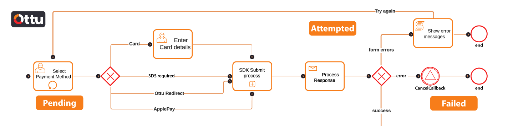

# Checkout SDK

## [Overview](./#overview)

If you are planning to use the Checkout SDK for your application, it is important to note that you will need to first implement the [Checkout API](../checkout-api.md) on your backend server. This is because the  Checkout SDK requires a [session ID](../checkout-api.md#session\_id-string-read-only) in order to function, and the [session ID](../checkout-api.md#session\_id-string-read-only) is obtained through the [Checkout API](../checkout-api.md).

The [Checkout API](../checkout-api.md) is responsible for generating a [session ID](../checkout-api.md#session\_id-string-read-only), which is a unique identifier that is used to initiate the  Checkout SDK. This [session ID](../checkout-api.md#session\_id-string-read-only) is required to be passed to the Checkout SDK in order for it to work properly.

It is important to keep in mind that the Checkout SDK cannot work without a backend implementation, as it relies on the [Checkout API](../checkout-api.md) to generate the necessary [session ID](../checkout-api.md#session\_id-string-read-only). Therefore, it is recommended that you first implement the [Checkout API](../checkout-api.md) on your backend server before integrating the  Checkout SDK into your application.

By following this process, you can ensure that your application is able to properly leverage the features and functionality provided by the Checkout SDK, while also maintaining a secure and reliable payment processing system for your users.


[web.md](web.md)



[ios.md](ios.md)



[android.md](android.md)



[flutter.md](flutter.md)


## [Ottu-Checkout definition](./#ottu-checkout-definition)

Ottu-checkout is a seamless, confidential and flexible payment checkout. Allows the merchant(s) to proceed the payment either single or bulk payment by a few steps. Ottu-checkout gives the merchant(s) the possibility to utilize many multiple payment gateways, simply generate the payment link and share it by different ways such as Email, WhatsApp, and SMS.

## [Ottu-Checkout SDK flow](./#ottu-checkout-sdk-flow)

### [Merchant backend](./#merchant-backend)

.png>)

In the event the due amount is determined, the merchant should be notified to initiate the payment transaction. The merchant server calls the [Checkout API](../checkout-api.md), then it goes to process the response. The API needs to be updated each time the amount changes. In case there is a validation error while updating the API, the current session will be ended and a new payment transaction should be created once again.

* If the [Checkout API](../checkout-api.md) returns success, it will render the page after providing the [session ID](../checkout-api.md#session\_id-string-read-only).
* If the [Checkout API](../checkout-api.md)returns error, the admin should be notified, then redirect to an error page and end the session.&#x20;

.png>)

### [Merchant frontend](./#merchant-frontend)

After rendering the page, SDK will be fetched and embed from CDN (content delivery network). Then initiating the checkout SDK, and the SDK will render all the available payment methods.&#x20;

 (1) (2).png>)

.png>)

The customer has the option of choosing from different payment methods.

1. Card: Customer enters the card details directly.
2. Saved card: tokenization.
3. Ottu redirect: Will guide to the required payment gateway page.
4. Apple Pay: A type of payment service, Apple Pay is only available for iOS devices.

e.g., After selecting the payment method, the response will be proceeded to one of the three below flow. <mark style="color:red;">**Form error:**</mark> for example when customer enter invalid card expiry dates, error message will be appeared, then the customer can try again. (this is only for multiple trial payment). <mark style="color:red;">**Error:**</mark> The cancel callback will be executed when the payment has an error. e.g., the session has expired. <mark style="color:green;">**Success**</mark>.&#x20;

.png>)

Depending on the customer's selected payment method, there are different cases after success flow.&#x20;

**1- Redirect:** where the payment URL is generated.&#x20;

.png>)

&#x20;**2-3DS required:** when the customer decides either the tokenization or card payment method. The 3DS page will be displayed > customer fills the required information Then proceed to either success call back or cancel call back.&#x20;

&#x20;**3-Payment success:** Just success call back and then end.&#x20;

 (1).png>)

.png>)
