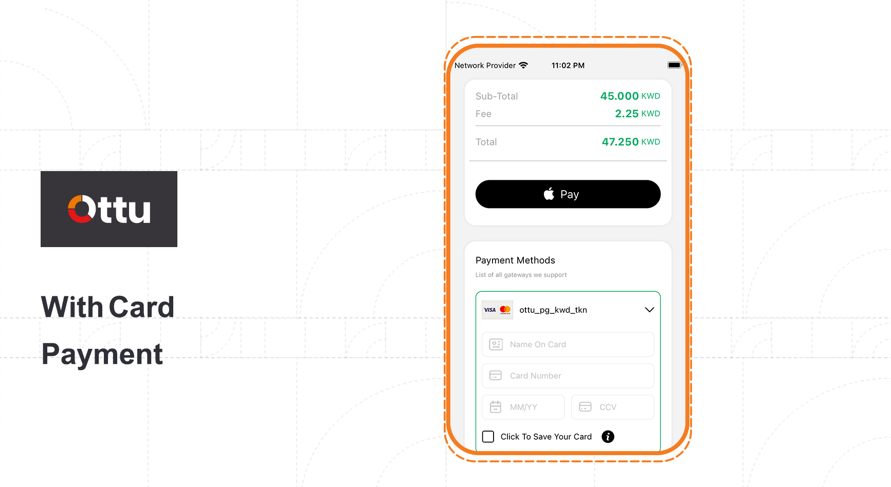

# Flutter

## [Getting Started](flutter.md#getting-started)

Let your Flutter app has an amazing and seamless payment experience by using Ottu SDK which is Flutter.\
Ottu offers, various and customizable UI screen in addition to elements which can be used out of the box to get your user’s payment information.\
Ottu supports your user interface by low level APIs, empowering you to build a custom experience.


For optimal security, call REST APIs from server-side implementations, not client-side applications such as mobile apps or web browsers.


## [Features](flutter.md#features)

**Simplified security:** Collecting sensitive data such like credit card numbers and complying with PCI  make collecting process  simplified secured. \
Instead of passing through your server, Ottu receives the sensitive data directly.

**Apple Pay:** Integrate seamlessly with Apple Pay.

**Native UI:** Native UI and elements to collect payment details.

<figure><figcaption></figcaption></figure>

<figure><figcaption></figcaption></figure>

**Localized:** both English and Arabic localizations are supported.

#### [Recommended usage](flutter.md#recommended-usage)

Apple's in-app purchase APIs should be utilized for selling digital  product or services which are used within your app such like (game hints & level promotions, upgrading subscription plans, unlock enhancement features).&#x20;


Ottu SDK could be used for other purposes.


#### [Privacy](flutter.md#privacy)

Collecting data by Ottu SDK is just for enhancement of our services and product, this data is never being sold, rented or used for advertising. \
Of course, data confidentially is **highly appreciated**.

## [**Requirements**](flutter.md#requirements)

The Ottu requires Flutter >=2.0 or above is compatible with android and iOS.

## [**Getting started**](flutter.md#getting-started)

You have to get a session token by using Ottu public API to initiate the required SDK. See [Rest API](../rest-api/)


For "api\_Key" API [Public key](../rest-api/authentication.md#public-key) sohuld be used.


### [**Installation**](flutter.md#installation)

Ottu  is available through [pub.dev](https://pub.dev/).\
To install, add the following line to your pupspec.yaml:

```swift
ottu: <latest version>
```

In your dart file, just import Ottu package and initialize Ottu SDK.

```swift
import 'package:ottu/ottu.dart';

//extend PaymentDelegate class
class _HomeScreenState extends State<HomeScreen> implements PaymentDelegate {
 // create instance of ottu
  Ottu ottu = Ottu();

 void makePayment() async {
    try {
    //add context,session_id,API_KEY,MERCHANT_ID,paymentDelegate's object and language(ENTER_LANGUAGE_ID_en_or_ar)
      await ottu.open(context, "session_id","API_KEY",'MERCHANT_ID', this, lang: "language");
    } catch (e) {
    //catch errors
    }
  }

  @override
  Widget build(BuildContext context) {
    return Scaffold(
      body: Center(
            child: ElevatedButton(
                child: const Text('Open SDK'),
                onPressed: () {
                    makePayment();
                },
            ),
        ),
    );
  }

//callback functions
  @override
  void cancelCallback(PaymentStatus paymentStatus) {
    //handle payment fail.
  }
  @override
  void successCallback(PaymentStatus paymentStatus) {
   //handle payment success.
  }
  @override
  void beforeRedirect(PaymentStatus paymentStatus) {
    //handle payment before redirect.
  }
  @override
  void errorCallback(PaymentStatus paymentStatus) {
  //handle error.
  }
}
 

```

## [Integrate Apple Pay](flutter.md#integrate-apple-pay)

To integrate Apple Pay, you need to enable Apple Pay in capabilities in your project.
