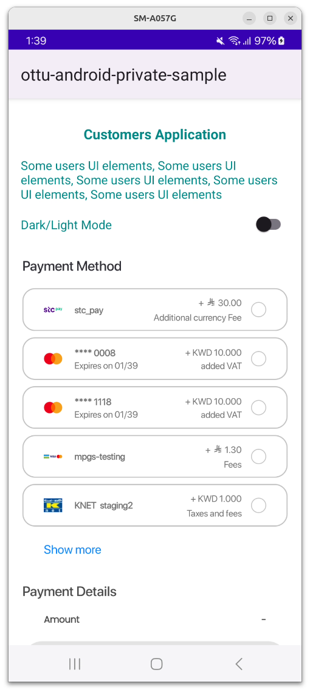

# Functions

## [**SDK Initialization**](functions.md#sdk-initialization)

The Checkout SDK is initialized using the `CheckoutArguments` class, which includes the [properties](functions.md#properties) listed below.

To initialize the SDK, an instance of `CheckoutArguments` must be passed as an argument to the `OttuCheckoutWidget` object.

For a detailed implementation example, refer to the [Example](functions.md#example) section.

## [**Properties**](functions.md#properties)

#### [**merchantId**](functions.md#merchantid-string-required) _<mark style="color:blue;">`string`</mark>_ _<mark style="color:red;">**`required`**</mark>_

It is used to define the Ottu merchant domain and must be set to the root domain of the Ottu account, excluding the `https://` or `http://` prefix.

For example, if the Ottu URL is `https://example.ottu.com`, the corresponding merchant\_id is `example.ottu.com`.

This property is required to ensure that the checkout process is correctly linked to the associated Ottu merchant account.

#### [**apiKey**](functions.md#apikey-string-required) _<mark style="color:blue;">`string`</mark>_ _<mark style="color:red;">**`required`**</mark>_

It is the Ottu [API public key](../../authentication.md#public-key), used for authentication when communicating with **Ottu's servers** during the checkout process.


Ensure that only the **public key** is used. The [private key](../../authentication.md#private-key-api-key) must remain confidential and must never be shared with any clients.


#### [**sessionId**](functions.md#sessionid-string-required) _<mark style="color:blue;">`string`</mark>_ _<mark style="color:red;">**`required`**</mark>_

It is a unique identifier for the payment transaction associated with the checkout process.

This identifier is automatically generated when a payment transaction is created. For further details on how to use the `session_id` parameter in the [Checkout API](../../checkout-api.md), refer to the [session\_id](../../checkout-api.md#session_id-string-mandatory) documentation.

#### [**formsOfPayment**](functions.md#formsofpayment-array-optional) _<mark style="color:blue;">`array`</mark>_ _<mark style="color:blue;">**`optional`**</mark>_

The `formsOfPayment` parameter is used to customize the forms of payment displayed in the [checkout process](../#ottu-checkout-sdk-flow). By default, all forms of payment are enabled.

**Available options for formsOfPayment:**

* `applePay`: The Apple Pay payment method is supported, allowing purchases to be made using Apple Pay-enabled devices.
* `cardOnsite`: A direct (onsite) payment method, where customers are required to enter their card details directly within the SDK.
* `tokenPay`: A method utilizing [tokenization](../../tokenization.md), ensuring that customer payment information is securely stored and processed.
* `redirect`: A payment method where customers are redirected to an external payment gateway or a third-party processor to complete the transaction.
* `stcPay`: A method where customers enter their mobile number and authenticate using an OTP sent to their mobile device.


If `formsOfPayment` are passed manually in an array, wrap each item in quotes—for example, `"stcPay"`.


#### [**setupPreload**](functions.md#setuppreload-object-optional) _<mark style="color:blue;">`object`</mark>_ _<mark style="color:blue;">**`optional`**</mark>_

An `ApiTransactionDetails` class object is used to store transaction details. If provided, transaction details will not be requested from the backend, thereby reducing processing time.

#### [**theme**](functions.md#theme-object-optional) _<mark style="color:blue;">`object`</mark>_ _<mark style="color:blue;">**`optional`**</mark>_

A Theme class object is used for UI customization. All fields are optional and may include values for background colors, text colors, and fonts for various UI components.

For more details, refer to [Android Customization Theme](../android/#customization-theme).

#### [**displaySettings**](functions.md#displaysettings-object-optional) _<mark style="color:blue;">`object`</mark>_ _<mark style="color:blue;">**`optional`**</mark>_

The `displaySettings` object accepts a `PaymentOptionsDisplaySettings` configuration, which defines how payment options are presented to the user during checkout. For more details, refer to the   [Payment Options Display Mode](functions.md#payment-options-display-mode) section.

#### [**successCallback, errorCallback, and successCallback**](functions.md#successcallback-errorcallback-and-successcallback-unit-required) _<mark style="color:blue;">`unit`</mark>_ _<mark style="color:red;">**`required`**</mark>_

Callback functions are used to retrieve the payment status. These must be provided directly to the Checkout initialization function. For more information, please check [here](functions.md#callbacks).

## [Payment Options Display Mode](functions.md#payment-options-display-mode) <a href="#payment-options-display-mode" id="payment-options-display-mode"></a>

The SDK provides flexible customization for how payment options are displayed. It supports the following optional parameters:

* **`mode`**: Determines the layout style—either `BottomSheet` (default) or `List`.
  * **BottomSheet**: This is the default layout used in previous SDK versions.
  * **List**: A new layout that shows payment options in a vertical list placed above the **Payment Details** section and the **Pay** button.
* **`visibleItemsCount`**: Sets how many payment options are shown at once (default is `5`). Applicable only in `List` mode.
  * This unsigned integer controls how many payment options are visible simultaneously in **List** mode.
  * If the number of available options is less than `visibleItemsCount`, the list automatically resizes to fit the actual number of options.


Passing `0` will cause the SDK to throw an exception. This exception must be caught and handled by the parent application.


* **`defaultSelectedPgCode`**: Specifies a payment gateway [(PG) code](../../checkout-api.md#pg_codes-array-required) to be pre-selected by default.
  * This field accepts a PG code to auto-select a specific payment option.
  * If the SDK finds a payment method matching the provided PG code, it will be selected by default.
  * If no match is found, no option is selected.

All of these parameters are optional and are demonstrated in the following figures.

#### Android <a href="#android.3" id="android.3"></a>

The `List` The List mode is displayed as illustrated in the figure below

<figure><figcaption></figcaption></figure>

A view with a selected payment option

<figure><figcaption></figcaption></figure>

A view with an expanded listExpanded list view

<figure><figcaption></figcaption></figure>

Here is a code sample:


```swift
val paymentOptionsDisplayMode =
  if (showPaymentOptionsList) Checkout.PaymentOptionsDisplaySettings.PaymentOptionsDisplayMode.List(
    visiblePaymentItemsCount = paymentOptionsListCount
  ) else Checkout.PaymentOptionsDisplaySettings.PaymentOptionsDisplayMode.BottomSheet
val paymentOptionsDisplaySettings = Checkout.PaymentOptionsDisplaySettings(
  mode = paymentOptionsDisplayMode,
  defaultSelectedPgCode = defaultSelectedPgCode
)
```


and passed to `Checkout.init` builder class via the following object:

```swift
.paymentOptionsDisplaySettings(paymentOptionsDisplaySettings)
```

#### iOS <a href="#ios.2" id="ios.2"></a>

The `List` mode looks like the following

<figure><figcaption></figcaption></figure>

Selected item view

<figure><figcaption></figcaption></figure>

Expanded list view

<figure><figcaption></figcaption></figure>

Here is a code sample:


```swift
let paymentOptionsDisplaySettings: PaymentOptionsDisplaySettings =
  if arguments.showPaymentOptionsList {
    PaymentOptionsDisplaySettings(
      mode: .list,
      visibleItemsCount: UInt(arguments.paymentOptionsListCount),
      defaultSelectedPgCode: arguments.defaultSelectedPgCode
    )
  } else {
    PaymentOptionsDisplaySettings(
      mode: .bottomSheet,
      defaultSelectedPgCode: arguments.defaultSelectedPgCode
    )
  }
```


and passed to `Checkout.init` via the following object:

```swift
displaySettings:paymentOptionsDisplaySettings
```

To see the full function call, please refer the code snippet in the [Ottu SDK - Flutter | Example](functions.md#example) section.
