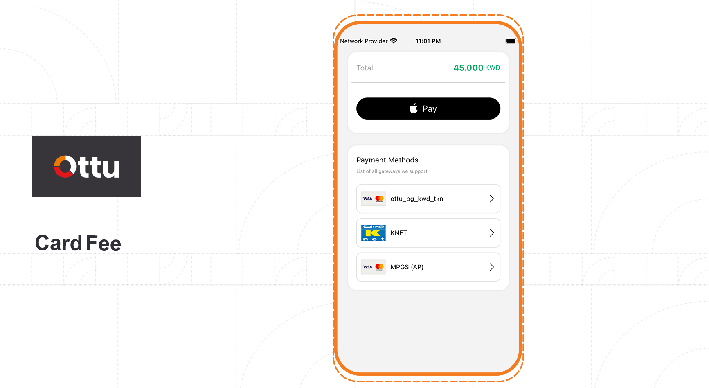

# iOS

## [**Ottu Checkout**](ios.md#ottu-checkout)

It's easy and quick to build a great payment experience using Ottu Checkouts which is iOS SDK. In order to collect your user's payment information, we provide powerful and customizable UI screens.


For optimal security, call REST APIs from server-side implementations, not client-side applications such as mobile apps or web browsers.


## [Features](ios.md#features)

**Simplified security:** Keeping PCI compliance is as easy as collecting credit card numbers with our simplified security. Instead of passing through your server, Ottu receives the sensitive data directly.

**Apple Pay:** Integrate seamlessly with Apple Pay.

**Native UI:** Native UI to collect payment details.

<figure><figcaption></figcaption></figure>

<figure><figcaption></figcaption></figure>

**Localized**: Both English & Arabic localizations are supported.


\


#### [Recommended usage](ios.md#recommended-usage)

Apple's in-app purchase APIs should be utilized for selling digital  product or services which are used within your app such like (game hints & level promotions, upgrading subscription plans, unlock enhancement features).&#x20;


Ottu SDK could be used for other purposes.


#### [Privacy](ios.md#privacy)

Collecting data by Ottu SDK is just for enhancement of our services and product, this data is never being sold, rented or used for advertising. \
Of course, data confidentially is **highly appreciated**.

### [**Requirements**](ios.md#requirements)

Xcode 13.0 or later is required, which is compatible with apps targeting iOS 12 or above.

## [**Getting started**](ios.md#getting-started)

Initially, a session token should be created by Ottu public API, then SDK could be initialized. See [Rest API](../rest-api/)


For "apiKey" API [Public key](../rest-api/authentication.md#public-key) sohuld be used.


## [**Installation**](ios.md#installation)

### [**Installation with CocoaPods**](ios.md#installation-with-cocoapods)

Ottu is available through [CocoaPods](http://cocoapods.org). \
To install it, simply add the following line to your Podfile:

```swift
pod 'Ottu'
```

### [**Installation with Swift Package Manager**](ios.md#installation-with-swift-package-manager)

The Swift Package Manager is used for automating the distribution of Swift code, and it is integrated into the `swift` compiler.[ https://swift.org/package-manager/](https://swift.org/package-manager/) When Swift package set up, It is easy to add Alamofire as a dependency, just like adding it to the `dependencies` value of your `Package.swift`.

```swift
dependencies: [
    .package(url: "https://github.com/ottuco/ottu-ios-sdk.git")
]
```

### [Manually](ios.md#manually)

By downloading the project and keeping the source folder in your project, you can integrate Ottu into your project manually if you prefer not to use any of the above dependency managers.

_**Swift 5.1, 5.0, 4.2, 4.0**_

In ViewController.swift, import Ottu framework and initialize Ottu SDK.

```swift
import Ottu

class ViewController: UIViewController,OttuDelegate {

    var responseDict : [String:Any]?
    var message = ""
    
    override func viewDidLoad() {
        super.viewDidLoad()
        //Intiate the SDK accordingly after getting session id from the public API documentation.
        //session_id - It is generated when payment was created. See API documentation
        //merchant_id - Merchant domain. See API documentation.
        //apiKey - API Public key should be used. See API documentation.
        //lang - You can use it to change the language. We support two languages english and arabic. You can use "en" for english and "ar" for arabic.        
        let session_id = "ENTER_YOUR_SESSION_ID"
        _ = Ottu.init(session_id, merchant_id: "MERCHANT_ID", apiKey: "API_KEY" ,lang: "ENTER_LANGUAGE_ID_en_or_ar", viewController: self, delegate: self)
    }
    
    //The error callback is invoked when problems occur during a payment.
    //Reason will be defined in the response attribute. 
    func errorCallback(message: String, response: [String : Any]?) {
        responseDict = response
        self.message = "Error"
        self.dismissed()

    }
    
    //Called when a customer cancels the payment.
    func cancelCallback(message: String, response: [String : Any]?) {
        responseDict = response
        self.message = "Cancel"
        self.dismissed()
    }
    
    //Called when the payment completed successfully.
    func successCallback(message: String, response: [String : Any]?) {
        responseDict = response
        self.message = "Success"
        self.dismissed()
    }
    
    //It is a helper function that has to return a promise object, to create the redirect_url.
    //This allows the merchant to redirect the user to the cart page and wait for a while before creating the redirect_url. 
    //In case the customer changes items in the cart, the due amount will be updated accordingly, then the merchant will wait for a while until the customer does not return, then the function returns a promise object, the cart will be frozen and marked as submitted, and the redirect_url will be generated.
    func beforeRedirect() {
        
    }
    
    //After successCallback or cancelCallback or errorCallback you can show alert to the user accordingly.
    func dismissed() {
        DispatchQueue.main.asyncAfter(deadline: .now()+1) {
            let alert = UIAlertController(title: self.message.capitalized, message: "\(String(describing: self.responseDict))", preferredStyle: .alert)
            alert.addAction(UIAlertAction(title: "Ok", style: .default, handler: nil))
            self.present(alert, animated: true, completion: nil)
        }
    }
    
}

```

## [Integrate Apple Pay](ios.md#integrate-apple-pay)

Please follow below steps to integrate Apple Pay button in storyboard.

Apply the configuration shown in the following figure.

<figure><figcaption></figcaption></figure>

Now create an action for the button and initialize the SDK with [session\_id](../rest-api/checkout-api.md#session\_id-string-mandatory).

```swift

let session_id = "ENTER_YOUR_SESSION_ID"
_ = Ottu.init(session_id, merchant_id: "MERCHANT_ID", apiKey: "API_KEY" ,lang: "ENTER_LANGUAGE_ID_en_or_ar",formsOfPayment: ["applePay"], viewController: self, delegate: self)
```


* You need to pass formsOfPayment as \["applePay"]. If it is not passed then normal flow will start working.
* To inetgrate apple pay you need to enable Apple Pay in capabilites in your project.

