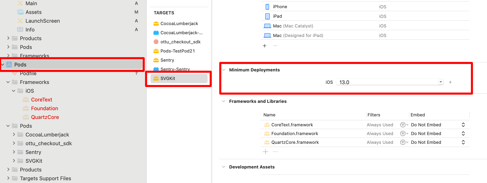

# iOS

The [Checkout SDK](./) is a Swift framework (library) provided by Ottu that allows you to easily integrate an Ottu-powered [checkout process](./#ottu-checkout-sdk-flow) into your iOS application. With the Checkout SDK, you can customize the look and feel of your checkout process, as well as which forms of payment are accepted.

To use the Checkout SDK, you'll need to include the library in your iOS application and initialize it with your Ottu [merchant\_id](https://docs.ottu.com/developer/checkout-sdk/web#merchant_id-string), [session\_id](https://docs.ottu.com/developer/checkout-sdk/web#session_id-string), and [API public key](../authentication.md#public-key). You can also specify additional options such as, which forms of payment to accept, the [theme](https://docs.ottu.com/developer/checkout-sdk/web#theme-object) styling for the checkout interface, and more.


[API private key](../authentication.md#private-key-api-key) should never be used on the client side. Instead, [API public key ](../authentication.md#public-key)should be used. This is essential to ensure the security of your application and the protection of sensitive data.


## [Installation](ios.md#installation) <a href="#installation" id="installation"></a>

### [Minimum Requirements](ios.md#minimum-requirements) <a href="#minimum-requirements" id="minimum-requirements"></a>

The SDK can be used on a device running iOS 13 or higher.

### [**Installation with CocoaPods**](ios.md#installation-with-cocoapods)

_**Ottu:**_ Ottu is available through [CocoaPods](http://cocoapods.org/). To install it, simply add the following line to your Podfile:


```ruby
pod 'ottu_checkout_sdk', :git => 'https://github.com/ottuco/ottu-ios.git', :tag => '1.0.22'
```


After all the frameworks are obtained via CocoaPods, it is needed to open project `*.xcworkspace` (not `*.xcodeproj`) in Xcode and ensure `Minimum Deployments iOS` is set to 13 for SVGKit as shown in the below figure:

<figure><figcaption></figcaption></figure>

## [Native UI](ios.md#native-ui) <a href="#native-ui" id="native-ui"></a>

The SDK UI is a `View` embedded in any part of any `ViewController` of the merchant's app.\
Here is the example:

<figure><figcaption></figcaption></figure>

However, if there’s only one payment option available and it is a wallet, the UI is minified:

<figure><figcaption></figcaption></figure>

## [SDK Configuration](ios.md#sdk-configuration) <a href="#sdk-configuration" id="sdk-configuration"></a>

### [Language](ios.md#language) <a href="#language" id="language"></a>

The SDK supports two languages: English and Arabic, the default one is English.

The SDK uses the language applied in the device settings. Nothing should be adjusted inside the app. However, if the transaction has been created with another language and setup preload is being used, the texts coming from the backend (like fees descriptions) will be in the transaction language.\
So please consider the current selected device language or current selected app language when passing a language code to the transaction creation request of [Checkout API](../checkout-api.md).

### [Light and dark theme](ios.md#light-and-dark-theme) <a href="#light-and-dark-theme" id="light-and-dark-theme"></a>

Also SDK supports UI adjustment according to the device theme - light or dark. It is applied when the SDK is been initialized, based on the device settings. Same as for the language - nothing is adjusted inside the app.

## [Functions](ios.md#functions) <a href="#functions" id="functions"></a>

Currently the SDK provides only one function which is the entry point for the merchants app.\
Also it provides callbacks which should be handled by the parent app. They are described in the next chapter.

### [**Checkout.init**](https://docs.ottu.com/developer/checkout-sdk/web#checkout.init)

Is the function that initializes the checkout process and sets up the necessary configuration options for the Checkout SDK. It needs to be called once by the parent app to initialize the checkout process, and it must be called with a set of configuration fields that includes all the necessary options for the checkout process.

When you call Checkout.init, the SDK will take care of setting up the necessary components for the checkout process, such as creating a form for the customer to enter their payment details, and handling communication with Ottu's servers to process the payment.

This function returns a `View`object. It is iOS native UI component which can be placed in any place of any `ViewController`instance (also iOS native).

### [Properties](ios.md#properties) <a href="#properties" id="properties"></a>

#### [**merchantId**](ios.md#merchantid-string-required) _<mark style="color:blue;">`string`</mark>_ _<mark style="color:red;">`required`</mark>_

The `merchant_id` specifies your Ottu merchant domain. This should be the root domain of your Ottu account, without the "https://" or "http://" prefix.

For example, if your Ottu URL is [https://example.ottu.com,](https://example.ottu.com,/) then your `merchant_id` is [example.ottu.com](http://example.ottu.com/). This property is used to identify which Ottu merchant account the checkout process should be linked to.

#### [**apiKey**](ios.md#apikey-string-required) _<mark style="color:blue;">`string`</mark>_ _<mark style="color:red;">`required`</mark>_

The `apiKey` is your Ottu API [public key](../authentication.md#public-key). This key is used for authentication purposes when communicating with Ottu's servers during the checkout process.


According to the REST API documentation, the `apiKey` property should be set to your Ottu API public key.


Ensure that you utilize the public key and refrain from using the private key. The private key should remain confidential at all times and must not be shared with any clients.

#### [**sessionId**](ios.md#sessionid-string-required) _<mark style="color:blue;">`string`</mark>_ _<mark style="color:red;">`required`</mark>_

The `session_id` is the unique identifier for the payment transaction associated with the checkout process.

This unique identifier is automatically generated when the payment transaction is created. For more information on how to use the `session_id` parameter in the Checkout API, see [`session_id`](../checkout-api.md#session_id-string-mandatory).

#### [**formsOfPayment**](ios.md#formsofpayment-string-required) _<mark style="color:blue;">`array`</mark>_ _<mark style="color:blue;">`optional`</mark>_

`formsOfPayment` allows you to customize which forms of payment will be displayed in your checkout process. By default, all forms of payment are configured.

The available options for `formsOfPayment` are:

* `applePay`: The Apple Pay payment method that allows customers to make purchases using their Apple Pay-enabled devices.
* `stcPay`: A method where customers enter their mobile number and provide an OTP send to their mobile number to complete their payment.
* `ottuPG`: A method that redirects customers to a page where customers enter their credit or debit card details to make a payment.
* `tokenPay`: A payment method that uses tokenization to securely store and process customers' payment information.
* `redirect`: A method where customers are redirected to a payment gateway or a third-party payment processor to complete their payment.

#### [**setupPreload**](ios.md#setuppreload-object-optional) _<mark style="color:blue;">`object`</mark>_ _<mark style="color:blue;">`optional`</mark>_

`ApiTransactionDetails` struct object containing the transaction details. If provided, the SDK will not require the transaction details from the backend, in order to save time.

#### [**theme**](ios.md#theme-object-optional) _<mark style="color:blue;">`object`</mark>_ _<mark style="color:blue;">`optional`</mark>_

`Theme` struct object for UI customization. All the fields are optional. Can contain values for background colors, text colors, fonts for various components. Allows customization for both light and dark device mode. See [Customization Theme](ios.md#customization-theme) section for details.

Please note that `theme` is optional. If not provided, the default UI settings will be used.

#### [**delegate**](ios.md#delegate-object-optional) _<mark style="color:blue;">`object`</mark>_ _<mark style="color:red;">`required`</mark>_

An object providing the SDK callbacks to the app This is usually the parent app’s class corresponding to `OttuDelegate` aggregating the SDK object. In order the class to correspond to this delegate, it needs to implement 3 callback functions, please refer to [Callbacks ](ios.md#callbacks)section for more information.

## [Callbacks](ios.md#callbacks) <a href="#callbacks" id="callbacks"></a>

In the Checkout SDK, callback functions play a vital role in providing real-time updates on the status of payment transactions. `Callbacks` enhance the user experience by enabling seamless and efficient handling of various payment scenarios, such as errors, successful payments, and cancellations.


All the callbacks described below can be called for any type of payment.


### [**errorCallback**](ios.md#errorcallback)

The `errorCallback` is a callback function that is invoked when issues arise during a payment. It is important to handle errors appropriately to ensure a smooth user experience.&#x20;


The recommended best practice in case of an error is to restart the checkout process by creating a new `session_id` using the [Checkout API](https://docs.ottu.com/developer/checkout-api).


To define the `errorCallback` function, you can use the `data-error` attribute on the Checkout script tag to specify a global function that will handle errors. If an error occurs during a payment, the `errorCallback` function will be invoked with `data` `JSONObject` with a data.status value of `error`

**Params Available in** `data` **`JSONObject` for** `errorCallback`

* `message` mandatory
* `form_of_payment` mandatory
* `status` mandatory
* `challenge_occurred` optional
* `session_id` optional
* `order_no` optional
* `reference_number` optional

### [**cancelCallback**](ios.md#cancelcallback)

The `cancelCallback` in the Checkout SDK is a callback function that is invoked when a payment is canceled.&#x20;

To define the `cancelCallback` function, you can use the `data-cancel` attribute on the Checkout script tag to specify a global function that will handle cancellations. If a customer cancels a payment, the `cancelCallback` function will be invoked with `data` `JSONObjec`t with a data.status value of `canceled`.

**Params Available in** `data` **`JSONObject` for** `cancelCallback`

* `message` mandatory
* `form_of_payment` mandatory
* `challenge_occurred` optional
* `session_id` optional
* `status` mandatory
* `order_no` optional
* `reference_number` optional
* `payment_gateway_info` optional


In both `cancelCallback` and `errorCallback`, the SDK must be reinitialized, either on the same session or on a new session.



### [**successCallback**](ios.md#successcallback)

In the Checkout SDK, the `successCallback` is a function triggered upon successful completion of the payment process. This callback receives `data` `JSONObject`, with a data.status value of `success`

**Params Available in** `data` **`JSONObject` for** `successCallback`

* `message` mandatory
* `form_of_payment`mandatory
* `challenge_occurred` optional
* `session_id` optional
* `status` mandatory
* `order_no` optional
* `reference_number` optional
* `redirect_url` optional
* `payment_gateway_info` optional

The `successCallback` function is defined and passed as the value of the `data-success` attribute on the Checkout script tag.

## [Example](ios.md#example)

There are both UIKit and SwiftUI samples available at the sample repo:

* UIKit: [ottu-ios/Example at main · ottuco/ottu-ios](https://github.com/ottuco/ottu-ios/tree/main/Example)
* SwiftUI: [ottu-ios/Example\_SwiftUI at main · ottuco/ottu-ios](https://github.com/ottuco/ottu-ios/tree/main/Example_SwiftUI)

However, the SDK initialization part and the callbacks delegate are the same for both of them. Here is the code sample:


```swift
self.checkout = Checkout(
    formsOfPayments: formsOfPayment,
    sessionId: sessionId,
    merchantId: merchantId,
    apiKey: apiKey,
    delegate: self
)
if let paymentView = self.checkout?.paymentView() {
    paymentView.translatesAutoresizingMaskIntoConstraints = false
    self.paymentContainerView.addSubview(paymentView)

    NSLayoutConstraint.activate([
        paymentView.leadingAnchor.constraint(equalTo: self.paymentContainerView.leadingAnchor),
        self.paymentContainerView.trailingAnchor.constraint(equalTo: paymentView.trailingAnchor),
        paymentView.topAnchor.constraint(equalTo: self.paymentContainerView.topAnchor),
        self.paymentContainerView.bottomAnchor.constraint(equalTo: paymentView.bottomAnchor)
      ])
}
extension OttuPaymentsViewController: OttuDelegate {
    func errorCallback(_ data: [String: Any] ? ) {
        paymentContainerView.isHidden = true

        let alert = UIAlertController(title: "Error", message: data?.debugDescription ?? "", preferredStyle:
            .alert)
        alert.addAction(UIAlertAction(title: "OK", style: .cancel))
        self.present(alert, animated: true)
    }

    func cancelCallback(_ data: [String: Any] ? ) {
        var message = ""

        if let paymentGatewayInfo = data ? ["payment_gateway_info"] as ? [String: Any],
            let pgName = paymentGatewayInfo["pg_name"] as ? String,
                pgName == "kpay" {
                    message = paymentGatewayInfo["pg_response"].debugDescription
                } else {
                    message = data?.debugDescription ?? ""
                }

        paymentContainerView.isHidden = true

        let alert = UIAlertController(title: "Canсel", message: message, preferredStyle: .alert)
        alert.addAction(UIAlertAction(title: "OK", style: .cancel))
        self.present(alert, animated: true)
    }

    func successCallback(_ data: [String: Any] ? ) {
        paymentContainerView.isHidden = true
        paymentSuccessfullLabel.isHidden = false

        let alert = UIAlertController(title: "Success", message: data?.debugDescription ?? "", preferredStyle:
            .alert)
        alert.addAction(UIAlertAction(title: "OK", style: .cancel))
        present(alert, animated: true)
    }
}
```


## [Customization Theme](ios.md#customization-theme) <a href="#customization-theme" id="customization-theme"></a>

The main class describing theme is called `CheckoutTheme`.

It uses additional component classes like:

* `ButtonComponent`
* `LabelComponent`
* `TextFieldComponent`

The `CheckoutTheme` class includes objects that represent various UI components. These components' names largely align with those outlined below, however they also include additional fields specific to each platform.



### [Properties description](ios.md#properties-description) <a href="#properties-description" id="properties-description"></a>

**Important Note:** All the properties are optional. The user can customize any of them. If some property is not set the default value (specified in Figma design) will be used.

#### [**Texts**](ios.md#texts)

#### **General**

| Property Name |                            Description                            |                Data Type                |
| ------------- | :---------------------------------------------------------------: | :-------------------------------------: |
| `mainTitle`   |                 Font and color for all “Captions”                 | [LabelComponent](ios.md#labelcomponent) |
| `title`       |           Font and color for payment options in the list          | [LabelComponent](ios.md#labelcomponent) |
| `subtitle`    | Font and color for payment options details (like expiration date) | [LabelComponent](ios.md#labelcomponent) |

#### **Fees**

| Property Name  |                           Description                          |                Data Type                |
| -------------- | :------------------------------------------------------------: | :-------------------------------------: |
| `feesTitle`    |    Font and color of fees value in the payment options list    | [LabelComponent](ios.md#labelcomponent) |
| `feesSubtitle` | Font and color of fees description in the payment options list | [LabelComponent](ios.md#labelcomponent) |

#### **Data**

| Property Name |                        Description                       |                Data Type                |
| ------------- | :------------------------------------------------------: | :-------------------------------------: |
| `dataLabel`   | Font and color of payment details fields (like “Amount”) | [LabelComponent](ios.md#labelcomponent) |
| `dataValue`   |         Font and color of payment details values         | [LabelComponent](ios.md#labelcomponent) |

**Other**

| Property Name      |                   Description                   |                Data Type                |
| ------------------ | :---------------------------------------------: | :-------------------------------------: |
| `errorMessageText` | Font and color of error message text in pop-ups | [LabelComponent](ios.md#labelcomponent) |

#### [**Text Fields**](ios.md#text-fields)

| Property Name    |                              Description                             |                    Data Type                    |
| ---------------- | :------------------------------------------------------------------: | :---------------------------------------------: |
| `inputTextField` | Font and color of text in any input field (including disabled state) | [TextFieldComponent](ios.md#textfieldcomponent) |

#### [**Colors**](ios.md#colors)

| Property Name          |                  Description                  | Data Type |
| ---------------------- | :-------------------------------------------: | :-------: |
| `backgroundColor`      | The main background of the SDK view component |  UIColor  |
| `backgroundColorModal` |       The background of any modal window      |  UIColor  |
| `iconColor`            |      The color of the icon of the payment     |  UIColor  |

#### [**Buttons**](ios.md#buttons)

| Property Name    |                            Description                            |                 Data Type                 |
| ---------------- | :---------------------------------------------------------------: | :---------------------------------------: |
| `button`         |           Background, text color and font for any button          | [ButtonComponent](ios.md#buttoncomponent) |
| `selectorButton` | Background, text color and font for payment item selection button | [ButtonComponent](ios.md#buttoncomponent) |

#### [**Switch**](ios.md#switch)

| Property Name       |              Description             | Data Type |
| ------------------- | :----------------------------------: | :-------: |
| `switchOnTintColor` | The color of switch (toggle) control |  UIColor  |

#### [**Margins**](ios.md#margins)

| Property Name |                     Description                     |              Data Type              |
| ------------- | :-------------------------------------------------: | :---------------------------------: |
| margins       | Top, left, bottom and right margins between compone | [UIEdgeInsets](ios.md#uiedgeinsets) |

#### [Payment Details](ios.md#payment-details)

| Property Name        |                                            Description                                            | Data Type |
| -------------------- | :-----------------------------------------------------------------------------------------------: | :-------: |
| `showPaymentDetails` | Boolean variable determining whether the “Payment Details” section should be displayed or hidden. |  Boolean  |

### [Data types description](ios.md#data-types-description) <a href="#data-types-description" id="data-types-description"></a>

#### [**LabelComponent**](ios.md#labelcomponent)

| Property Name | Data Type  |
| ------------- | :--------: |
| `color`       |   UIColor  |
| `font`        |   UIFont   |
| `fontFamily`  |   String   |

#### [**TextFieldComponent**](ios.md#textfieldcomponent)

| Property Name     |                Data Type                |
| ----------------- | :-------------------------------------: |
| `label`           | [LabelComponent](ios.md#labelcomponent) |
| `text`            | [LabelComponent](ios.md#labelcomponent) |
| `backgroundColor` |                 UIColor                 |

#### [**ButtonComponent**](ios.md#buttoncomponent)

| Property Name             | Data Type |
| ------------------------- | :-------: |
| `enabledTitleColor`       |  UIColor  |
| `disabledTitleColor`      |  UIColor  |
| `font`                    |   UIFont  |
| `enabledBackgroundColor`  |  UIColor  |
| `disabledBackgroundColor` |  UIColor  |
| `fontFamily`              |   String  |

#### [**UIEdgeInsets**](ios.md#uiedgeinsets)

| Property Name | Data Type |
| ------------- | :-------: |
| `left`        |    Int    |
| `top`         |    Int    |
| `right`       |    Int    |
| `bottom`      |    Int    |

## [Example](ios.md#example.1) <a href="#example.1" id="example.1"></a>

In order to build the `theme` the user needs to perform similar actions described in this file of the test app.

Here is a code snippet:

```swift
func createTheme() - > CheckoutTheme {
    var theme = CheckoutTheme()
    theme.backgroundColor = .systemBackground
    theme.backgroundColorModal = .secondarySystemBackground
    theme.margins = UIEdgeInsets(top: 8, left: 2, bottom: 8, right: 2)
    theme.mainTitle.color = .label
    theme.mainTitle.fontFamily = "Arial"
    theme.button.enabledTitleColor = .payButtonTitle
    theme.button.disabledTitleColor = .payButtonDisabledTitle
    theme.button.fontFamily = "Arial"
    theme.button.enabledBackgroundColor = .payButtonBackground
    theme.button.disabledBackgroundColor = .payButtonDisabledBackground
    return theme
}
```

And here is how it is been passed to the SDK initiazliation (`theme` object):

```swift
self.checkout = Checkout(
    theme: theme,
    sessionId: sessionId,
    merchantId: merchantId,
    apiKey: apiKey,
    delegate: self
)
```

## [Apple Pay](ios.md#apple-pay) <a href="#apple-pay" id="apple-pay"></a>

When the [integration ](web.md#apple-pay)between Ottu and Apple for Apple Pay is completed, the necessary checks to display the Apple Pay button are handled automatically by the Checkout SDK.

1. **Initialization**: Upon initialization of the Checkout SDK with the provided [session\_id ](../checkout-api.md#session_id-string-mandatory)and payment gateway codes ([pg\_codes](../checkout-api.md#pg_codes-array-required)), several conditions are automatically verified:
   * It is confirmed that a `session_id` and `pg_codes` associated with the Apple Pay Payment Service have been supplied.
   * It is ensured that the customer is using an Apple device that supports Apple Pay. If the device is not supported, the button will not be shown, and an error message stating `This device doesn't support Apple Pay` will be displayed to inform the user of the compatibility issue.
   * It is verified that the customer has a wallet configured on their Apple Pay device. if the wallet is not configured (i.e., no payment cards are added), the Setup button will  appear. Clicking on this button will prompt the Apple Pay wallet on the user's device to open, allowing them to configure it by adding payment cards.
2. **Displaying the Apple Pay Button**: If all these conditions are met, the Apple Pay button is displayed and made available for use in the checkout flow.
3. **Restricting Payment Options**: To display only the Apple Pay button, `applePay` should be passed within the `formsOfPayment` parameter. The `formsOfPayment` property instructs the Checkout SDK to render only the Apple Pay button. If this property is not included, all available payment options are rendered by the SDK.

This setup ensures a seamless integration and user experience, allowing customers to easily set up and use Apple Pay during the checkout process.

## [STC Pay](ios.md#stc-pay) <a href="#stc-pay" id="stc-pay"></a>

When the [integration](web.md#stc-pay) between Ottu and STC Pay is completed, the necessary checks to display the STC Pay button are handled seamlessly by the Checkout SDK.

1. **Initialization**: Upon initialization of the Checkout SDK with the provided [session\_id](../checkout-api.md#session_id-string-mandatory) and payment gateway codes ([pg\_codes](../checkout-api.md#pg_codes-array-required)), several conditions are automatically verified:
   * It is confirmed that the `session_id` and `pg_codes` provided during SDK initialization are associated with the STC Pay Payment Service. This ensures that the STC Pay option is available for the customer to choose as a payment method.
   * It is ensured that the STC Pay button is displayed by the iOS SDK, regardless of whether the customer has provided a mobile number while creating the transaction.

This setup ensures a seamless integration and user experience, allowing customers to easily set up and use STC Pay during the checkout process.

## [KNET - Apple Pay](ios.md#knet-apple-pay) <a href="#knet-apple-pay" id="knet-apple-pay"></a>

Due to compliance requirements, KNET necessitates a popup displaying the payment result after each failed payment. This functionality is available only in the `cancelCallback` when there is a response from the payment gateway. As a result, the user must click on the Apple Pay button again to retry the payment.


The popup notification requirement is specific to the KNET payment gateway. Other payment gateways may have different requirements or notification mechanisms, so it is essential to follow the respective documentation for each payment gateway integration.


To properly handle the popup notification for KNET, the following code snippet should be implemented into your payment processing flow:

```swift
func cancelCallback(_ data: [String: Any] ? ) {
    var message = ""

    if let paymentGatewayInfo = data ? ["payment_gateway_info"] as ? [String: Any],
        let pgName = paymentGatewayInfo["pg_name"] as ? String,
            pgName == "kpay" {
                message = paymentGatewayInfo["pg_response"].debugDescription
            } else {
                message = data?.debugDescription ?? ""
            }

    navigationController?.popViewController(animated: true)
    let alert = UIAlertController(title: "Canсel", message: message, preferredStyle: .alert)
    alert.addAction(UIAlertAction(title: "OK", style: .cancel))
    self.present(alert, animated: true)
}
}
```

The above code performs the following checks and actions:

1. **Verification**: It first checks if the cancel object contains information about the payment gateway (`payment_gateway_info`).
2. **Payment Gateway Identification**: It then verifies if the `pg_name` property in `payment_gateway_info` is equal to "kpay", confirming that the payment gateway used is KNET.
3. **Response Handling**: If the conditions are met, it retrieves the payment gateway's response from the `pg_response` property. If not available, it uses a default "Payment was cancelled." error message.
4. **Popup Notification**: Finally, it displays the error message in a popup using `self.present(alert, animated: true)` to notify the user about the failed payment.

This setup ensures compliance with KNET's requirements and provides a clear user experience for handling failed payments.

## [Error Reporting](ios.md#error-reporting) <a href="#error-reporting" id="error-reporting"></a>

The SDK utilizes Sentry for error logging and reporting, which is initialized based on the configuration from SDK Studio. However, since the SDK is integrated into the merchant's app, conflicts may arise if the app also uses Sentry. To avoid this, merchants can disable Sentry in the Checkout SDK by setting the `is_enabled` flag to `false` in the configuration.

## [FAQ](ios.md#faq) <a href="#faq" id="faq"></a>

#### :digit\_one: [What forms of payments are supported by the SDK?](ios.md#id-1.-what-forms-of-payments-are-supported-by-the-sdk) <a href="#id-1.-what-forms-of-payments-are-supported-by-the-sdk" id="id-1.-what-forms-of-payments-are-supported-by-the-sdk"></a>

The SDK supports the following payment forms: `tokenPay`, `ottuPG`, `redirect` `applePay` and `stcPay`. Merchants can display specific methods according to their needs.

**For example,** if you want to only show the STC Pay button, you can do so using formsOfPayment = \[`stcPay`], and only the STC Pay button will be displayed. The same applies for `applePay` and other methods.

#### :digit\_two: [What are the minimum system requirements for the SDK integration?](ios.md#id-2.-what-are-the-minimum-system-requirements-for-the-sdk-integration) <a href="#id-2.-what-are-the-minimum-system-requirements-for-the-sdk-integration" id="id-2.-what-are-the-minimum-system-requirements-for-the-sdk-integration"></a>

It is required to have a device running iOS 13 or higher.

#### :digit\_three: [Can I customize the appearance beyond the provided themes?](ios.md#id-3.-can-i-customize-the-appearance-beyond-the-provided-themes) <a href="#id-3.-can-i-customize-the-appearance-beyond-the-provided-themes" id="id-3.-can-i-customize-the-appearance-beyond-the-provided-themes"></a>

Yes, see the [Customization theme](ios.md#customization-theme) section.

#### :digit\_four: [How do I customize the payment request for Apple Pay?](ios.md#id-4.-how-do-i-customize-the-payment-request-for-apple-pay) <a href="#id-4.-how-do-i-customize-the-payment-request-for-apple-pay" id="id-4.-how-do-i-customize-the-payment-request-for-apple-pay"></a>

You can tailor the payment request for Apple Pay using their respective initialization methods. These methods allow you to set various properties like API version, supported cards, networks, countries, and merchant capabilities etc. You can check the list of properties supported by [ApplePay](https://developer.apple.com/documentation/apple_pay_on_the_web/applepaypaymentrequest)
