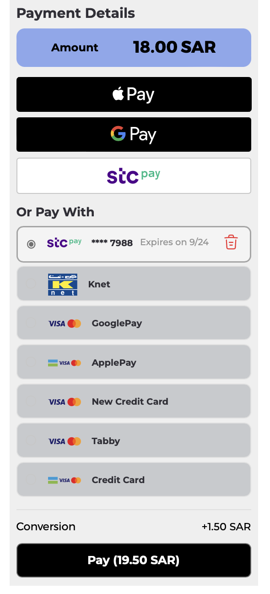
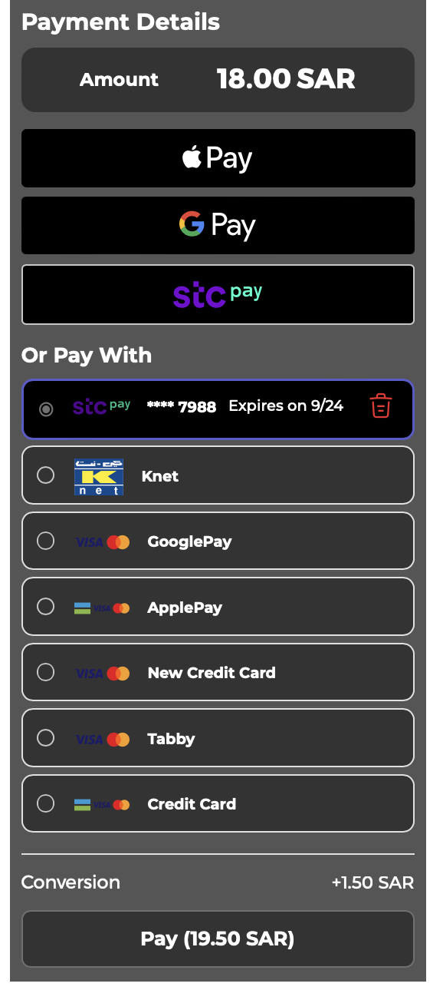
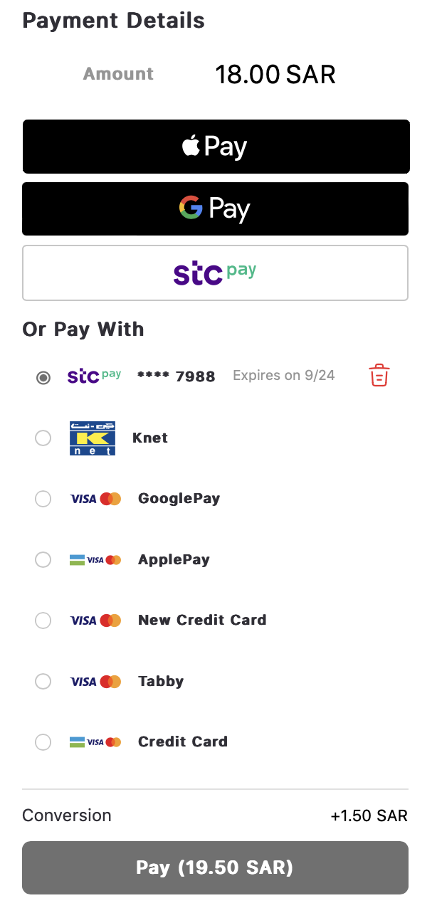
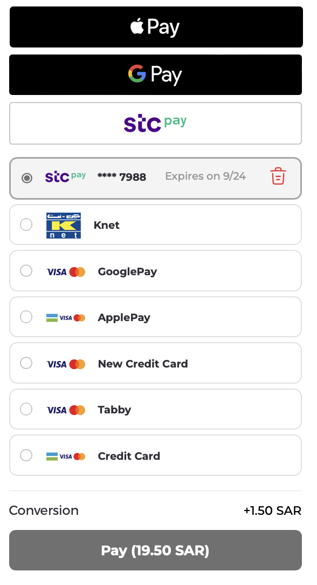
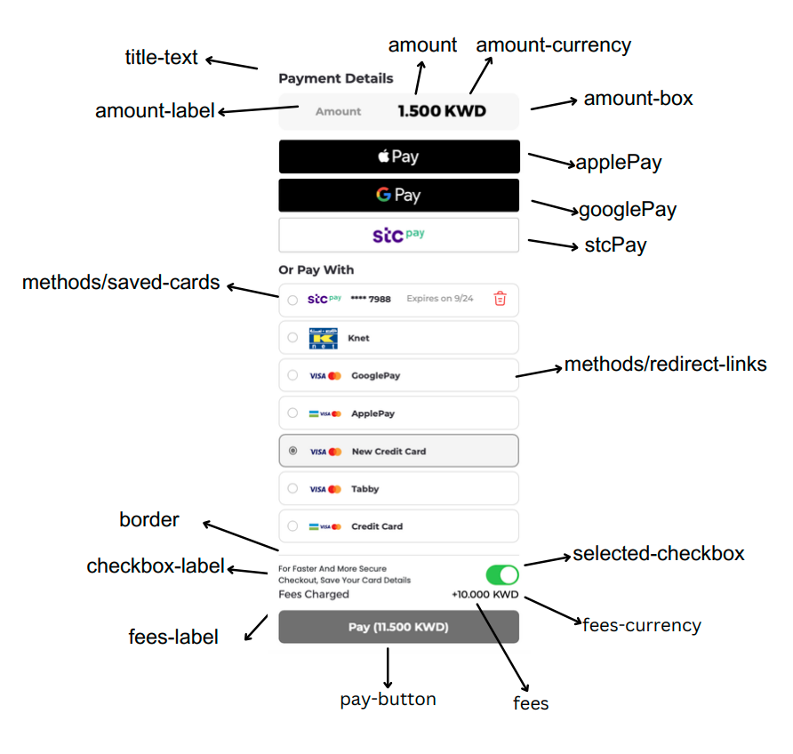
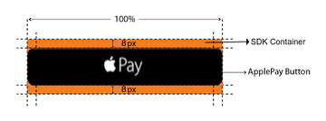
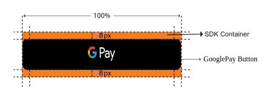
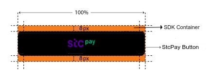
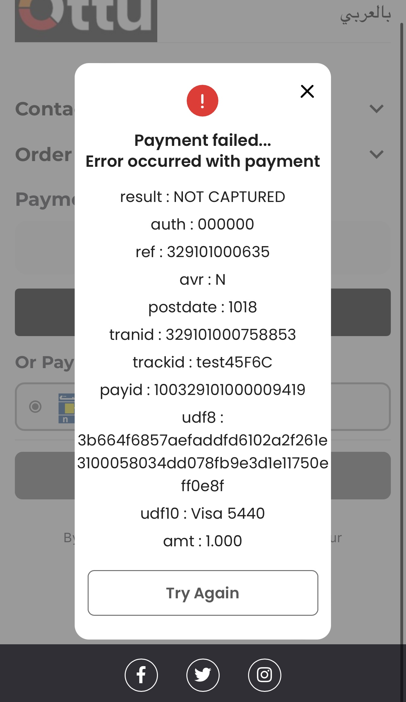

# Web V3

In this documentation, you will find comprehensive resources and guides to help you seamlessly integrate and leverage the features of SDK Version 3 in your development projects. Whether you're an experienced developer or just starting out, this documentation is designed to assist you at every step. For SDK Version 2 Documentation, please visit the following link: [SDK Version 2 Documentation](web.md)

The [Checkout SDK](./) is a JavaScript library provided by Ottu that allows you to easily integrate an Ottu-powered [checkout process](./#ottu-checkout-sdk-flow) into your web application. With the Checkout SDK, you can customize the look and feel of your checkout process, as well as which forms of payment are accepted.

To use the Checkout SDK, you'll need to include the library in your web application and initialize it with your Ottu [merchant\_id](web-v3.md#merchant\_id-string), [session\_id](web-v3.md#session\_id-string), and [API key](../authentication.md#public-key). You can also specify additional options such as, which forms of payment to accept, the [theme](web-v3.md#theme-object) styling for the checkout interface, and more.


Please note that the Checkout SDK requires the implementation of the [Checkout API](../checkout-api.md) in order to function properly.

For optimal security, call REST APIs from server-side implementations, not client-side applications such as mobile apps or web browsers.


## [Checkout SDK](web-v3.md#checkout-sdk)

## [Demo](web-v3.md#demo)

Below is a demo of the Checkout SDK in action. This demo shows how the Checkout SDK can be used to create a streamlined checkout experience for customers, with support for multiple forms of payment and a customizable interface.



#### [Installation](web-v3.md#installation)

To install the Checkout SDK, you'll need to include the library in your web application by adding a script tag to your HTML section. You can do this by using the following code snippet:

```html
<head>
    <script
        src="https://assets.ottu.net/checkout/v3/checkout.min.js"
        data-error="errorCallback"
        data-cancel="cancelCallback"
        data-success="successCallback"
        data-beforepayment="beforePayment"
    ></script>
</head>
```

Replace [errorCallback](web-v3.md#window.errorcallback), [cancelCallback](web-v3.md#window.cancelcallback), [successCallback](web-v3.md#window.successcallback), and [beforePayment](web-v3.md#windows.beforepayment-hook) with the names of your error handling, cancel handling, success handling, and beforePayment handling functions, respectively.

You're all set! You can now use the [Checkout SDK ](./)to create a checkout form on your web page and process payments through Ottu.

## [Functions](web-v3.md#functions)

#### [**Checkout.init**](web-v3.md#checkout.init)

Is the function that initializes the [checkout process](./#ottu-checkout-sdk-flow) and sets up the necessary configuration options for the [Checkout SDK](./). It needs to be called once on your web page to initialize the checkout process, and it must be called with a configuration object that includes all the necessary options for the checkout process.

When you call `Checkout.init`, the SDK will take care of setting up the necessary components for the checkout process, such as creating a form for the customer to enter their payment details, and handling communication with Ottu's servers to process the payment.

#### [**Checkout.reload**](web-v3.md#checkout.reload)

The `Checkout.reload` function in the Checkout SDK is used to refresh the SDK. It's useful when you want to reload the **content** of the SDK after an **error** has occurred or when the content needs to be **refreshed**.

Here's an example of how `Checkout.reload` might be called:

```javascript
Checkout.reload();
```

#### [**Properties** ](web-v3.md#properties)

#### [**selector**](web-v3.md#selector-string)  _<mark style="color:blue;">**`string`**</mark>_

The `selector` property in the Checkout SDK is used to specify the `css` selector for the HTML element that will contain the checkout form. This is typically a `<div>` element on your web page.

To specify the selector, you can add a `<div>` element to your web page with a unique `id` attribute, like this:

```html
<div id="checkout"></div>
```

It's important to note that the `selector` property must be the ID of the HTML element that will contain the checkout form. This is because the Checkout SDK replaces the contents of the specified element with the checkout elements.

Here's an example of how `Checkout.init` might be called with a `selector` property:

```javascript
Checkout.init({
    selector: 'checkout',
    // ... other parameters
});
```

#### [**merchant\_id**](web-v3.md#merchant\_id-string)  _<mark style="color:blue;">**`string`**</mark>_

The `merchant_id` specifies your Ottu merchant domain. This should be the root domain of your Ottu account, without the "https://" or "http://" prefix.

For example, if your Ottu URL is `https://example.ottu.com`, then your `merchant_id` is **example.ottu.com**. This property is used to identify which Ottu merchant account the checkout process should be linked to.

#### [**apiKey**](web-v3.md#apikey-string) _<mark style="color:blue;">**`string`**</mark>_

The `apiKey` is your Ottu [API public key](../authentication.md#public-key). This key is used for authentication purposes when communicating with Ottu's servers during the checkout process.

According to the REST [API documentation](../authentication.md), the `apiKey` property should be set to your Ottu  API public key.


Ensure that you utilize the public key and refrain from using the [private key](../authentication.md#private-key-api-key). The private key should remain confidential at all times and must not be shared with any clients.


#### [**session\_id**](web-v3.md#session\_id-string) _<mark style="color:blue;">**`string`**</mark>_

The `session_id` is the unique identifier for the payment transaction associated with the checkout process.

This unique identifier is automatically generated when the payment transaction is created. For more information on how to use the `session_id` parameter in the Checkout API, see [session\_id](../checkout-api.md#session\_id-string-read-only).

#### [**lang**](web-v3.md#lang-string) _<mark style="color:blue;">**`string`**</mark>_

The `lang` property serves to designate the language for presenting the checkout elements. You can configure this property with either "`en`" for English or "`ar`" for Arabic. When `lang` is configured as "`en`", the checkout form will appear in English, and if set to "`ar`", the checkout elements will be shown in Arabic. Moreover, when the `lang` parameter is set to "`ar`", the layout will adapt to a right-to-left (RTL) orientation to suit Arabic script.

#### [**formsOfPayment**](web-v3.md#formsofpayment-array) _<mark style="color:blue;">**`array`**</mark>_

`formsOfPayment` allows you to customize which forms of payment will be displayed in your checkout process. By default, all forms of payment are configured.

The available options for `formsOfPayment` are:

* `"applePay"`: The Apple Pay payment method that allows customers to make purchases using their Apple Pay-enabled devices.
* `"googlePay"`: The Google Pay payment method that allows customers to make purchases using their Google wallet cards linked in google accounts.
* `"ottuPG"`: A method that redirects customers to a page where customers enter their credit or debit card details to make a payment.
* `"tokenPay"`: A payment method that uses tokenization to securely store and process customers' payment information.
* `"redirect"`: A method where customers are redirected to a payment gateway or a third-party payment processor to complete their payment.
* `"stcPay"`: A method where customers enter their mobile number and provide an OTP send to their mobile number to complete their payment.

#### [displayMode](web-v3.md#displaymode-string) _<mark style="color:blue;">`string`</mark>_

There are two display Modes i.e `grid` & `column`.The Default `displayMode` is `column`. Here's an example of how `Checkout.init` might be called to customize the `displayMode`

*   #### grid

    In `grid` mode, saved cards will appear on the left side and the redirect links on the right side.

```javascript
Checkout.init({
    // other parameters
    displayMode: 'grid'
});
```

<figure><figcaption></figcaption></figure>

*   #### column

    Default `displayMode` will be `column`, where all forms of payment appear one under another, similar to a responsive view.

```javascript
Checkout.init({
    // other parameters
    displayMode: 'column'
});
```

<figure><figcaption></figcaption></figure>

#### [applePayInit](web-v3.md#applepayinit-object) _<mark style="color:blue;">`object`</mark>_

The `applePayInit` object enables users to modify the Apple Pay configurations used for generating payment sessions through Apple Pay. By default, all options are pre-configured. However users have the flexibility to customize these configurations using `applePayInit` according to their requirements.

* **buttonType**\
  Users can change Apple Pay Button Type by using `buttonType` property. Values supported by `buttonType` are written[ here](https://developer.apple.com/documentation/apple\_pay\_on\_the\_web/applepaybuttontype).
* **buttonColor**\
  Users can change Apple Pay Button Color by using `buttonColor` property. Values supported by `buttonColor` are white, white-outline and black.
* **buttonLocale**\
  Users can change Apple Pay Button Locale by using buttonLocale property. \
  Value of buttonLocale must be a 2 letter language code like “`ar`”, “`en`” etc.
* **version**\
  Users can change the API version used for creating Apple Pay payment session by using the version property. Values supported by version are written[ here](https://developer.apple.com/documentation/apple\_pay\_on\_the\_web/apple\_pay\_on\_the\_web\_version\_history).

In addition to above properties, users have the capability to customize the Apple Pay payment request using properties defined [here](https://developer.apple.com/documentation/apple\_pay\_on\_the\_web/applepaypaymentrequest). However, due to backend constraints, not all properties are modifiable. Below is the list of supported and unsupported values:

#### Supported Properties

* `merchantCapabilities`
* `merchantIdentifier`
* `supportedNetworks`
* `countryCode`
* `supportedCountries`
* `total`&#x20;
* `lineItems`
* `currencyCode`

#### Unsupported Properties

* `requiredBillingContactFields`
* `billingContact`
* `requiredShippingContactFields`
* `shippingContact`
* `shippingContactEditingMode`&#x20;
* `supportsCouponCode`
* `couponCode`
* `applicationData`

```javascript
Checkout.init({
    selector: "checkout",
    merchant_id: 'domain',
    session_id: 'session_id',
    apiKey: 'apiKey',
    // Default values configured for Apple Pay
    applePayInit: {
        version: 6,
        buttonType: 'plain',
        buttonColor: 'black',
        buttonLocale: 'en',
        supportedNetworks: ['amex', 'masterCard', 'maestro', 'visa', 'mada'],
        merchantCapabilities: ['supports3DS']
        // Remaining values are configured via init checkout API
    }
});
```

#### [googlePayInit](web-v3.md#googlepayinit-object) <mark style="color:blue;">`object`</mark>

The `googlePayInit` object enables users to modify the Google Pay configurations used for generating payment sessions through Google Pay. By default, all options are pre-configured. However, developers have the flexibility to customize these configurations using `googlePayInit` according to their requirements.&#x20;

* **buttonType**\
  Users can change Google Pay Button Type by using `buttonType` property. Values supported by `buttonType` are written[ here](https://developers.google.com/pay/api/web/reference/request-objects#ButtonOptions).
* **buttonColor**\
  Users can change Google Pay Button Color by using `buttonColor` property. Values supported by `buttonColor` are white and black.
* **buttonSizeMode**\
  Users can change Google Pay Button Size Mode by using `buttonSizeMode` property. Values supported by `buttonSizeMode` are static and fill.
* **buttonLocale**\
  Users can change Google Pay Button Locale by using `buttonLocale` property. \
  Value of `buttonLocale` must be a 2 letter language code like “`ar`”, “`en`” etc.&#x20;

In addition to above properties, users have the capability to customize Google Pay payment request by utilizing the options outlined in the documentation[ here](https://developers.google.com/pay/api/web/reference/request-objects#PaymentDataRequest).However, due to backend constraints, not all properties are modifiable. Below is the list of supported and unsupported values:

#### Supported Properties

* `apiVersion`
* `apiVersionMinor`
* `environment`
* `emailRequired`
* `merchantId`
* `merchantName`
* `tokenizationSpecificationType`
* `publicKey`
* `gateway`
* `gatewayMerchantId`
* `allowedAuthMethods`
* `allowedCardNetworks`
* `allowPrepaidCards`
* `allowCreditCards`
* `billingAddressRequired`
* `assuranceDetailsRequired`
* `billingAddressParameters`
* `displayItems`
* `totalPrice`
* `totalPriceLabel`
* `totalPriceStatus`
* `countryCode`
* `currencyCode`

#### Unsupported Properties

* `shippingAddressRequired`
* `shippingAddressParameters`
* `shippingOptionRequired`
* `shippingOptionParameters`
* `offerInfo`&#x20;
* `callbackIntents`
* `existingPaymentMethodRequired`

**Example**

```javascript
Checkout.init({
    // Other parameters
    googlePayInit: {
        apiVersion: 2,
        apiVersionMinor: 0,
        allowedCardNetworks: ["AMEX", "DISCOVER",
            "INTERAC", "JCB", "MASTERCARD", "VISA"],
        allowedCardAuthMethods: ["PAN_ONLY",
            "CRYPTOGRAM_3DS"],
        allowPrepaidCards: true,
        allowCreditCards: true,
        billingAddressRequired: false,
        assuranceDetailsRequired: false,
        existingPaymentMethodRequired: true,
        tokenizationSpecificationType: 'PAYMENT_GATEWAY',
        totalPriceStatus: 'FINAL',
        totalPriceLabel: 'TOTAL',
        buttonType: 'plain',
        buttonLocale: 'en',
        buttonColor: 'black'
        // Remaining Values are configured via
        // init checkout API
    }
});
```

#### [theme](web-v3.md#theme-object) _<mark style="color:blue;">`object`</mark>_

The SDK Theme Customization feature allows you to modify the appearance of elements within the SDK using a `theme` object. This object contains specific `css` properties that are applied to various components, giving you control over their styling. `theme` object consists of key-value pairs, where each key corresponds to a specific component, and the associated value is a set of `css` properties to be applied to that component

```javascript
Checkout.init({
    // other parameters
    theme: {
        'pay-button': {
            'background': 'black'
        }
    }
});
```

#### Here are some example themes that you can use




```javascript
Checkout.init({
    // other parameters
    theme: {
        "main": {
            "padding": "0px 10px",
            "background": "#d4d4d461"
        },
        "primary-text": {
            "color": "black"
        },
        "pay-button": {
            "background": "black",
            "color": "white"
        },
        "amount-box": {
            "background": "#1157e878"
        },
        "methods": {
            "background": "#373f5236"
        },
        "checkbox-label": {
            "color": "#003aff"
        }
    }
});
```

<figure><figcaption></figcaption></figure>



```javascript
Checkout.init({
    selector: "checkout",
    merchant_id: 'domain',
    session_id: 'session_id',
    apiKey: 'apiKey',
    theme: {
        "main": {
            "padding": "0px 10px",
            "background": "#555555"
        },
        "title-text": {
            "color": "white"
        },
        "primary-text": {
            "color": "white"
        },
        "secondary-text": {
            "color": "white"
        },
        "pay-button": {
            "background": "#333",
            "color": "white"
        },
        "amount-box": {
            "background": "#333"
        },
        "stcPay": {
            "background": "black"
        },
        "stc-modal": {
            "background": "black"
        },
        "stc-input": {
            "color": "black"
        },
        "methods": {
            "background": "#333"
        },
        "selected-method": {
            "background": "black",
            "border": "2px solid #6e6ef5d4",
        },
        "card-removal-modal": {
            "background": "black"
        },
        "keep-card-button": {
            "color": "black"
        },
        "info-modal": {
            "background": "black"
        },
        "error-retry-button": {
            "color": "black"
        },
        "ccv-input": {
            "background": "black",
            "color": "white"
        },
        "floating-label": {
            "background": "black"
        },
        "stc-popup-error": {
            "color": "red"
        },
        "stc-popup-back-button": {
            "stroke": "red"
        },
        "popup-close-button": {
            "fill": "red"
        },
        "stc-resendOtp-button": {
            "color": "black"
        }
    }
});
```

<figure><figcaption></figcaption></figure>



```javascript
Checkout.init({
    selector: "checkout",
    merchant_id: 'domain',
    session_id: 'session_id',
    apiKey: 'apiKey',
    theme: {
        "title-text": {
            "font-family": "SF PRO REGULAR"
        },
        "primary-text": {
            "font-family": "SF PRO REGULAR"
        },
        "secondary-text": {
            "font-family": "SF PRO REGULAR"
        },
        "amount-box": {
            "background": "transparent"
        },
        "methods": {
            "background": "transparent",
            "border": "none"
        },
        "selected-method": {
            "background": "transparent",
            "border": "none"
        },
        "ccv-input": {
            "background": "transparent"
        },
        "floating-label": {
            "background": "white"
        }
    }
});
```

<figure><figcaption></figcaption></figure>



```javascript
Checkout.init({
    selector: "checkout",
    merchant_id: 'domain',
    session_id: 'session_id',
    apiKey: 'apiKey',
    googlePayInit: {
        buttonColor: "black"
    },
    theme: {
        "wallet-buttons": {
            "flex-direction": "row",
            "gap": "10px"
        },
        "stcPay": {
            "background": "black"
        }
    }
});
```

<figure><figcaption></figcaption></figure>



```javascript
Checkout.init({
    // other parameters
    theme: {
        "payment-details-heading": {
            "display": "none"
        },
        "payment-methods-heading": {
            "display": "none"
        },
        "amount-box": {
            "display": "none"
        }
    }
});
```

<figure><figcaption></figcaption></figure>



#### Scenarios

* **Hide Amount**\
  Using the `theme` object merchant can hide the amount and payment details heading according to his/her needs.

```javascript
Checkout.init({
    // other parameters
    theme: {
        "payment-details-heading": {
            "display": "none"
        },
        "amount-box": {
            "display": "none"
        }
    }
});
```

<figure><figcaption></figcaption></figure>

#### [Supported Values](web-v3.md#supported-values)

<table data-view="cards"><thead><tr><th></th><th></th><th></th></tr></thead><tbody><tr><td><ol><li><strong>Main</strong></li></ol><ul><li><code>main</code></li><li><code>title-text</code></li><li><code>primary-text</code></li><li><code>secondary-text</code></li><li><code>pay-button</code></li><li><code>border</code></li><li><code>payment-details-heading</code></li><li><code>payment-methods-heading</code></li></ul></td><td></td><td></td></tr><tr><td><ol start="2"><li><strong>Amount Box</strong></li></ol><ul><li><code>amount-box</code></li><li><code>amount</code></li><li><code>amount-label</code></li><li><code>amount-currency</code></li></ul></td><td></td><td></td></tr><tr><td><ol start="3"><li><strong>Fees</strong></li></ol><ul><li><code>fees</code></li><li><code>fees-label</code></li><li><code>fees-currency</code></li></ul></td><td></td><td></td></tr><tr><td><ol start="4"><li><strong>Checkboxes</strong></li></ol><ul><li><code>checkbox-label</code></li><li><code>stc-checkbox-label</code></li><li><code>selected-checkbox</code></li></ul></td><td></td><td></td></tr><tr><td><ol start="5"><li><strong>WalletButtons</strong></li></ol><ul><li><code>wallet-buttons</code></li><li><code>applePay</code></li><li><code>applePay-tooltip</code></li><li><code>googlePay</code></li><li><code>stcPay</code></li></ul></td><td></td><td></td></tr><tr><td><ol start="6"><li><strong>PaymentMethods</strong></li></ol><ul><li><code>methods-block</code></li><li><code>methods</code></li><li><code>saved-cards</code></li><li><code>redirect-links</code></li><li><code>selected-method</code></li><li><code>payment-method-name</code></li><li><code>card-number</code></li><li><code>card-expiry</code></li><li><code>delete-card-logo</code></li><li><code>ccv-input</code></li><li><code>floating-label</code></li><li><code>cvv-info-text</code></li></ul></td><td></td><td></td></tr><tr><td><ol start="7"><li><strong>Modals</strong></li></ol><ul><li><code>card-removal-modal</code></li><li><code>info-modal</code></li><li><code>stc-modal</code></li><li><code>modal-overlay</code></li></ul></td><td></td><td></td></tr><tr><td><ol start="8"><li><strong>CloseButton</strong></li></ol><ul><li><code>popup-close-button</code></li></ul></td><td></td><td></td></tr><tr><td><ol start="9"><li><strong>DeleteCardPopup</strong></li></ol><ul><li><code>delete-card-button</code></li><li><code>delete-card-message</code></li><li><code>keep-card-button</code></li></ul></td><td></td><td></td></tr><tr><td><ol start="10"><li><strong>ErrorPopup</strong></li></ol><ul><li><code>error-popup-heading</code></li><li><code>error-popup-message</code></li><li><code>error-popup-data</code></li><li><code>retry-button</code></li></ul></td><td></td><td></td></tr><tr><td><ol start="11"><li><strong>SuccessPopup</strong></li></ol><ul><li><code>success-popup-heading</code></li><li><code>success-popup-message</code></li><li><code>success-popup-data</code></li></ul></td><td></td><td></td></tr><tr><td><ol start="12"><li><strong>StcPayPopup</strong></li></ol><ul><li><code>stc-popup-heading</code></li><li><code>stc-mobile-popup-heading</code></li><li><code>stc-otp-popup-heading</code></li><li><code>stc-input</code></li><li><code>stc-mobile-input</code></li><li><code>stc-otp-input</code></li><li><code>stc-popup-error</code></li><li><code>stc-sendOtp-button</code></li><li><code>stc-resendOtp-button</code></li><li><code>stc-pay-button</code></li><li><code>stc-popup-back-button</code></li></ul></td><td></td><td></td></tr></tbody></table>

<figure><figcaption></figcaption></figure>

<figure><figcaption></figcaption></figure>

<figure><figcaption></figcaption></figure>

**Example**

<mark style="color:blue;">**HTML**</mark>

```javascript
<div id="checkout"></div>
```

<mark style="color:blue;">**Javascript**</mark>

```javascript
Checkout.init({
    selector: "checkout",
    merchant_id: "domain",
    session_id: "session_id",
    apiKey: "apiKey",
    lang: "en",
    formsOfPayment: [
        'applePay', 'tokenPay', 'ottuPG', 'redirect',
        'googlePay', 'stcPay'
    ],
    displayMode: 'grid', // default is column
});
```

#### [Checkout.showPopup(type, message, response)](web-v3.md#checkout.showpopup-type-message-response)

Is a function that shows a message in a popup on the screen. The message parameter must be a string, and the optional `pg_response` parameter is an object that displays key-value pairs representing object values within the popup.


Popup will not display null values passed in the response.


* **type**<mark style="color:blue;">**`string`**</mark>\
  he type identifies the modal that should be displayed to the customer. Supported values are `error`, `success`&`redirect`
* **message** <mark style="color:blue;">**`string`**</mark>\
  The message for a failed payment can be displayed to the customer.
* **pg\_response** <mark style="color:blue;">**`object`**</mark>\
  The raw response data that was received directly from the payment gateway after the transaction attempt. This typically includes transaction status, transaction identifier, and potentially error messages or additional data provided by the gateway. `pg_response` is only supported by type `error`& `success`

#### Example

`Checkout.showPopup("success","Payment Successful! Redirecting you now. Please hold on.")`

<figure><figcaption></figcaption></figure>

`Checkout.showPopup(‘error’,'Selected payment method failed. Try again.' , { "merchant":"009057332", "timeOfLastUpdate":"2023-08-01T14:19:00.510Z", "version":"65" })`

<figure><figcaption></figcaption></figure>

`Checkout.showPopup(‘redirect’,’Redirecting to the payment page’)`

<figure><figcaption></figcaption></figure>

## [Callbacks](web-v3.md#callbacks)

In the Checkout SDK, callback functions play a vital role in providing real-time updates on the status of payment transactions. `Callbacks` enhance the user experience by enabling seamless and efficient handling of various payment scenarios, such as errors, successful payments, and cancellations.

Please note that due to technical constraints associated with off-site redirection during the payment process, the `successCallback` and `cancelCallback` functions are only called for on-site checkouts. However, the `errorCallback` function is called for any kind of payments. On-site checkouts include options such as Apple Pay, Google Pay, payments with saved cards, and on-site card form transactions, which support callback functionality for a seamless user experience.

#### [**window.errorCallback**](web-v3.md#window.errorcallback)

The `errorCallback` is a callback function that is invoked when issues arise during a payment. It is important to handle errors appropriately to ensure a smooth user experience. The recommended best practice in case of an error is to restart the checkout process by creating a new [session\_id](../checkout-api.md#session\_id-string-mandatory) using the [Checkout API](../checkout-api.md).

To define the `errorCallback` function, you can use the `data-error` attribute on the Checkout script tag to specify a global function that will handle errors. If an error occurs during a payment, the `errorCallback` function will be invoked with a [data object](web-v3.md#data-object) with a data.status value of “`error`”

**Params Available in Data Object for `errorCallback`**

* `message`
* `form_of_payment`
* `challenge_occurred`&#x20;
* `session_id`&#x20;
* `status`&#x20;
* `order_no`&#x20;
* `reference_number`

**Here's an example of how `errorCallback` might be defined**

```javascript
window.errorCallback = function(data) {
    // If the payment fails with the status "error," the SDK
    // triggers the errorCallback. In errorCallback, we show an
    // error popup by checking if form_of_payment in data is
    // "token_pay" or "redirect".
    const validFormsOfPayments = ['token_pay', 'redirect'];
    if (validFormsOfPayments.includes(data.form_of_payment) ||
        data.challenge_occurred) {
        const message = "Oops, something went wrong. Refresh the page and try again.";
        // Displays a popup with data.message if present; else, it displays a static message.
        window.Checkout.showPopup("error", data.message || message);
    }
    console.log('Error callback', data);
}
```

In this example, the `errorCallback` function is defined and passed as the value of the `data-error` attribute on the Checkout script tag. If an error occurs during a payment, the function will be invoked with a `data object`. This function will handle error as need and show error modal using `Checkout.showPopup()`.


`errorCallback` function is not required to perform a redirection. It can handle errors in any way that is appropriate for your application.


#### [**window.cancelCallback**](web-v3.md#window.cancelcallback)

The `cancelCallback` in the [Checkout SDK](web-v3.md#checkout-sdk) is a callback function that is invoked when a payment is canceled. To define the `cancelCallback` function, you can use the `data-cancel` attribute on the Checkout script tag to specify a global function that will handle cancellations. If a customer cancels a payment, the `cancelCallback` function will be invoked with a[ data object](https://ottu-sandbox.gitbook.io/public/developer/checkout-sdk/web-v3#data-object).with a data.status value of "`canceled`”

**Params Available in Data Object for `cancelCallback`**

* `message`
* `form_of_payment`
* `challenge_occurred`&#x20;
* `session_id`&#x20;
* `status`&#x20;
* `order_no`&#x20;
* `reference_number`
* `payment_gateway_info`

**Here's an example of how `cancelCallback` might be defined**

```javascript
window.cancelCallback = function(data) {
    // If the payment fails with the status "canceled," the SDK
    // triggers the cancelCallback. In cancelCallback, we show
    // an error popup by checking if pg_name in
    // data.payment_gateway_info is "kpay" or data.form_of_payment
    // is "token_pay".
    if (data.payment_gateway_info &&
        data.payment_gateway_info.pg_name === "kpay") {
        // Displays a popup with pg_response as key-value pairs.
        window.Checkout.showPopup("error", " ", data.payment_gateway_info.pg_response);
    } else if (data.form_of_payment === 'token_pay' ||
        data.challenge_occurred) {
        const message = "Oops, something went wrong. Refresh the page and try again.";
        // Displays a popup with data.message if present; else, it displays a static message.
        window.Checkout.showPopup("error", data.message || message);
    }
    console.log('Cancel callback', data);
}
```

In this example, the `cancelCallback` function is defined and passed as the value of the `data-cancel` attribute on the Checkout script tag. If a customer cancels a payment, the function will be invoked with a[ data object](https://ottu-sandbox.gitbook.io/public/developer/checkout-sdk/web-v3#data-object) containing information about the cancelled transaction. This function will handle cancellation as needed and show error modal using [Checkout.showPopup()](web-v3.md#checkout.showpopup-type-message-response).

#### [**window.successCallback**](web-v3.md#window.successcallback)

In the [Checkout SDK](./), the `successCallback` is a function triggered upon successful completion of the payment process. This callback receives a [data object](web-v3.md#data-object),with a data.status value of "`success"`

**Params Available in Data Object for `successCallback`**

* `message`
* `form_of_payment`
* `challenge_occurred`&#x20;
* `session_id`&#x20;
* `status`&#x20;
* `order_no`&#x20;
* `reference_number`
* `redirect_url`
* `payment_gateway_info`

The `successCallback` function is defined and passed as the value of the data-success attribute on the Checkout script tag. If the payment process completes successfully, the function will be invoked with a [data object](web-v3.md#data-object) containing information about the completed transaction. The function will then redirect the customer to the specified `redirect_url` using `window.location.href`.

**Here's an example of how `successCallback` might be defined**

```javascript
window.successCallback = function(data) {
    // If payment gets completed with status "success," SDK triggers the successCallback.
    // In successCallback, we redirect the user to data.redirect_url.
    window.location.href = data.redirect_url;
}
```

#### [windows.beforePayment Hook](web-v3.md#windows.beforepayment-hook)

To ensure the integrity of your transactions, the Checkout SDK provides a `beforePayment` hook that allows you to take necessary precautions before the payment process starts. It's crucial for e-commerce platforms to implement this feature, especially when considering multi-tab operations by users.

#### How to Implement

**Initialize the Hook**

1. When initializing the SDK, you can set up the `beforePayment` hook which will trigger when the payment process starts.. This hook should return a [Promise](https://developer.mozilla.org/en-US/docs/Web/JavaScript/Reference/Global\_Objects/Promise). If the Promise is **resolved**, the user may **continue** with the payment process. However, if the Promise is **rejected**, the payment process will be **halted**, and an error message will appear in the browser console.&#x20;
2. For wallet payments such as `ApplePay`, `GooglePay`, and `STCPay`, the respective payment sheet will be presented. As soon as the payment process begins, the SDK will invoke the `beforePaymen`t hook.&#x20;
3. For other payment methods, including redirect, `ottuPG`, and `tokenPay`, the `beforePayment` hook is triggered when the `Pay` button is clicked

**Params Available in Data Object for `beforePayment`**

* `redirect_url`

```javascript
window.beforePayment = function(data) {
    return new Promise(function(resolve, reject) {
        fetch('https://api.yourdomain.com/basket/freeze', {
            method: 'POST'
        })
        .then(function(response) {
            if (response.ok) {
                if (data && data.redirect_url) {
                    window.Checkout.showPopup(
                        'redirect', 
                        data.message || 'Redirecting to the payment page', 
                        null
                    );
                }
                resolve(true);
            }
            else reject(new Error('Failed to freeze the basket.'));
        })
        .catch(reject);
    });
};
```

**Handle Payment Outcomes**

* **Success**: Direct users to the payment success page.
* **Cancel/Error**: It's essential to unfreeze the cart to allow the user to make changes and retry the payment. Use the `cancelCallback` and `errorCallback` provided by the SDK to handle these cases.

#### Best Practices

* Always freeze cart updates during ongoing payment processes. This ensures users can't manipulate cart contents in parallel with a transaction, preserving transaction integrity.
* Ensure that the cart is unfrozen in cases of payment cancellations or errors. This improves user experience, allowing them to adjust their cart if needed.

#### [**data Object**](web-v3.md#data-object)

The data object received by the [errorCallback](web-v3.md#window.errorcallback), [cancelCallback](web-v3.md#window.cancelcallback) and [successCallback](web-v3.md#window.successcallback) contains information related to the payment transaction, such as the status of the payment process, the [session\_id](web-v3.md#session\_id-string) generated for the transaction, any error message associated with the payment, and more. This information can be used to handle the payment process and take appropriate actions based on the status of the transaction.

#### Data Object Child Parameters

*   #### **message**_<mark style="color:blue;">**`string`**</mark>_

    It is a string message that can be displayed to the customer. It provides a customer-friendly message regarding the status of the payment transaction.
*   #### session\_id _<mark style="color:blue;">`string`</mark>_

    It is a unique identifier generated when a payment transaction is created. It is used to associate a payment transaction with the checkout process. You can find the `session_id` in the response of the Checkout API's [session\_id](../checkout-api.md#session\_id-string-read-only) endpoint. This parameter is required to initialize the Checkout SDK.
*   #### status _<mark style="color:blue;">`string`</mark>_

    It is of the checkout process. Possible values are:

    * `success`: The customer was charged successfully, and they can be redirected to a success page or display a success message.
    * `canceled`: The payment was either canceled by the customer or rejected by the payment gateway for some reason. When a payment is canceled, it's typically not necessary to create a new payment transaction, and the same [session\_id](web-v3.md#session\_id-string-1) can be reused to initiate the Checkout SDK and allow the customer to try again. By reusing the same session\_id, the customer can resume the checkout process without having to re-enter their payment information or start over from the beginning.
    * `error`: An error occurred during the payment process, This can happen for a variety of reasons, such as a network failure or a problem with the payment gateway's system. The recommended action is to create a new payment transaction using the Checkout API and restart the checkout process.
*   #### redirect\_url _<mark style="color:blue;">`URL`</mark>_

    The URL where the customer will be redirected after the payment stage only if the webhook URL returns a success status. [order\_no](../webhooks/payment-webhooks.md#order\_no-string-conditional), [reference\_number](../webhooks/payment-webhooks.md#reference\_number-string-mandatory) and [session\_id](../webhooks/payment-webhooks.md#session\_id-string-mandatory) will be appended to the redirect URL as query parameters. The developer implementing the SDK must ensure that the redirection process is smooth and secure, providing a seamless experience for the customer while maintaining the integrity of the payment process.&#x20;


It's important to note that the redirect\_url option is only present in the [successCallback](web-v3.md#window.successcallback). In other scenarios, especially with [cancelCallback](web-v3.md#window.cancelcallback) and [errorCallback](web-v3.md#window.errorcallback), it's absent.


*   #### order\_no _<mark style="color:blue;">`string`</mark>_

    The order number provided in the [Checkout API](../checkout-api.md). See [Checkout API](../checkout-api.md) & [order\_no](../checkout-api.md#order\_no-string-optional).
*   #### **reference\_number**<mark style="color:blue;">**`string`**</mark>

    A unique identifier associated with the payment process. It is sent to the payment gateway as a unique reference and can be used for reconciliation purposes.
*   #### form\_of\_payment <mark style="color:blue;">`string`</mark>

    Enum: `apple_pay`, `google_pay`, `token_pay`, `stc_pay` , `redirect`

    Indicates the form of payment used to process the transaction. This can be one of several options, including `apple_pay`, `google_pay`, `token_pay`, `stc_pay`, or `redirect`. It's important to note that the redirect option is only present in the `errorCallback`. In other scenarios, especially with `cancelCallback` and `successCallback`, it's absent. This is because, in the redirect flow, the customer is redirected to a different page where actions like payment cancellation or confirmation occur, not on the page where the SDK is displayed.

    * `apple_pay` - Apple Pay
    * `google_pay` - Google Pay
    * `token_pay` - Token Pay
    * `stc_pay` - STC Pay
    * `redirect` - Redirect
*   #### payment\_gateway\_info _<mark style="color:blue;">`object`</mark>_

    Information about the payment gateway, accompanied by the response received from the payment gateway
*   #### pg\_code _<mark style="color:blue;">`string`</mark>_

    The unique identifier, or `pg_code`, for the payment gateway that was used to process the  payment. This value corresponds to the specific payment method utilized by the customer, such as `credit-card`.
*   #### pg\_name _<mark style="color:blue;">`string`</mark>_

    The name of the payment gateway, represented in all lowercase letters, that was used to perform the payment. This could be one of several values, such as `kpay` (for KNET), `mpgs`, or `cybersource`. These identifiers provide a human-readable way to understand the payment mechanism that was utilized.
*   #### pg\_response _<mark style="color:blue;">`object`</mark>_

    The raw response data that was received directly from the payment gateway after the transaction attempt. This typically includes transaction status, transaction identifier, and potentially error messages or additional data provided by the gateway.
*   #### challenge\_occurred _<mark style="color:blue;">`bool`</mark>_

    Default: false\
    This flag indicates if an additional verification, such as 3DS, OTP, PIN, etc., was initiated during the payment process. Use this flag in `cancelCallback` and `errorCallback` to control the presentation of error messages, especially for on-site payments undergoing a challenge flow. For example, after a failed 3DS verification, it's useful to show a custom popup informing the user of the payment failure. However, it's crucial to note that not all on-site failed payments need custom error messaging. In cases like `GooglePay` or `ApplePay`, error messages are inherently handled by the Payment Sheet, which remains open for the user to retry, making this distinction vital.

## [Example Without googlePayInit/ApplePayInit](web-v3.md#example-without-googlepayinit-applepayinit)

```javascript
window.errorCallback = function(data) {
    // If payment fails with status "error," SDK triggers the
    // errorCallback. In errorCallback, we show an error popup by
    // checking if form_of_payment in data is "token_pay" or "redirect".
    let validFormsOfPayments = ['token_pay', 'redirect'];
    if (validFormsOfPayments.includes(data.form_of_payment) ||
        data.challenge_occurred) {
        const message = "Oops, something went wrong. Refresh the page and try again.";
        // Displays a popup with data.message if present, else it displays a static message.
        window.Checkout.showPopup("error", data.message || message);
    }
    console.log('Error callback', data);
    // Unfreeze the basket upon an error
    unfreezeBasket();
}

window.successCallback = function(data) {
    // If payment gets completed with status "success," SDK triggers the
    // successCallback. In successCallback, we redirect the user to data.redirect_url.
    window.location.href = data.redirect_url;
}

window.cancelCallback = function(data) {
    // If payment fails with status "canceled," SDK triggers the cancelCallback.
    // In cancelCallback, we show an error popup by checking if pg_name in
    // data.payment_gateway_info is "kpay" or data.form_of_payment is "token_pay".
    if (data.payment_gateway_info && data.payment_gateway_info.pg_name === "kpay") {
        // Displays a popup with pg_response as key-value pairs.
        window.Checkout.showPopup("error", '', data.payment_gateway_info.pg_response);
    } else if (data.form_of_payment === "token_pay" || data.challenge_occurred) {
        const message = "Oops, something went wrong. Refresh the page and try again.";
        // Displays a popup with data.message if present, else it displays a static message.
        window.Checkout.showPopup("error", data.message || message);
    }
    console.log('Cancel callback', data);
    // Unfreeze the basket upon an error
    unfreezeBasket();
}

// Before any payment action (Apple Pay, Google Pay, token payments, direct payments, etc.)
window.beforePayment = function(data) {
    return new Promise(function(resolve, reject) {
        fetch('https://api.yourdomain.com/basket/freeze', {
            method: 'POST'
        })
        .then(function(response) {
            if (response.ok) {
                if (data && data.redirect_url) {
                    window.Checkout.showPopup('redirect', data.message || 'Redirecting to the payment page', null);
                }
                resolve(true);
            }
            else reject(new Error('Failed to freeze the basket.'));
        })
        .catch(reject);
    });
}

function unfreezeBasket() {
    fetch('https://api.yourdomain.com/basket/unfreeze', {
        method: 'POST'
    })
    // Handle unfreeze basket responses or errors if necessary
}

Checkout.init({
    selector: "checkout",
    merchant_id: 'sandbox.ottu.net',
    session_id: 'session_id',
    apiKey: 'apiKey',
    lang: 'en',
    displayMode: 'grid', // default is column
});

```

## [**Extended example**](web-v3.md#extended-example)

#### HTML

```html
</head>
    <div id="checkout"></div>
    <script src='https://assets.ottu.net/checkout/v3/checkout.min.js'
        data-error="errorCallback"
        data-success="successCallback"
        data-cancel="cancelCallback"
        data-beforepayment="beforePayment">
    </script>
```

#### JS

```javascript
window.errorCallback = function(data) {
    // If payment fails with status “error” SDK triggers
    // the errorCallback, In errorCallback we show an error
    // popup by checking if form_of_payment in data is
    // “token_pay” or “redirect”.
    let validFormsOfPayments = ['token_pay', 'redirect'];
    if (validFormsOfPayments.includes(data.form_of_payment) ||
        data.challenge_occurred) {
        const message = "Oops, something went wrong. Refresh the page and try again.";
        // Displays a popup with data.message if present, else displays static message.
        window.Checkout.showPopup("error", data.message || message);
    }
    console.log('Error callback', data);
    // Unfreeze the basket upon an error
    unfreezeBasket();
}

window.successCallback = function(data) {
    // If payment gets completed with status “success” SDK
    // triggers the successCallback, In successCallback we
    // redirect the user to data.redirect_url
    window.location.href = data.redirect_url;
}

window.cancelCallback = function(data) {
    // If payment fails with status “canceled” SDK triggers
    // the cancelCallback, In cancelCallback we show error
    // popup by checking if pg_name in data.
    // payment_gateway_info is “kpay” or data.form_of_payment
    // is “token_pay”.
    if (data.payment_gateway_info &&
        data.payment_gateway_info.pg_name === "kpay") {
        // Displays a popup with pg_response as key-value pairs.
        window.Checkout.showPopup("error", '', data.payment_gateway_info.pg_response);
    } else if (data.form_of_payment === "token_pay" ||
        data.challenge_occurred) {
        const message = "Oops, something went wrong. Refresh the page and try again.";
        // Displays a popup with data.message if present, else displays static message.
        window.Checkout.showPopup("error", data.message || message);
    }
    console.log('Cancel callback', data);
    // Unfreeze the basket upon an error
    unfreezeBasket();
}

// Before any payment action (Apple Pay, Google Pay, token payments, direct payments, etc.)
window.beforePayment = function(data) {
    return new Promise(function(resolve, reject) {
        fetch('https://api.yourdomain.com/basket/freeze', {
            method: 'POST'
        })
        .then(function(response) {
            if (response.ok) {
                if (data && data.redirect_url) {
                    window.Checkout.showPopup('redirect', data.message || 'Redirecting to the payment page', null);
                }
                resolve true;
            }
            else reject new Error('Failed to freeze the basket.');
        })
        .catch(reject);
    });
}

function unfreezeBasket() {
    fetch('https://api.yourdomain.com/basket/unfreeze', {
        method: 'POST'
    })
    // Handle unfreeze basket responses or errors if necessary
}

```

#### JS

Checkout init function

```javascript
Checkout.init({
    selector: "checkout",
    merchant_id: 'sandbox.ottu.net',
    session_id: 'session_id',
    apiKey: 'apiKey',
    lang: 'en', // en or ar default en
    formsOfPayments: ['applePay', 'googlePay', 'stcPay', 'ottuPG', 'tokenPay', 'redirect'],
    displayMode: 'grid', // default is column
    applePayInit: {
        buttonType: 'plain',
        supportedNetworks: ['amex', 'masterCard', 'maestro', 'visa', 'mada'],
        merchantCapabilities: ['supports3DS'],
    },
    googlePayInit: {
        apiVersion: 2,
        apiVersionMinor: 0,
        allowedCardNetworks: ['AMEX', 'DISCOVER', 'INTERAC', 'JCB', 'MASTERCARD', 'VISA'],
        allowedCardAuthMethods: ['PAN_ONLY', 'CRYPTOGRAM_3DS'],
        tokenizationSpecificationType: 'PAYMENT_GATEWAY',
        baseCardPaymentMethodType: '',
        paymentsClient: null,
        totalPriceStatus: 'FINAL',
        totalPriceLabel: 'Total',
        buttonType: 'buy',
        buttonLocale: 'en',
        buttonColor: 'white',
    }
});
```

## [Apple Pay](web-v3.md#apple-pay)

If you have completed the [Apple Pay integration](web-v3.md#apple-pay) between Ottu and Apple, the Checkout SDK will automatically make the necessary checks to display the Apple Pay button.

When you initialize the Checkout SDK with your [session\_id](web-v3.md#session\_id-string) and payment gateway [codes](../checkout-api.md#pg\_codes-list-required), the SDK will automatically verify the following conditions:

* When initializing the Checkout SDK, a [session\_id](web-v3.md#session\_id-string) with a [pg\_codes](../checkout-api.md#pg\_codes-list-required) that was associated with the Apple Pay Payment Service was supplied.
* The customer has an Apple device that supports Apple Pay payments.
* The browser being used supports Apple Pay.
* The customer has a wallet configured on their Apple Pay device.

If all of these conditions are met, the Apple Pay button will be displayed and available for use in your checkout flow. If the wallet is not configured, the Apple Pay button will still appear.Clicking on the button Apple Pay wallet on their device will open, allowing them to configure it and add payment cards.

By default, the type of the Apple Pay button is [pay](https://developer.apple.com/documentation/passkit/pkpaymentbuttontype/instore), which is used to initiate a payment. However, you can override the default button type using the  [applePayInit](web-v3.md#applepayinit-object) property of the Checkout SDK.

#### [Customize Apple Pay button](web-v3.md#customize-apple-pay-button)


If you're using only the Apple Pay button from the Checkout SDK and wish to customize its appearance, it's vital to adhere to the [ Apple Pay guidelines](https://developer.apple.com/design/human-interface-guidelines/technologies/apple-pay/buttons-and-marks) to ensure your design aligns with Apple's specifications. Note that the SDK uses default styles outlined in the guidelines. Using styles not supported by Apple, such as certain background-colors or border-colors, will not take effect. Failure to comply with these guidelines could lead to your app being rejected or even a ban on your developer account by Apple.


It's the responsibility of the merchant to ensure that their use of the Apple Pay button follows Apple's guidelines, and Ottu cannot be held responsible for any issues that arise from non-compliance. If you have any questions or concerns about using the Apple Pay button, please consult the [Apple Pay guidelines](https://developer.apple.com/design/human-interface-guidelines/technologies/apple-pay/buttons-and-marks) or contact Apple directly for assistance.

If you only want to use Apple Pay with the Ottu Checkout SDK and control the other payment methods yourself, you can customize the Apple Pay button using the Checkout SDK's [formsOfPayment](web-v3.md#formsofpayment-array), [applePayInit](web-v3.md#applepayinit-object) and[ theme](web-v3.md#theme-object) properties. Properties like button color, button type and button Locale can be customized using `ApplePayInit` while `CSS` properties like height, width, margin etc are can be customized using `theme`.

To display only the Apple Pay button with default css, use the following code:

```javascript
Checkout.init({
    // Define the mandatory properties
    formsOfPayment: ["applePay"]
});
```

The [formsOfPayment](web-v3.md#formsofpayment-array) property tells the Checkout SDK to render only the Apple Pay button. If you don't include this property, the SDK will render all available payment options.

To customize the Apple Pay button's appearance, you can use the [theme ](web-v3.md#theme)property. The example below adjusts the size of the button and centers it within the Checkout SDK container:

```javascript
Checkout.init({
    // Define the mandatory properties
    formsOfPayment: ["applePay"],
    applePayInit: {
        buttonType: 'plain',
    },
    theme: {
        applePay: {
            "width": '100%',
            "height": '50px',
            "margin-top": '0',
            "margin-bottom": '0',
        }
    }
});
```

The Apple Pay button inside the Checkout SDK container can be customized using the[ ](https://hazems-organization-new.gitbook.io/demo-of-the-smarter-way-1/developer/checkout-sdk/web-v3#css-object)[theme ](web-v3.md#theme)property by defining the following:

* `applePayInit.buttonType`: This determines the type of the Apple Pay button. For example, setting `buttonType`: `plain`will render a plain Apple Pay button, while setting it to `buy`or `donate`will render buttons with the corresponding labels.
* `theme.applePay`: This class sets the width,height, margin, and padding of the button.

By default, the width of the Apple Pay button is 100% of the Checkout SDK container width, gap of 8px from other buttons. The Checkout SDK creates a containerized div with the css class ottu\_\_sdk-main and places the Apple Pay button inside it. This container has no margin or padding added, as shown in below figure.

<figure><figcaption></figcaption></figure>

To learn more about the `applePay` property, see the [theme](web-v3.md#theme).

## [Google Pay](web-v3.md#google-pay)

If you have completed the Google Pay integration between Ottu and Google Pay, the Checkout SDK will handle the necessary checks to display the Google Pay button seamlessly.

When you initialize the Checkout SDK with your [session\_id](../checkout-api.md#session\_id-string-mandatory) and payment gateway codes [pg\_codes](../checkout-api.md#pg\_codes-array-required) , the SDK will automatically verify the following conditions:

* The `session_id` and `pg_codes` provided during SDK initialization must be associated with the Google Pay Payment Service. This ensures that the Google Pay option is available for the customer to choose as a payment method.
* Web SDK checks if the merchant configuration for Google Pay is correct or not and then show Google Pay button based on it.
* The Web SDK displays the Google Pay button irrespective of whether the customer's Google Pay wallet is configured. When the customer clicks the button, they are prompted to log in with their email and add their card if their wallet is not set up.

Google Pay configuration is controlled by using [googlePayInit](web-v3.md#googlepayinit-object) object.

**Customize Google Pay button**


If you're using only the Google Pay button from the Checkout SDK and wish to customize its appearance, it's vital to adhere to the [Google Pay guidelines](https://developers.google.com/pay/api/web/guides/brand-guidelines) to ensure your design aligns with Google's specifications. Note that the SDK uses default styles outlined in the guidelines. Using styles not supported by Google, such as certain background-colors or border-colors, will not take effect. Failure to comply with these guidelines could lead to your app being rejected or even a ban on your developer account by Google.&#x20;


It's the responsibility of the merchant to ensure that their use of the Google Pay button follows Google's guidelines, and Ottu cannot be held responsible for any issues that arise from non-compliance. If you have any questions or concerns about using the Google Pay button, please consult the [Google Pay guidelines](https://developers.google.com/pay/api/web/guides/brand-guidelines) or contact Google directly for assistance.

You can customize the Google Pay button using the Checkout SDK's [formsOfPayment](web-v3.md#formsofpayment-array), googlePayInit and theme . The `formsOfPayment` property tells the Checkout SDK to render only the Google Pay button. If you don't include this property, the SDK will render all available payment options.

Properties like button color, button type and button Locale can be customized using [googlePayInit ](web-v3.md#googlepayinit-object)while `CSS` properties like height, width, margin etc are can be customized using [theme](web-v3.md#theme-object).

```javascript
Checkout.init({
    // Define the mandatory properties
    formsOfPayment: ["googlePay"],
    // Below are the default values configured for googlePay
    googlePayInit: {
        buttonType: 'donate',
    },
    theme: {
        googlePay: {
            "width": "100%",
            "height": "50px",
            "margin-top": "0",
            "margin-bottom": "0",
        }
    }
});
```

<figure><figcaption></figcaption></figure>

## [STC Pay​](web-v3.md#stc-pay)

If you have completed the STC Pay integration between Ottu and STC Pay, the Checkout SDK will handle the necessary checks to display the STC Pay button seamlessly. When you initialize the Checkout SDK with your [session\_id](../checkout-api.md#session\_id-string-mandatory) and payment gateway codes [pg\_codes](../checkout-api.md#pg\_codes-array-required), the SDK will automatically verify the following conditions:

1. The `session_id` and `pg_codes` provided during SDK initialization must be associated with the STC Pay Payment Service. This ensures that the STC Pay option is available for the customer to choose as a payment method.
2. The Web SDK displays the STC Pay button irrespective of whether the customer has provided a mobile number while creating the transaction or not.

#### Customize STC Pay Button

You can customize the STC Pay button using the Checkout SDK's [formsOfPayment](web-v3.md#formsofpayment-array) and [theme](web-v3.md#theme-object) properties. The `formsOfPayment` property tells the Checkout SDK to render only the STC Pay button. If you don't include this property, the SDK will render all available payment options.

```javascript
Checkout.init({
    // Define the mandatory properties
    formsOfPayment: ["stcPay"],
    theme: {
        "stcPay": {
            "background": "black",
            "width": "100%",
            "height": "50px",
            "margin-top": "0",
            "margin-bottom": "0",
        }
    }
});
```

<figure><figcaption></figcaption></figure>

## [**KNET - Apple Pay**](web-v3.md#knet-apple-pay)

Due to compliance requirements, KNET requires a popup displaying the payment result after each failed payment. This is available only on the cancelCallback when there is a response from the payment gateway. As a side effect, the user can not try again the payment without clicking on Apple Pay again.


The use of the popup notification described above is specific to the KNET payment gateway. Other payment gateways might have different requirements or notification mechanisms, so be sure to follow the respective documentation for each payment gateway integration.


To properly handle the popup notification for KNET, you need to implement the provided code snippet into your payment processing flow. The code looks like this:

```javascript
window.cancelCallback = function(data) {
    // If payment fails with the status "canceled," the SDK triggers the cancelCallback.
    // In cancelCallback, we show an error popup by checking
    // if pg_name is in data.payment_gateway_info is "kpay" or data.form_of_payment is "token_pay".

    if (data.payment_gateway_info && data.payment_gateway_info.pg_name === "kpay") {
        // Displays a popup with pg_response as key-value pairs.
        window.Checkout.showPopup("error", " ", data.payment_gateway_info.pg_response);
    } else if (data.form_of_payment === 'token_pay' || data.challenge_occurred) {
        const message = "Oops, something went wrong. Refresh the page and try again.";
        // Displays a popup with data.message if present, else displays a static message.
        window.Checkout.showPopup("error", data.message || message);
    }

    console.log('Cancel callback', data);
}
```

The above code performs the following checks and actions:

1. It first verifies if the `cancel` object contains information about the payment gateway (`payment_gateway_info`).
2. Next, it checks if the `pg_name` property in `payment_gateway_info` is equal to `"kpay"`, indicating that the payment gateway used is indeed KNET.
3. If the above conditions are met, it retrieves the payment gateway's response from the `pg_response` property or, if not available, uses a default "Payment was cancelled." error message.
4. Finally, it displays the error message in a popup using the `window.Checkout.showPopup()` function to notify the user about the failed payment.

<figure><figcaption></figcaption></figure>

## [FAQ](web-v3.md#faq)

#### :digit\_one: [What forms of payments are supported by the SDK?](web-v3.md#what-forms-of-payments-are-supported-by-the-sdk)

The SDK supports the following payment forms: `applePay`, `tokenPay`, `ottuPG`, `redirect`, `googlePay`, and `stcPay`. Merchants can display specific methods according to their needs. \
**For example,** if you want to only show the Apple Pay button, you can do so using \
[formsOfPayment](web-v3.md#formsofpayment-array) = \["`applePay"`], and only the Apple Pay button will be displayed. The same applies for `stcPay`, `googlePay`, and other methods.

#### :digit\_two: [How do I migrate from an older version of the SDK to the new version?](web-v3.md#how-do-i-migrate-from-an-older-version-of-the-sdk-to-the-new-version)

To migrate from an older version to the latest version, please refer to the [Installation](web-v3.md#installation) section of the Ottu SDK docs. There you can find the SDK script with the latest version.

#### :digit\_three: [How can I customize the appearance of the checkout page using themes?](web-v3.md#how-can-i-customize-the-appearance-of-the-checkout-page-using-themes)

The SDK offers various predefined [themes ](web-v3.md#theme-object)that merchants can use to easily change the checkout page’s appearance. Themes such as [dark theme](web-v3.md#dark-theme), [minimal theme](web-v3.md#minimal-theme), [hide headers](web-v3.md#hide-headers), and [hide amount](web-v3.md#hide-amount) are available. Each theme is predefined by specific `css` classes with unique properties.

#### :digit\_four: [Can I customize the appearance beyond the provided themes?](web-v3.md#can-i-customize-the-appearance-beyond-the-provided-themes)

Yes, after familiarizing yourself with the supported `css` classes, you can use the `theme` object to customize the appearance of any component you want.\
**Example:** If you want to change Pay Button color to blue, you can use below class in theme

```javascript
theme: {
    "pay-button": {
        "background": "blue"
    }
}
```

#### :digit\_five: [Are there any known compatibility issues with browsers or platforms?](web-v3.md#are-there-any-known-compatibility-issues-with-browsers-or-platforms)

Yes, there are some compatibility nuances to be aware of:

* For the Apple Pay button, it is mainly displayed on Apple devices and the Safari browser. For Chrome, it will only be displayed on the latest iOS 16.
* For and Google Pay, STC Pay & other payments methods, always refer to their official documentation for the most recent information about compatibility issues.

#### :digit\_six: [How do I customize the payment request for Apple Pay and Google Pay?](web-v3.md#how-do-i-customize-the-payment-request-for-apple-pay-and-google-pay)

You can tailor the payment request for both Apple Pay and Google Pay using their respective initialization methods. These methods allow you to set various properties like API version, supported cards, networks, countries, and merchant capabilities etc.You can check the list of properties supported by [ApplePay](https://developer.apple.com/documentation/apple\_pay\_on\_the\_web/applepaypaymentrequest) & [GooglePay](https://developers.google.com/pay/api/web/reference/request-objects#PaymentDataRequest).

#### :digit\_seven: [Why am I seeing a tooltip related to Apple Pay’s unavailability on the Apple Pay button?](web-v3.md#why-am-i-seeing-a-tooltip-related-to-apple-pays-unavailability-on-the-apple-pay-button)

The tooltip indicates certain prerequisites for Apple Pay are not met. Reasons could include a pending iOS update, cards not added to the Wallet, invalid merchant configurations, domain not verified by Apple, or the device being unsupported or old. Ensure all Apple Pay requirements are met for a smooth payment experience.

#### :digit\_eight: [What if a merchant wants to perform specific actions before the payment process?](web-v3.md#what-if-a-merchant-wants-to-perform-specific-actions-before-the-payment-process)

Merchants can utilize the [beforePayment](web-v3.md#windows.beforepayment-hook) hook. This allows for specific actions or checks to be performed prior to payment/redirection. Once your actions or checks are complete, resolve the promise to proceed with the redirection/payment.

**In conclusion**, this documentation serves as your comprehensive guide to our Web SDK. Here's a quick recap of the key points covered: Information about the fundamental **Checkout SDK**, the backbone of seamless web-based transactions. Practical [demonstrations ](web-v3.md#demo)have provided valuable insights into effective SDK integration. Detailed descriptions of [functions ](web-v3.md#functions)and methods have equipped you to harness the SDK's full potential. Explaining the essential role of [callbacks](web-v3.md#callbacks) in event handling. A rich array of **examples** has guided you through real-world SDK feature implementations. Exploring [Apple Pay](web-v3.md#apple-pay)**,** [Google Pay](web-v3.md#google-pay)**,** and even [KNET-Apple Pay](web-v3.md#knet-apple-pay) for efficient, secure payments.

As you conclude your journey through this documentation, consider exploring the next section: [**Checkout SDK - iOS**](ios.md).&#x20;
