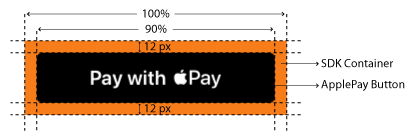

# Web

The [Checkout SDK](./) is a JavaScript library provided by Ottu that allows you to easily integrate an Ottu-powered [checkout process](./#ottu-checkout-sdk-flow) into your web application. With the Checkout SDK, you can customize the look and feel of your checkout process, as well as which forms of payment are accepted.

To use the Checkout SDK, you'll need to include the library in your web application and initialize it with your Ottu [merchant\_id](web.md#merchant\_id-string), [session\_id](web.md#session\_id-string), and [API key](../rest-api/authentication.md#public-key). You can also specify additional options such as, which forms of payment to accept, the [css](web.md#css-object) styling for the checkout interface, and more.


Please note that the Checkout SDK requires the implementation of the [Checkout API](../rest-api/checkout-api.md) in order to function properly.

For optimal security, call REST APIs from server-side implementations, not client-side applications such as mobile apps or web browsers.


## [Checkout SDK](web.md#checkout-sdk)

## [Demo](web.md#demo)

Below is a demo of the Checkout SDK in action. This demo shows how the Checkout SDK can be used to create a streamlined checkout experience for customers, with support for multiple forms of payment and a customizable interface.



#### [Installation](web.md#installation)

To install the Checkout SDK, you'll need to include the library in your web application by adding a script tag to your HTML section. You can do this by using the following code snippet:

```html
<head>
    <script src="https://assets.ottu.net/checkout/v2/checkout.min.js" 
     data-error="errorCallback" data-cancel="cancelCallback"
     data-success="successCallback" 
     data-beforeredirect="beforeRedirect"></script>
 </head>
```

Replace [errorCallback](web.md#window.errorcallback), [cancelCallback](web.md#window.cancelcallback), [successCallback](web.md#window.successcallback), and [beforeRedirect](web.md#window.beforeredirect) with the names of your error handling, cancel handling, success handling, and before-redirect handling functions, respectively.

You're all set! You can now use the [Checkout SDK ](./)to create a checkout form on your web page and process payments through Ottu.

## [Functions](web.md#functions)

#### [**Checkout.init**](web.md#checkout.init)

Is the function that initializes the [checkout process](./#ottu-checkout-sdk-flow) and sets up the necessary configuration options for the [Checkout SDK](./). It needs to be called once on your web page to initialize the checkout process, and it must be called with a configuration object that includes all the necessary options for the checkout process.

When you call `Checkout.init`, the SDK will take care of setting up the necessary components for the checkout process, such as creating a form for the customer to enter their payment details, and handling communication with Ottu's servers to process the payment.

#### [**Checkout.reload**](web.md#checkout.reload)

The `Checkout.reload` function in the Checkout SDK is used to refresh the SDK. It's useful when you want to reload the **content** of the SDK after an **error** has occurred or when the content needs to be **refreshed**.

Here's an example of how `Checkout.reload` might be called:

```javascript
Checkout.reload();
```

In this example, the `Checkout.reload` function is called to refresh the content of the SDK. This can be useful when an error has occurred and the content needs to be reloaded or refreshed.

#### [**Properties** ](web.md#properties)

#### [**selector**](web.md#selector-string)  _<mark style="color:blue;">**`string`**</mark>_

The `selector` property in the Checkout SDK is used to specify the `css` selector for the HTML element that will contain the checkout form. This is typically a `<div>` element on your web page.

To specify the selector, you can add a `<div>` element to your web page with a unique `id` attribute, like this:

```html
<div id="checkout"></div>
```

In this example, the `id` attribute of the `<div>` element is set to `"checkout"`. This means that the `selector` property in `Checkout.init` should be set to `"checkout"`.

It's important to note that the `selector` property must be the ID of the HTML element that will contain the checkout form. This is because the Checkout SDK replaces the contents of the specified element with the checkout elements.

Here's an example of how `Checkout.init` might be called with a `selector` property:

```javascript
Checkout.init({
    selector: 'checkout', 
    ... // other properties
});
```

In this example, the `selector` property is set to `"checkout"`, which means that the checkout form will be contained in the `<div>` element with `id="checkout"`.

#### [**merchant\_id**](web.md#merchant\_id-string)  _<mark style="color:blue;">**`string`**</mark>_

The `merchant_id` specifies your Ottu merchant domain. This should be the root domain of your Ottu account, without the "https://" or "http://" prefix.

For example, if your Ottu URL is `https://example.ottu.com`, then your `merchant_id` is **example.ottu.com**. This property is used to identify which Ottu merchant account the checkout process should be linked to.

#### [**apiKey**](web.md#apikey)

The `apiKey` is your Ottu [API public key](../rest-api/authentication.md#public-key). This key is used for authentication purposes when communicating with Ottu's servers during the checkout process.

According to the REST [API documentation](../rest-api/), the `apiKey` property should be set to your Ottu  [API public key](../rest-api/authentication.md#public-key).


Ensure that you utilize the public key and refrain from using the private key. The private key should remain confidential at all times and must not be shared with any clients.


#### [**session\_id**](web.md#session\_id-string) _<mark style="color:blue;">**`string`**</mark>_

The `session_id` is the unique identifier for the payment transaction associated with the checkout process.

This unique identifier is automatically generated when the payment transaction is created. For more information on how to use the `session_id` parameter in the Checkout API, see [session\_id](../rest-api/checkout-api.md#session\_id-string-read-only).

#### [**lang**](web.md#lang-string) _<mark style="color:blue;">**`string`**</mark>_

The `lang` property is used to specify the language in which the checkout elements should be displayed. This property can be set to either `"en"` (for English) or `"ar"` (for Arabic).

When `lang` is set to `"en"`, the checkout form will be displayed in English, and when it's set to `"ar"`, the checkout elements will be displayed in Arabic. Additionally, when the `lang` parameter is set to `"ar"`, the layout will switch to right-to-left (RTL) to accommodate Arabic script. \
For more information on how to use lang parameter in the Checkout API, see [lang](../rest-api/checkout-api.md#language-string-optional).

#### [**formsOfPayment**](web.md#formsofpayment-array) _<mark style="color:blue;">**`array`**</mark>_

`formsOfPayment` allows you to customize which forms of payment will be displayed in your checkout process. By default, all forms of payment are configured.

The available options for `formsOfPayment` are:

* `"applePay"`: The Apple Pay payment method that allows customers to make purchases using their Apple Pay-enabled devices.
* `"googlePay"`: The Google Pay payment method that allows customers to make purchases using their Google wallet cards linked in google accounts.
* `"ottuPG"`: A method that redirects customers to a page where customers enter their credit or debit card details to make a payment.
* `"tokenPay"`: A payment method that uses tokenization to securely store and process customers' payment information.
* `"redirect"`: A method where customers are redirected to a payment gateway or a third-party payment processor to complete their payment.
* `"stcPay"`: A method where customers enter their mobile number and provide an OTP send to their mobile number to complete their payment.

This property can be particularly useful when you want to customize the checkout process and display only specific forms of payment, such as only displaying the Apple Pay button and hiding the other payment options.

#### [**css** ](web.md#css-object) _<mark style="color:blue;">**`object`**</mark>_

`css` can be used to override some of the elements rendered by the SDK to better integrate with your website.

There are several `css` classes that can be overridden using the [css](web.md#css-object) property, including:

* `.ottu__sdk-main`: the class of the div which wraps all the elements of the container. It's useful to override this when you want to modify the size of the rendered content by the SDK.
* `.ottu__sdk-apple-pay-button-type`: specifies the button type of the Apple Pay button. This class defaults to `pay` and if there is no card in the wallet, it will automatically change to `setUp`. More information can be found on the ApplePay official documentation for [ApplePay Button Type](https://developer.apple.com/documentation/apple\_pay\_on\_the\_web/applepaybuttontype).
* `.apple-pay-button`: the class of the Apple Pay button, which is a `div`. It can be customized for width, padding, margin, and more. Useful to customize when `formsOfPayment` is configured to display only the Apple Pay button.

Here's an example of how [Checkout.init](web.md#checkout.init) might be called with a  [css](web.md#css-object) property to customize the `.ottu__sdk-main` class, `.ottu__sdk-apple-pay-button-type` class, and `.apple-pay-button` class:

```javascript
Checkout.init({
    selector: 'checkout',
    merchant_id: 'domain',
    session_id: 'session_id',
    apiKey: 'api_key',
    formsOfPayment: ['applePay', 'tokenPay', 'redirect'],
    css: `
    .ottu__sdk-main {
      flex-basis: 100%;
      justify-content: center;
      width: 150px!important;
      max-width: 150px!important;
    }
    .ottu__sdk-apple-pay-button-type {
      -apple-pay-button-type: check-out;
    }
    .apple-pay-button {
      width: 90%;
      padding-top: 0px;
      margin-top: 12px;
      margin-bottom: 12px;
    }
  `
});
```

In this example, the [css](web.md#css-object) property is set to override the `.ottu__sdk-main`, `.ottu__sdk-apple-pay-button-type`, and `.apple-pay-button` classes with new styles. The updated styles for these classes will be applied to the checkout container when it's rendered by the SDK.

#### [googlePayInit](web.md#googlepayinit-object) <mark style="color:blue;">`object`</mark>

The `googlePayInit` object enables users to modify the Google Pay configurations used for generating payment sessions through Google Pay. By default, all options are pre-configured. However, developers have the flexibility to customize these configurations using `googlePayInit` according to their requirements by utilizing the options outlined in the documentation [here](https://developers.google.com/pay/api/web/reference/request-objects.). \
Additionally, the `buttonStyles` property allows users to customize the `css` of the Google button in the SDK, making it easier to integrate with your website.

* **buttonStyles** <mark style="color:blue;">**`object`**</mark>\
  The `buttonStyle` is an object in the Google Pay API that enables merchants to customize the default styling properties of the Google Pay button. This object provides options to modify the width, margin-top, and margin-bottom of the button. By utilizing the `ButtonStyle` object, merchants can tailor the appearance of the Google Pay button to align with their website or app design.\
  Default `css` is:  **width: 90%**, **margin-top: 12px**, **margin-bottom: 12px**.

**Example**

To display only the Google Pay button, use the following code:

```javascript
Checkout.init({
      selector: "checkout",
      merchant_id:"merchant.ottu.dev",
	formsOfPayment: ["googlePay"],
	// ...mandatory properties,
googlePayInit: {
 		apiVersion: 2,
 		apiVersionMinor: 0,
 		allowedCardNetworks: ["AMEX", "DISCOVER", "INTERAC", "JCB", "MASTERCARD", "VISA"],
 		allowedCardAuthMethods:  ["PAN_ONLY", "CRYPTOGRAM_3DS"],
 		tokenizationSpecificationType: 'PAYMENT_GATEWAY',
 		totalPriceStatus: 'FINAL',
 		totalPriceLabel: 'TOTAL',
 		buttonType: 'buy',
 		buttonLocale: 'en',
 		buttonStyles: {
   			'width': '90% !important',
   			'margin-top': '12px !important',
   			'margin-bottom': '12px !important',
 		}
},
}
```

**Example**

<mark style="color:blue;">**HTML**</mark>

```javascript
<div id="checkout"></div>
```

<mark style="color:blue;">**Javascript**</mark>

```javascript
Checkout.init({
    selector: "checkout",
    merchant_id: "",
    session_id: "",
    apiKey: "",
    lang: "en",
    formsOfPayment: ['applePay', 'tokenPay', 'ottuPG', 'redirect', 'googlePay', 'stcPay']
    css: `
        ottu__sdk-main {
        flex-basis: 100%;
        justify-content: center;
        width: 150px!important;
        max-width: 150px!important;
    }`
});
```

#### [**Checkout.showErrorPopup(message, pg\_response)**](web.md#checkout.showerrorpopup-message-pg\_response)

Is a function that shows an error message in a popup on the screen. The message parameter must be a string, and the optional `pg_response` parameter is an object that displays key-value pairs representing object values within the popup.

* **message** <mark style="color:blue;">**`string`**</mark>\
  The message for a failed payment can be displayed to the customer.
* **pg\_response** <mark style="color:blue;">**`object`**</mark>\
  The raw response data that was received directly from the payment gateway after the transaction attempt. This typically includes transaction status, transaction identifier, and potentially error messages or additional data provided by the gateway.

#### Example

`Checkout.showErrorPopup('Selected payment method failed. Try again.' , { "merchant":"009057332", "timeOfLastUpdate":"2023-08-01T14:19:00.510Z", "version":"65" })`

<figure><figcaption></figcaption></figure>

`Checkout.showErrorPopup('Selected payment method failed. Try again.' , cancel.payment_gateway_info.pg_response)`

<figure><figcaption></figcaption></figure>

## [Callbacks](web.md#callbacks)

In the Checkout SDK, callback functions play a vital role in providing real-time updates on the status of payment transactions. `Callbacks` enhance the user experience by enabling seamless and efficient handling of various payment scenarios, such as errors, successful payments, and cancellations.

Please note that due to technical constraints associated with off-site redirection during the payment process, the `successCallback` and `cancelCallback` functions are only called for on-site checkouts. However, the `errorCallback` function is called for any kind of payments. On-site checkouts include options such as Apple Pay, Google Pay, payments with saved cards, and on-site card form transactions, which support callback functionality for a seamless user experience.

#### [**window.errorCallback**](web.md#window.errorcallback)

The `errorCallback` is a callback function that is invoked when issues arise during a payment. It is important to handle errors appropriately to ensure a smooth user experience. The recommended best practice in case of an error is to restart the checkout process by creating a new [session\_id](../rest-api/checkout-api.md#session\_id-string-mandatory) using the [Checkout API](../rest-api/checkout-api.md).

To define the `errorCallback` function, you can use the `data-error` attribute on the Checkout script tag to specify a global function that will handle errors. If an error occurs during a payment, the `errorCallback` function will be invoked with an `error` object.

The `error` object has the following properties:

* `status`: A string indicating the status of the payment transaction. The only value that will be passed to the `errorCallback` is `"error"`.
* `message`: A string containing a description of the error that occurred.

Here's an example of how `errorCallback` might be defined:

```html
<head>
    <script src="https://assets.ottu.net/checkout/v2/checkout.min.js" data-error="errorCallback"></script>
    <script>
        function errorCallback(error) {
          console.log(error);
          // handle error - redirect to payment page
          window.location.href = "https://payment.example.com";
        }
    </script>
</head>
```

In this example, the `errorCallback` function is defined and passed as the value of the `data-error` attribute on the Checkout script tag. If an error occurs during a payment, the function will be invoked with an `error` object. The function will then handle the error as needed and redirect the customer to `https://payment.example.com`.


`errorCallback` function is not required to perform a redirection. It can handle errors in any way that is appropriate for your application.


#### [**window.cancelCallback**](web.md#window.cancelcallback)

The `cancelCallback` in the Checkout SDK is a callback function that is invoked when a payment is canceled.

To define the `cancelCallback` function, you can use the `data-cancel` attribute on the Checkout script tag to specify a global function that will handle cancellations. If a customer cancels a payment, the `cancelCallback` function will be invoked with a [data object](web.md#data-object).

`cancelCallback` receives a [data object](web.md#data-object),  where the `data.status` is `"canceled"`.

Here's an example of how `cancelCallback` might be defined:

```javascript
window.cancelCallback = function (data) {
    console.log(data);
    // handle cancellation
    Checkout.reload();
};
```

In this example, the `cancelCallback` function is defined and passed as the value of the `data-cancel` attribute on the Checkout script tag. If a customer cancels a payment, the function will be invoked with a [data object](web.md#data-object) containing information about the cancelled transaction. The function will then handle the cancellation as needed and refresh the Checkout SDK with [Checkout.reload()](web.md#checkout.reload).

#### [**window.successCallback**](web.md#window.successcallback)

The `successCallback` in the Checkout SDK is a `callback` function that is invoked when the payment process has been completed successfully.

Here's an example of how `successCallback` might be defined:

```javascript
window.successCallback = function (data) {
    window.location.href = data.redirect_url;
};
```

`successCallback` receives a [data object](web.md#data-object), where the `data.status` is `"success"`.

In this example, the `successCallback` function is defined and passed as the value of the `data-success` attribute on the Checkout script tag. If the payment process completes successfully, the function will be invoked with a [data object](web.md#data-object) containing information about the completed transaction. The function will then redirect the customer to the specified `redirect_url` using `window.location.href`.

**Example**

```javascript
window.successCallback = function (data) {
    data = {
        "status": "success",
        "message": "Payment operation completed successfully.",
        "session_id": "",
        "order_no": "",
        "operation": "pay",
        "reference_number": "",
        "redirect_url": "https://payment.example.com/success"
    };

    window.location.href = data.redirect_url;
};
```

#### [**window.beforeRedirect**](web.md#window.beforeredirect)

For `redirect` checkout processes, you may want to freeze the customer's basket before the customer is redirected to the payment page. The Checkout SDK provides a `beforeRedirect` callback that you can use to perform any necessary actions before the redirection occurs.

To define the `beforeRedirect` callback, you can use the `data-beforeredirect` attribute on the Checkout script tag to specify a global function that will handle the callback. This function should return a [Promise](https://developer.mozilla.org/en-US/docs/Web/JavaScript/Reference/Global\_Objects/Promise) that resolves when the necessary actions are complete.

Here's an example of how to define the `beforeRedirect` callback:

```html
<head>
    <script src="https://assets.ottu.net/checkout/v2/checkout.min.js" data-beforeredirect="beforeRedirect"></script>
    <script>
        window.beforeRedirect = function() {
            // Freeze the customer's basket while waiting for an API response
            return new Promise(function(resolve, reject) {
                // Send a request to your API to freeze the customer's basket
                fetch('https://api.yourdomain.com/basket/freeze', {
                        method: 'POST'
                    })
                    .then(function(response) {
                        // If the API response is successful, resolve the Promise
                        if (response.ok) {
                            resolve(true);
                        } else {
                            // If the API response fails, reject the Promise
                            reject(new Error('Failed to freeze basket'));
                        }
                    })
                    .catch(function(error) {
                        // If the API request fails, reject the Promise
                        reject(error);
                    });
            });
        }
    </script>
</head>
```

In this example, the `beforeRedirect` callback sends a request to an API endpoint to freeze the customer's basket while waiting for the redirection to occur. If the API response is successful, the Promise is resolved and the redirection proceeds. If the API request fails or the response is unsuccessful, the Promise is rejected and the redirection is cancelled.

#### [**data Object**](web.md#data-object)

The data object received by the [cancelCallback](web.md#window.cancelcallback) and [successCallback](web.md#window.successcallback) contains information related to the payment transaction, such as the status of the payment process, the [session\_id](web.md#session\_id-string) generated for the transaction, any error message associated with the payment, and more. This information can be used to handle the payment process and take appropriate actions based on the status of the transaction.

* **Data object child parameters**
  *   #### **message**<mark style="color:blue;">**`string`**</mark>

      It is a string message that can be displayed to the customer. It provides a customer-friendly message regarding the status of the payment transaction.
  * **session\_id **<mark style="color:blue;">**`string`**</mark>\
    It is a unique identifier generated when a payment transaction is created. It is used to associate a payment transaction with the checkout process. You can find the `session_id` in the response of the Checkout API's [session\_id](../rest-api/checkout-api.md#session\_id-string-read-only) endpoint. This parameter is required to initialize the Checkout SDK.
  *   &#x20;**status **<mark style="color:blue;">**`string`**</mark>

      It is of the checkout process. Possible values are:

      * `success`: The customer was charged successfully, and they can be redirected to a success page or display a success message.
      * `canceled`: The payment was either canceled by the customer or rejected by the payment gateway for some reason. When a payment is canceled, it's typically not necessary to create a new payment transaction, and the same [session\_id](web.md#session\_id-string-1) can be reused to initiate the Checkout SDK and allow the customer to try again. By reusing the same session\_id, the customer can resume the checkout process without having to re-enter their payment information or start over from the beginning.
      * `error`: An error occurred during the payment process, This can happen for a variety of reasons, such as a network failure or a problem with the payment gateway's system. The recommended action is to create a new payment transaction using the Checkout API and restart the checkout process.
  * **redirect\_url **<mark style="color:blue;">**`UR`**</mark>`L`\
    The URL which is provided in Checkout API for redirect\_url. See [Checkout API ](../rest-api/checkout-api.md)& [redirect\_url](../rest-api/checkout-api.md#redirect\_url-url-optional).
  * &#x20;**order\_no **<mark style="color:blue;">**`string`**</mark>\
    The order number provided in the [Checkout API](../rest-api/checkout-api.md). See [Checkout API](../rest-api/checkout-api.md) & [order\_no](../rest-api/checkout-api.md#order\_no-string-optional).
  *   #### **reference\_number**<mark style="color:blue;">**`string`**</mark>

      A unique identifier associated with the payment process. It is sent to the payment gateway as a unique reference and can be used for reconciliation purposes.
  *   #### form\_of\_payment <mark style="color:blue;">`string`</mark>

      The form of payment which was used to process the payment. This could be one of several values, such as\
      Enum: `"apple_pay"`, `"google_pay"`, `"token_pay"`, `"stc_pay"`.
  * **payment\_gateway\_info** <mark style="color:blue;">**`object`**</mark>\
    Information about the payment gateway, accompanied by the response received from the payment gateway
    *   **pg\_code **<mark style="color:blue;">**`string`**</mark>

        The unique identifier, or `pg_code`, for the payment gateway that was used to process the  payment. This value corresponds to the specific payment method utilized by the customer, such as `credit-card`.
    *   **pg\_name **<mark style="color:blue;">**`string`**</mark>

        The name of the payment gateway, represented in all lowercase letters, that was used to perform the payment. This could be one of several values, such as `kpay` (for KNET), `mpgs`, or `cybersource`. These identifiers provide a human-readable way to understand the payment mechanism that was utilized.
    *   **pg\_response **<mark style="color:blue;">**`object`**</mark>

        The raw response data that was received directly from the payment gateway after the transaction attempt. This typically includes transaction status, transaction identifier, and potentially error messages or additional data provided by the gateway.

## [**Extended example**](web.md#extended-example)

```html
<!-- HTML -->
<div id="checkout"></div>
<script src="https://assets.ottu.net/checkout/v2/checkout.min.js"
  data-error="errorCallback"
  data-success="successCallback"
  data-cancel="cancelCallback">
</script>

```

```javascript
// JS
// Error callback function
window.errorCallback = function(error) {
  let validFormsOfPayments = ['apple_pay', 'google_pay' , 'stc_pay'];
  if (!validFormsOfPayments.includes(error.form_of_payment)) {
    const message = "Oops, something went wrong. Refresh the page and try again.";
    window.Checkout.showErrorPopup(error.message || message);
  }
  console.log('Error callback', error);
};

// Success callback function
window.successCallback = function(success) {
  window.location.href = success.redirect_url;
};

// Cancel callback function
window.cancelCallback = function(cancel) {
  if (cancel.payment_gateway_info && cancel.payment_gateway_info.pg_name === "kpay") {
    window.Checkout.showErrorPopup('', cancel.payment_gateway_info.pg_response);
  }
  console.log('Cancel callback', cancel);
};

// Checkout init function
Checkout.init({
  selector: "checkout",
  merchant_id: "sandbox.ottu.net",
  session_id: "51436d465f77e59242ef25f15409c2f23fe54761",
  apiKey: "3bf2a041d0896419415feac3228b17e3ec53e793",
  lang: "en", // en or ar default en
  formsOfPayments: ['applePay', 'googlePay', 'stcPay', 'ottuPG', 'tokenPay', 'redirect'],
  css: `ottu__sdk-main {
    flex-basis: 100%;
    justify-content: center;
    width: 150px!important;
    max-width: 150px!important;
  }
  .apple-pay-button {
    width: 90%;
    margin-top: 12px;
    margin-bottom: 12px;
  }`,
  googlePayInit: {
    apiVersion: 2,
    apiVersionMinor: 0,
    allowedCardNetworks: ['AMEX', 'DISCOVER', 'INTERAC', 'JCB', 'MASTERCARD', 'VISA'],
    allowedCardAuthMethods: ['PAN_ONLY', 'CRYPTOGRAM_3DS'],
    tokenizationSpecificationType: 'PAYMENT_GATEWAY',
    baseCardPaymentMethodType: null,
    paymentsClient: null,
    totalPriceStatus: 'FINAL',
    totalPriceLabel: 'Total',
    buttonType: 'buy',
    buttonLocale: 'en',
    buttonStyles: {
      'width': '90%',
      'margin-top': '12px',
      'margin-bottom': '12px',
    },
  },
});

```

## [Apple Pay](web.md#apple-pay)

If you have completed the [Apple Pay integration](web.md#apple-pay) between Ottu and Apple, the Checkout SDK will automatically make the necessary checks to display the Apple Pay button.

When you initialize the Checkout SDK with your [session\_id](web.md#session\_id-string) and payment gateway [codes](../rest-api/checkout-api.md#pg\_codes-list-required), the SDK will automatically verify the following conditions:

* When initializing the Checkout SDK, a [session\_id](web.md#session\_id-string) with a [pg\_codes](../rest-api/checkout-api.md#pg\_codes-list-required) that was associated with the Apple Pay Payment Service was supplied.
* The customer has an Apple device that supports Apple Pay payments.
* The browser being used supports Apple Pay.
* The customer has a wallet configured on their Apple Pay device.

If all of these conditions are met, the Apple Pay button will be displayed and available for use in your checkout flow. If the wallet is not configured, the Apple Pay button will still appear, but with [setUp type](https://developer.apple.com/documentation/passkit/pkpaymentbuttontype/setup). Clicking on the `setUp` button Apple Pay wallet on their device will open, allowing them to configure it and add payment cards.

By default, the type of the Apple Pay button is [pay](https://developer.apple.com/documentation/passkit/pkpaymentbuttontype/instore), which is used to initiate a payment. However, you can override the default button type using the css init property of the Checkout SDK.

#### [Customize Apple Pay button](web.md#customize-apple-pay-button)


If you're using only the Apple Pay button from the Checkout SDK and want to customize its appearance, it's important to follow the [Apple Pay guidelines](https://developer.apple.com/design/human-interface-guidelines/technologies/apple-pay/buttons-and-marks) to ensure that your design is consistent with Apple's requirements. Failure to follow the guidelines could result in your app being rejected or your developer account being banned by Apple.


It's the responsibility of the merchant to ensure that their use of the Apple Pay button follows Apple's guidelines, and Ottu cannot be held responsible for any issues that arise from non-compliance. If you have any questions or concerns about using the Apple Pay button, please consult the [Apple Pay guidelines](https://developer.apple.com/design/human-interface-guidelines/technologies/apple-pay/buttons-and-marks) or contact Apple directly for assistance.

If you only want to use Apple Pay with the Ottu Checkout SDK and control the other payment methods yourself, you can customize the Apple Pay button using the Checkout SDK's [formsOfPayment](web.md#formsofpayment-array) and [css](web.md#css-object) properties.

To display only the Apple Pay button with default css, use the following code:

```javascript
Checkout.init({
    ... // define the mandatory properties
   formsOfPayment: ["applePay"]
});
```

The [formsOfPayment](web.md#formsofpayment-array) property tells the Checkout SDK to render only the Apple Pay button. If you don't include this property, the SDK will render all available payment options.

To customize the Apple Pay button's appearance, you can use the [css](web.md#css-object) property. The example below adjusts the size of the button and centers it within the Checkout SDK container:

```javascript
Checkout.init({
    ... // define the mandatory properties
    formsOfPayment: ["applePay"],
    css: `
        .ottu__sdk-main {
            flex-basis: 100%;
            justify-content: center;
            width: 150px!important;
            max-width: 150px!important;
        }
        .ottu__sdk-apple-pay-button-type {
            -apple-pay-button-type: check-out;
        }
        .apple-pay-button {
            width:100%;
            padding-top:0px;
            margin-top:18px;
            margin-bottom:18px;
        }
    `
});
```

The Apple Pay button inside the Checkout SDK container can be customized using the [css](web.md#css-object) property by defining the following css classes:

* `.ottu__sdk-apple-pay-button-type`: This class determines the type of the Apple Pay button. For example, setting `-apple-pay-button-type: plain` will render a plain Apple Pay button, while setting it to `buy` or `donate` will render buttons with the corresponding labels.
* `.apple-pay-button`: This class sets the width, margin, and padding of the button.

By default, the width of the Apple Pay button is 90% of the Checkout SDK container width, with top and bottom margins of 12px. The Checkout SDK creates a containerized `div` with the css class `ottu__sdk-main` and places the Apple Pay button inside it. This container has no margin or padding added, as shown in below figure.

<figure><figcaption></figcaption></figure>

To learn more about the `css` property, see the [css](web.md#css-object).

## [Google Pay](web.md#google-pay)

If you have completed the Google Pay integration between Ottu and Google Pay, the Checkout SDK will handle the necessary checks to display the Google Pay button seamlessly.

When you initialize the Checkout SDK with your [session\_id](../rest-api/checkout-api.md#session\_id-string-mandatory) and payment gateway codes [pg\_codes](../rest-api/checkout-api.md#pg\_codes-array-required) , the SDK will automatically verify the following conditions:

* The `session_id` and `pg_codes` provided during SDK initialization must be associated with the Google Pay Payment Service. This ensures that the Google Pay option is available for the customer to choose as a payment method.
* Web SDK checks if the merchant configuration for Google Pay is correct or not and then show Google Pay button based on it.
* The Web SDK displays the Google Pay button irrespective of whether the customer's Google Pay wallet is configured. When the customer clicks the button, they are prompted to log in with their email and add their card if their wallet is not set up.

Google Pay configuration is controlled by using [googlePayInit](web.md#googlepayinit-object) object.

**Customize Google Pay button**

You can customize the Google Pay button using the Checkout SDK's [formsOfPayment](web.md#formsofpayment-array) and [css](web.md#css-object) properties. The [formsOfPayment](web.md#formsofpayment-array) property tells the Checkout SDK to render only the Google Pay button. If you don't include this property, the SDK will render all available payment options.

## [**KNET - Apple Pay**](web.md#knet-apple-pay)

Due to compliance requirements, KNET requires a popup displaying the payment result after each failed payment. This is available only on the cancelCallback when there is a response from the payment gateway. As a side effect, the user can not try again the payment without clicking on Apple Pay again.


The use of the popup notification described above is specific to the KNET payment gateway. Other payment gateways might have different requirements or notification mechanisms, so be sure to follow the respective documentation for each payment gateway integration.


To properly handle the popup notification for KNET, you need to implement the provided code snippet into your payment processing flow. The code looks like this:

```javascript
window.cancelCallback = function(cancel) {
  if (cancel.payment_gateway_info && cancel.payment_gateway_info.pg_name === "kpay") {
    const errorMessage = cancel.payment_gateway_info.pg_response || "Payment was cancelled.";
    window.Checkout.showErrorPopup(errorMessage);
  }
  console.log('Cancel callback', cancel);
};
```

The above code performs the following checks and actions:

1. It first verifies if the `cancel` object contains information about the payment gateway (`payment_gateway_info`).
2. Next, it checks if the `pg_name` property in `payment_gateway_info` is equal to `"kpay"`, indicating that the payment gateway used is indeed KNET.
3. If the above conditions are met, it retrieves the payment gateway's response from the `pg_response` property or, if not available, uses a default "Payment was cancelled." error message.
4. Finally, it displays the error message in a popup using the `window.Checkout.showErrorPopup()` function to notify the user about the failed payment.

<figure><figcaption></figcaption></figure>
