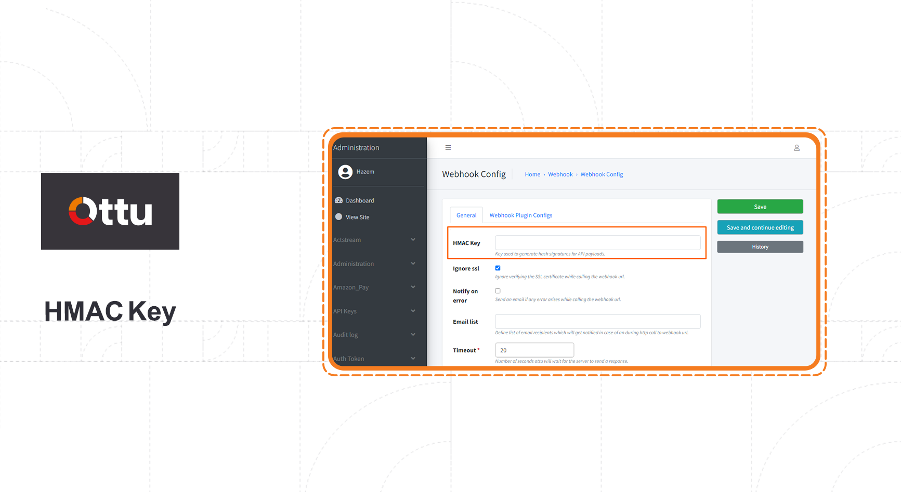

# Hash Signature

## [Hash-signature](hash-signature.md#hash-signature)

### <mark style="color:blue;"></mark>[What is hashing](hash-signature.md#what-is-hashing)

Hashing is the process of converting an input of any length into a fixed sized string of text involving a mathematical function, this generates an array of letters and number through an algorithm.

#### Hashing process key features

Represent data as a short string.

* Impossible to recover the data from the produced hashing output.
* Verify the downloaded document.
* Using for digital signature (authentication, non-repudiation and integrity).

#### Hash-signature

Digital signature can be generated, when hashes with asymmetric encryption were combined. This provides:

**Integrity:** The message was received is the same message that originally was sent. **Authentication:** The message which received is really sent by sender.\
**Non-repudiation:** The received message is not fake or provide by third party.

## <mark style="color:blue;"></mark>[Ottu hash-signature](hash-signature.md#ottu-hash-signature)

Ottu using hash-signature to support the security and trustability, by hashing part of the payload parameters and send hash-signature with every payload. This allows Ottu to ensure the data has not modified or cut within the payment transition process.

### [Algorithm used](hash-signature.md#algorithm-used)

SHA256

### <mark style="color:blue;"></mark>[Fields used](hash-signature.md#fields-used)

**amount**

**currency\_code**

**customer\_first\_name**&#x20;

**customer\_last\_name**

**customer\_email**

**customer\_phone**&#x20;

**customer\_address\_line1**

**customer\_address\_line2**

**customer\_address\_city**

**customer\_address\_state**

**customer\_address\_country**&#x20;

**customer\_address\_postal\_code**

**gateway\_name**&#x20;

**gateway\_account**

**order\_no**&#x20;

**reference\_number**

**result**&#x20;

**state**

### <mark style="color:blue;"></mark>[Ottu hash-signature key](hash-signature.md#ottu-hash-signature-key)

Ottu using the key defined by the merchant.

<figure><figcaption></figcaption></figure>

&#x20; **Fill the Key field and click save.**&#x20;

<figure><figcaption></figcaption></figure>

## <mark style="color:blue;"></mark>[Ottu signing API](hash-signature.md#ottu-signing-api)

In order to ensure that the hashing is completed properly, Ottu uses a signing API. Signing API should be limited to validation of implementation, not signing of responses.

***

**End point** \<ottu-url>/b/pbl/v2/sign

**Request body**

```json
{
   "amount":"86.00",
   "currency_code":"KWD",
   "customer_first_name":"example-customer"
}
```

**Response body**

```json
{
   "signature":"5ea4c38edb1133e6ea5ba25322ce486c435ab04f14f20dae056a09e14946847a"
}
```

## [Implementation (Hash-signature)](hash-signature.md#implementation-hash-signature)

### [Same hashing key](hash-signature.md#same-hashing-key)

#### Hash-signature (developing side)

**Hashing KEY=3323232**

```json
our key: 3323232
message-before---->:
 [('amount', '86.00'), 
('currency_code', 'KWD'), ('customer_first_name', 'example-customer')]
message-after-----> amount86.00currency_codeKWDcustomer_first_nameexample-customer

------- HASHING IS DONE ----------
Out[2]: ('5ea4c38edb1133e6ea5ba25322ce486c435ab04f14f20dae056a09e14946847a')
```

#### Hash-signature (Ottu Signing API)

**Hashing KEY=3323232**

**End point** \<ottu-url>/b/pbl/v2/sign

**Request body**

```json
{
   "amount":"86.00",
   "currency_code":"KWD",
   "customer_first_name":"example-customer"
}
```

**Response body**

```json
{
   "signature":"5ea4c38edb1133e6ea5ba25322ce486c435ab04f14f20dae056a09e14946847a"
}
```


The generated hash-signature by two sides are exactly the same.


### [Different hashing key](hash-signature.md#different-hashing-key)

#### Hash-signature (developing side)

**Hashing KEY=3323232**

```json
our key: 3323232
message-before---->:
 [('amount', '86.00'), 
('currency_code', 'KWD'), ('customer_first_name', 'example-customer')]
message-after-----> amount86.00currency_codeKWDcustomer_first_nameexample-customer

------- HASHING IS DONE ----------
Out[2]: ('5ea4c38edb1133e6ea5ba25322ce486c435ab04f14f20dae056a09e14946847a')
```

#### Hash-signature (Ottu Signing API)

**Hashing KEY=1234** From the merchant dashboard administration panel, change the Hashing KEY to 1234

**Request body**

```json
{
   "amount":"86.00",
   "currency_code":"KWD",
   "customer_first_name":"example-customer"
}
```

**Response body**

```json
{
   "signature":"5ea4c38edb1133e6ea5ba25322ce486c435ab04f14f20dae056a09e14946847a"
}
```


The generated hash-signatures by two sides are not the same.&#x20;


## [API whitelisting](hash-signature.md#api-whitelisting)

Ottu enables merchant(s) to determine the IP list for accessing the API.

.png>)

**Check Enable API, and fill the IP address, then click save button.**&#x20;

 (1).png>)

In conjunction with the payment transaction type, the whitelisting IP address should be applied to the checkout API. For instance, type of payment transaction is ecommerce.

 (1).png>)

**Fill the IP address, then click save button.**&#x20;

 (1).png>)
