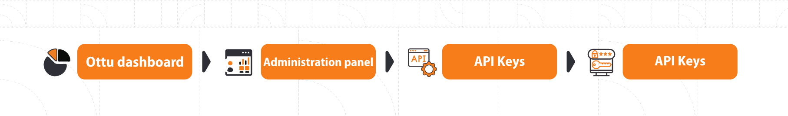

# Authentication

## [Authentication types](authentication.md#authentication-types)

Ottu works with three authentication types:

[ Basic authentication](authentication.md#basic-authentication), [token authentication](authentication.md#token-authentication), and [API key](authentication.md#api-key).

### [Basic authentication](authentication.md#basic-authentication)

Username and password are required. \
The permission access for the user to be defined.

**It should be mentioned as below:**

<mark style="color:blue;">**Header:**</mark> Authorization

<mark style="color:blue;">**Username:**</mark>\*\*\*\*\*\*\*&#x20;

<mark style="color:blue;">**Password:**</mark>\*\*\*\*\*\*\*

### [Token authentication](authentication.md#token-authentication)

It is obsolete and only for legacy.

### [API keys](authentication.md#api-keys)

#### **Private key**

This key is used when merchant's server communicates with Ottu API, it should not be embedded in SDKs or made it public.&#x20;

**It should be mentioned as below:**

<mark style="color:blue;">**Header:**</mark> Authorization

<mark style="color:blue;">**Value:**</mark> Api-Key \{{api\_key\}}

#### **Public key**

This key is used for SDKs such like Web, Android, iOS, or Flutter.

### [How to get API key](authentication.md#how-to-get-api-key)

#### [**Step 1**](authentication.md#step-1)

Click on add API key.

.png>)

#### [**Step 2**](authentication.md#step-2)

Fill the required fields and click save.

Name: _<mark style="color:red;">**`required`**</mark>_ Max length 50.

Revoke: _<mark style="color:blue;">**`optional`**</mark>_ once checked, the API key can not be used anymore.&#x20;

Expires: _<mark style="color:blue;">**`optional`**</mark>_ once the API gets expired, it can not be used anymore.

#### [Step 3](authentication.md#step-3)

Click on the created API key here is named as “Example”.

.png>)

**The API keys** [**private** ](authentication.md#private-key)**and** [**public**](authentication.md#public-key) **will be shown as below figure.**

<figure><figcaption></figcaption></figure>
