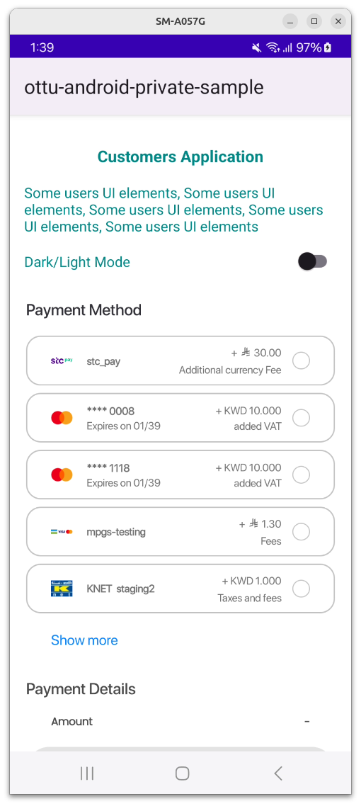

# Upload Attachment

The Upload Attachment API allows merchants to upload a file, generating a `file_url` that can be linked to transactions. Files can be uploaded independently or directly associated with a transaction by including [session\_id](checkout-api.md#session\_id-string-mandatory) or [order\_no](checkout-api.md#order\_no-string-optional) in the request.

#### [**Use Cases**](upload-attachment.md#use-cases)

* **Upload Before session\_id Generation**: Upload a file before creating a transaction, results generating `file_url`&#x20;
* **Upload After session\_id Generation**: Add files to an existing transaction by providing `session_id` or `order_no`.
* **Update File After Payment**: Replace an attached file after payment by uploading a new file to be associated with the existing transaction (i.e., attach the invoice).

#### [Specifications](upload-attachment.md#specifications)

* **Single file upload** per request.
* **Direct transaction linking** by including `session_id` or `order_no`.
* **Reusable file URLs** for new transactions using [attachment\_upload\_url ](checkout-api.md#attachment\_upload\_url-string-optional)in the [Checkout API](checkout-api.md).
* **Supports URL shortening** for easier access with `shortify_attachment_url` (when `session_id` or `order_no` is provided).
* **Maximum file size**: Upload limit is 2.5 MB.
* **Support for various file formats** such as PDF, JPEG, PNG, DOC, DOCX, JPG, XLS, XLSX, and TXT.

## [Setup ](upload-attachment.md#setup)

Before using the `Upload Attachment API`, ensure the following conditions and setup steps are met for successful integration.

* **File Format and Compatibility**\
  When uploading a file, ensure it complies with the accepted file formats: PDF, JPEG, PNG, DOC, DOCX, JPG, XLS, XLSX, and TXT. The API will only process files with these extensions.
* **Request Body Format**\
  All request parameters, must be sent using `multipart/form-data`. JSON format is not supported.&#x20;

**Options for Using the `Upload Attachment API`:**

### [**Upload Before session\_id Generation**](upload-attachment.md#upload-before-session\_id-generation)

For cases where a file needs to be uploaded to the server before creating any transaction.

* **Upload the file independently** to generate a `file_url`.
* **Use the generated** `file_url` by adding it to the [attachment\_upload\_url](checkout-api.md#attachment\_upload\_url-string-optional) parameter in the [Checkout API](checkout-api.md) when creating the transaction.

### [**Upload After session\_id Generation**](upload-attachment.md#upload-after-session\_id-generation)

For cases where a file is uploaded to the server after the transaction has been created:

* **Create Transaction:** Creating a new transaction using [Checkout API](checkout-api.md). This will result generated [session\_id](checkout-api.md#session\_id-string-mandatory) and [order\_no](checkout-api.md#order\_no-string-optional) (if provided).
* **Include:** `session_id` or `order_no` in the `Upload Attachment API` request payload to link the file directly to an existing transaction.
* **URL Shortening (Optional)**: When providing `session_id` or `order_no`, you may set `shortify_attachment_url` to `true` to receive a shortened file URL.

## [Authentication ](upload-attachment.md#authentication)

**Supported Methods**

* [Private API Key](authentication.md#private-key-api-key)
* [Basic Authentication](authentication.md#basic-authentication)

For Further information, please refer to the [Authentication](upload-attachment.md#authentication) section.

## [How it works ](upload-attachment.md#how-it-works)

The `Upload Attachment API` supports two options for uploading the file.

### [Upload Before session\_id Generation ](upload-attachment.md#upload-before-session\_id-generation-1)

Upload a file before creating a transaction to generate a `file_url`. This `file_url` can then be included in the [attachment\_upload\_url](checkout-api.md#attachment\_upload\_url-string-optional) parameter of the [Checkout API](checkout-api.md) when the transaction is created. This approach is ideal when the file should be accessible from the start of the transaction process.

**1. Request Payload**

The merchant sends a request to the `Upload Attachment API`, using the following key parameters in a `multipart/form-data` format:

* `file` (**Required**): The actual file to be uploaded, in one of the supported formats PDF, JPEG, PNG, DOC, DOCX, JPG, XLS, XLSX, and TXT.

**2. Response Payload**

Once the upload is complete, the API response includes:

* `file_url`(**Mandatory**): The relative URL of the uploaded file in storage, which can be used to link the file to other transactions.
* `original_filename`(**Mandatory**): The original name of the uploaded file.


`file_url`is used  to link the uploaded file to a new transaction by adding it to the [attachment\_upload\_url](checkout-api.md#attachment\_upload\_url-string-optional) parameter in the [Checkout API](checkout-api.md) request.


### [Upload After session\_id Generation](upload-attachment.md#upload-after-session\_id-generation-1)

Upload a file after the transaction is created. Include [session\_id](checkout-api.md#session\_id-string-mandatory) or [order\_no ](checkout-api.md#order\_no-string-optional)in the upload request to link the file directly to the existing transaction. Optional URL shortening with `shortify_attachment_url` is available when `session_id` or `order_no` is provided. This scenario is helpful when file upload depends on transaction-specific data or upon successful transaction creation.

**1. Request Payload**

The merchant sends a request to the `Upload Attachment API`, using the following key parameters in a `multipart/form-data` format:

* `file` (**Required**): The actual file to be uploaded, in one of the supported formats PDF, JPEG, PNG, DOC, DOCX, JPG, XLS, XLSX, and TXT.
* `session_id` or `order_no`(**Required)**: To identify the transaction for which the file is being uploaded.&#x20;
* `shortify_attachment_url` (**Optional**): If set to `true`, the response will include a shortened URL for the uploaded attachment.

**2. Response Payload**

Once the upload is complete, the API response includes:

* `file_url`(**Mandatory**): The relative URL of the uploaded file in storage, which can be used to link the file to other transactions.
* `original_filename`(**Mandatory**): The original name of the uploaded file.
* `attachment_short_url`(**Conditional**): A shortened URL for the uploaded file, available only when:
  * `session_id` or `order_no` is provided.
  * `shortify_attachment_url` is set to true.


The generated `file_url` can be used to upload the file to different and multiple transactions, though not within the same API call.


## [API Schema Reference](upload-attachment.md#api-schema-reference)


[Ottu API - 2024-10-28T145733.228.yaml](<../.gitbook/assets/Ottu API - 2024-10-28T145733.228.yaml>)



## [Guide ](upload-attachment.md#guide)

This guide provides step-by-step instructions on how to use the `Upload Attachment API`. Follow these steps to successfully integrate and utilize the API.

### [Upload Before session\_id Generation](upload-attachment.md#upload-before-session\_id-generation-2)

Here only the `file` parameter is required in the `Upload Attachment API` request payload, as shown below:

**1. Upload Attachment Request Payload**

```bash
curl --location '<<ottu-url>>/checkout/v1/upload-attachment/' \
     --header 'Authorization: ••••••' \
     --form 'file=@example/Ottu_logo.png'
```

**2. Upload Attachment Response Payload**

```json
{
    "file_url": "payment_transactions/attachments/Ottu_logo_1F31q4q.png",
    "original_filename": "Ottu_logo.png"
}
```

After the file is uploaded, the API returns a `file_url`. This URL can be used to link the uploaded file to a new transaction by including it in the [attachment\_upload\_url](checkout-api.md#attachment\_upload\_url-string-optional) parameter of the [Checkout API](checkout-api.md) request payload.

**3. Checkout Request Payload**

```json
{
    "type": "payment_request",
    "pg_codes": ["credit-card"],
    "amount": "1",
    "attachment_upload_url":"payment_transactions/attachments/Ottu_logo_1F31q4q.png",
    "currency_code": "SAR"
}
```

**4. Checkout Response Payload**

```json
{
    "attachment": "<<ottu_url>>/media/payment_transactions/attachments/Ottu_logo.png",
    "attachment_upload_url": "payment_transactions/attachments/Ottu_logo_1F31q4q",
    /// rest of checkout response parameters
}
```

### [**Upload After session\_id Generation**](upload-attachment.md#upload-after-session\_id-generation-2)

The transaction identifiers must be included in the `Upload Attachment API` request payload.

**1. Create a Payment Transaction**\
Before uploading an attachment, a payment transaction must be created via the [Checkout AP](checkout-api.md)I. This transaction generates a [session\_id](checkout-api.md#session\_id-string-mandatory), which is necessary for the next step.

**Checkout Request Payload**

```json
{
    "type": "payment_request",
    "pg_codes": ["credit-card"],
    "amount": "1",
    "order_no":"Example_order",
    "customer_phone":"1234556",
    "currency_code": "SAR"
}
```

**Generated Transaction identifier:**&#x20;

<pre class="language-json"><code class="lang-json"><strong>"session_id": "037ad20c32615e7bc2f9620fd0aec912423e06c4"
</strong></code></pre>

**Provided Transaction identifier:**&#x20;

```json
"order_no":"Example_order"
```

Either the generated `session_id` or the merchant-provided `order_no` can be used to identify the transaction. In the following steps, we will use `session_id` as the reference.

**2. Prepare the Upload Attachment Request Payload**

Once you have the `session_id` from the payment transaction, prepare your request to upload the attachment.

* **Request Method**: `POST`
* **API Endpoint**: `<<ottu-url>>/checkout/v1/upload-attachment/`
* **Content-Type**: `multipart/form-data`

**3. Request Parameters**

Ensure that your request includes the following parameters:

* **session\_id**: The `session_id` generated during the payment transaction.
* **file**: The file path to be uploaded, ensuring it meets the supported file format requirements (PDF, JPEG, PNG, DOC, DOCX, JPG, XLS, XLSX, and TXT)
* **shortify\_attachment\_url** (optional): Set to `true` if you prefer a shortened URL in the response.

**4. Upload Attachment Request Payload**

```bash
curl --location '<<ottu-url>>/checkout/v1/upload-attachment/' \
     --header 'Authorization: ••••••' \
     --form 'session_id="037ad20c32615e7bc2f9620fd0aec912423e06c4"' \
     --form 'file=@example/Ottu_logo.png' \
     --form 'shortify_attachment_url=true'
```

**5. Upload Attachment Response Payload**

If the request is successful, you will receive a response containing the uploaded file’s details, including the `file_url` and, if applicable, a shortened URL. Here's an example response:

```json
{
    "file_url": "payment_transactions/attachments/Ottu_logo.png",
    "original_filename": "Ottu_logo.png",
    "attachment_short_url": "https://e.pay.kn/27opcB5ZqxlM"
}
```

## [Best Practices ](upload-attachment.md#best-practices)

To ensure a smooth and efficient integration with the `Upload Attachment API`, follow these best practices:

**1. Validate File Types and Sizes**

* **Check file formats**: Ensure that the uploaded file adheres to the supported formats (`pdf`, `jpeg`, `png`, `doc`, `docx`, `jpg`, `xls`, `xlsx`, and `txt`). This prevents errors during the upload process.

**2. Handle API Responses Efficiently**

* **Check for errors**: Always check the API response for success or failure indicators, and handle errors appropriately. Log any errors for further analysis.
* **Store important details**: Save the `file_url` or `attachment_short_url` returned in the response for future reference or for displaying to users.

**3. Optimize for Performance**

* **Use short URLs wisely**: Only set `shortify_attachment_url` to `true` if you intend to use the shortened URL. Avoid unnecessary operations if the original URL is sufficient.

**4. Use `session_id` or `order_no` Correctly**

* **Transaction identification**: You can use either the generated [session\_id](checkout-api.md#session\_id-string-mandatory) or the merchant-provided [order\_no](checkout-api.md#order\_no-string-optional) to associate the attachment with the transaction. Be sure to use the correct identifier based on your transaction flow.

## [**Different Way to Upload Attachment**](upload-attachment.md#different-way-to-upload-attachment)

#### **Direct File Upload with the Checkout API**

Merchants can use the [Checkout AP](checkout-api.md)I to create a new transaction and associate a file with it. This can be achieved by including the file through the [attachment](checkout-api.md#attachment-file-optional) parameter. However, because `multipart/form-data` does not support adding nested values to parameters (e.g., [notifications](checkout-api.md#notifications-object-optional) or [extra](checkout-api.md#extra-object-optional)), it is often more practical to use the `attachment_upload_url`. This allows for a more flexible and reliable way to link files to transactions while preserving parameter structure.

<figure><figcaption></figcaption></figure>

## [FAQ](upload-attachment.md#faq)

#### :digit\_one: [**What file types are supported by the Upload Attachment API?**](upload-attachment.md#what-file-types-are-supported-by-the-upload-attachment-api)

The API supports the following file types: `pdf`, `jpeg`, `png`, `doc`, `docx`, `jpg`, `xls`, `xlsx`, and `txt`. Ensure that the file you are uploading is in one of these formats to avoid errors.

#### :digit\_two: [Can the file\_url from an upload with session\_id be reused for other transactions?](upload-attachment.md#can-the-file\_url-from-an-upload-with-session\_id-be-reused-for-other-transactions)

Yes, Ottu allows merchants to use a `file_url` generated from a Upload After `session_id` Generation, for different transactions.

#### :digit\_three: [**Can I upload multiple files in a single request?**](upload-attachment.md#can-i-upload-multiple-files-in-a-single-request)

No, the API does not support multiple files to be uploaded in a single request. It includes only one file per request.

#### :digit\_four: [**How do I get the session\_id required for the upload?**](upload-attachment.md#how-do-i-get-the-session\_id-required-for-the-upload)

The [session\_id](checkout-api.md#session\_id-string-mandatory) is generated when you create a payment transaction via the [Checkout API](checkout-api.md). You will use this `session_id` to associate the attachment with the transaction.

#### :digit\_five: [**What happens if I upload an unsupported file type?**](upload-attachment.md#what-happens-if-i-upload-an-unsupported-file-type)

If you try to upload a file with an unsupported format, the API will return an error indicating that the file type is invalid.

#### :digit\_six: [**What is the purpose of the shortify\_attachment\_url parameter?**](upload-attachment.md#what-is-the-purpose-of-the-shortify\_attachment\_url-parameter)

The `shortify_attachment_url` parameter, when set to `true`, will generate a shortened version of the URL for the uploaded attachment.&#x20;

#### :digit\_seven: [**How do I handle errors from the Upload Attachment API?**](upload-attachment.md#how-do-i-handle-errors-from-the-upload-attachment-api)

The API will return detailed error messages in the response body when an issue occurs, such as unsupported file types, invalid `session_id`, or file size limits being exceeded. Be sure to implement error handling in your code to display appropriate messages to users.

#### :digit\_eight: [**What is file\_url, and where can I use it?**](upload-attachment.md#what-is-file\_url-and-where-can-i-use-it)

The `file_url` is the relative URL of an uploaded file generated by the `Upload Attachment API`. It can be used to attach the same file to other transactions by including it in the [attachment\_upload\_url](checkout-api.md#attachment-file-optional) parameter of the [Checkout API](checkout-api.md) request payload.
