# Apple Pay

## <mark style="color:blue;"></mark>[Introduction](apple-pay.md#introduction)

Generally, payment services refer to two main services: mobile payment and digital wallets.

## <mark style="color:blue;"></mark>[Ottu payment services](apple-pay.md#ottu-payment-services)

Payment services are like different channels on top of bank integration that speed up charging customers.\
Currently, Ottu enables Apple Pay payment services, but there can be more and will add soon Samsung Pay.

## [Apple Pay](apple-pay.md#apple-pay)

Ottu supports Apple Pay in KSA and Bahrain.

## [Apple Pay configuration](apple-pay.md#apple-pay-configuration)

### [Apple Pay setup](apple-pay.md#apple-pay-setup)

### [Creating merchant ID](apple-pay.md#creating-merchant-id)

Merchant needs to have a developer account in Apple.

#### ****:digit\_one: **** [**Login to the account**](apple-pay.md#login-to-the-account)****

#### ****:digit\_two:****[**Go to “certificates, Identifiers & Profile” section** ](apple-pay.md#go-to-certificates-identifiers-and-profile-section.)

#### ****:digit\_three:****[**Go to Identifier and Click on + (new Identifier)**](apple-pay.md#go-to-identifier-and-click-on-+-new-identifier)****

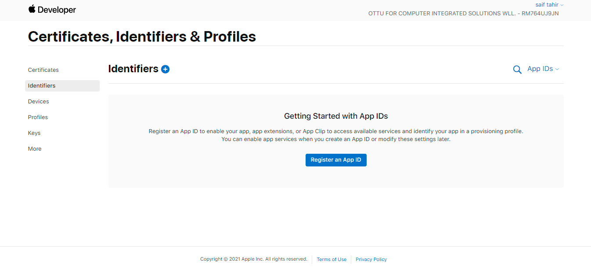

#### ****:digit\_four:****[**Register a new Merchant ID- enter the installation URL and description**](apple-pay.md#register-a-new-merchant-id-enter-the-installation-url-and-description)****

.png>)

#### ****:digit\_five:****[**Go inside the identifier and add the domain under Merchant domain section**](apple-pay.md#go-inside-the-identifier-and-add-the-domain-under-merchant-domain-section)****

&#x20;**Enter the** installation. **** Merchant[**.althawaq.com** ](http://merchant.althawaq.com)**and save.**&#x20;

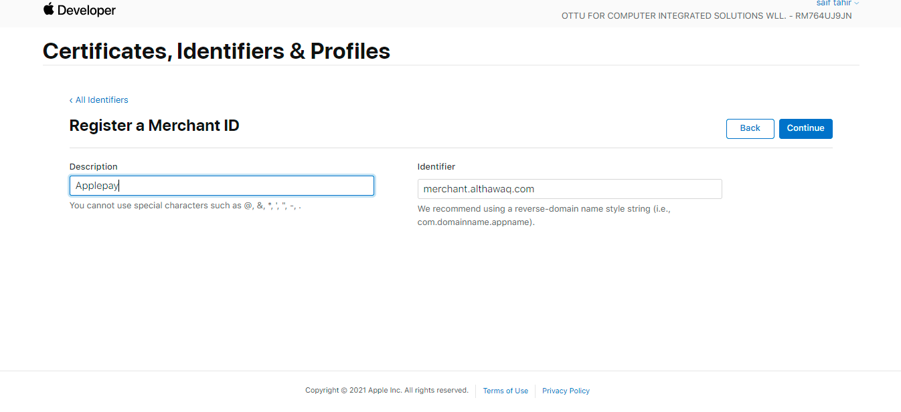

#### ****:digit\_six:****[**Click on register**](apple-pay.md#click-on-register)&#x20;

.png>)

### <mark style="color:blue;"></mark>[Adding and verifying a domain](apple-pay.md#adding-and-verifying-a-domain)

#### ****:digit\_seven:****[**Click on Althawaqh** Apple Pay](apple-pay.md#click-on-althawaqh-apple-pay)

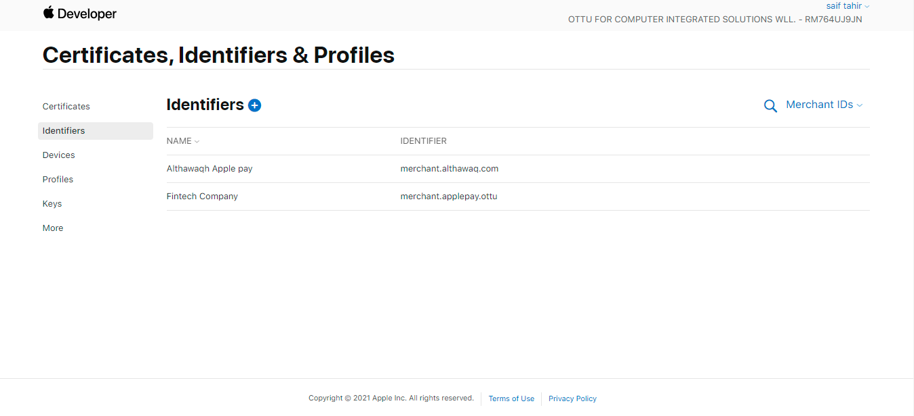

#### ****:digit\_eight:****[**Add merchant domain**](apple-pay.md#add-merchant-domain)****

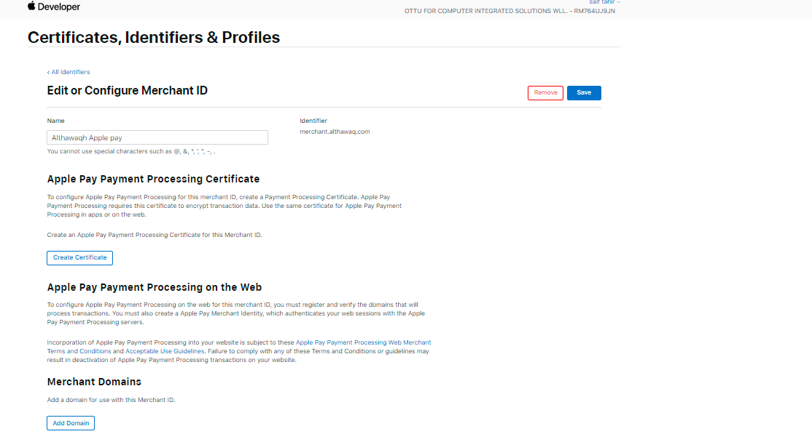

#### &#x20; :digit\_nine:****[**Enter the domain you want to register**](apple-pay.md#enter-the-domain-you-want-to-register)****

#### ****:digit\_one:****:digit\_zero:****[**Download the text file and provide it to Ottu**](apple-pay.md#download-the-text-file-and-provide-it-to-ottu)****

#### ****:digit\_one:****:digit\_one:****[**Ottu will update and configure the file in the installation backend**](apple-pay.md#ottu-will-update-and-configure-the-file-in-the-installation-backend.)****

#### :digit\_one::digit\_two:[Domain verification](apple-pay.md#domain-verification)

**After Ottu configures the file, click on verify under the merchant domain section for the verification of the domain. Ottu will confirm on this**

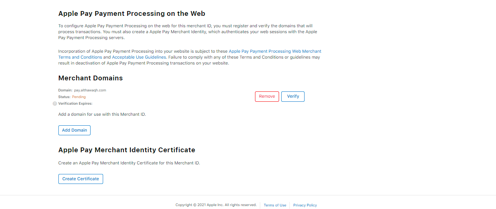

#### &#x20;:digit\_one:****:digit\_three:****[**The domain is verified**](apple-pay.md#the-domain-is-verified)****

### [Creating Apple Pay certificates](apple-pay.md#creating-apple-pay-certificates)

#### ****:digit\_one:****:digit\_four:****[**Go again to Certificates, Identifiers & profiles. Scroll down**](apple-pay.md#go-again-to-certificates-identifiers-and-profiles.-scroll-down)****

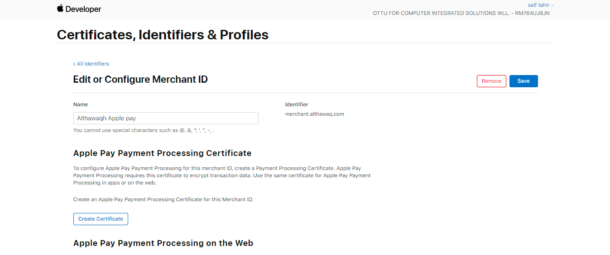

#### &#x20;:digit\_one::digit\_five: [**Go to Apple Pay Merchant Identity Certificate and click on “create certificate”**](apple-pay.md#go-to-apple-pay-merchant-identity-certificate-and-click-on-create-certificate)****

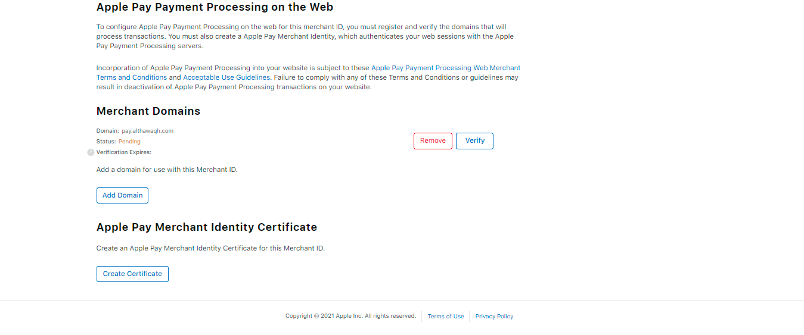

#### ****:digit\_one::digit\_six: [**Ottu will provide CSR certificate**](apple-pay.md#ottu-will-provide-csr-certificate)****

After logging into Ottu dashboard, you click on the three dots located at the right corner of the page which will lead you to the “Administration panel”. From the left pane in the “Administration panel” choose “Payment  Service”

<figure><figcaption></figcaption></figure>

Click on “:heavy\_plus\_sign: Add payment service”

<figure>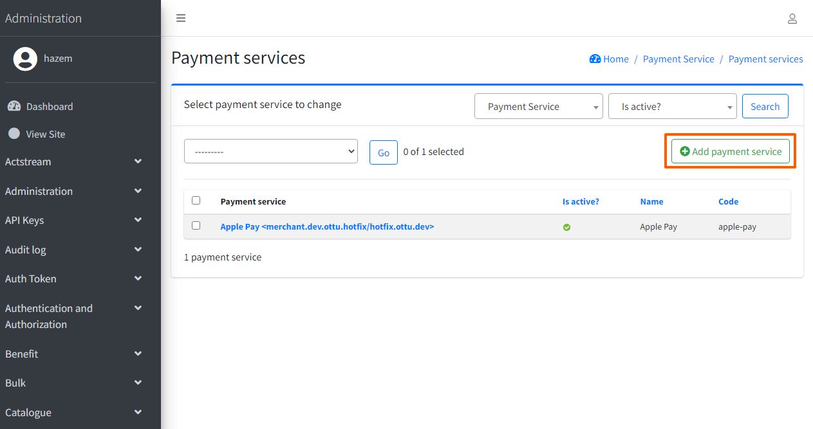<figcaption></figcaption></figure>

Fill the required fields and click “Save”

<figure>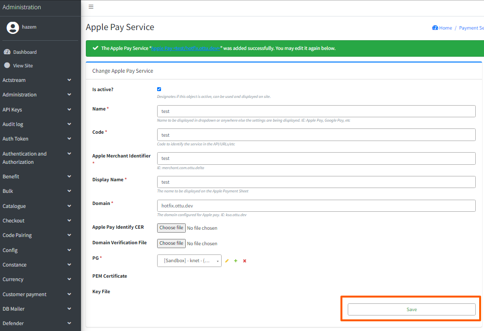<figcaption></figcaption></figure>

<table><thead><tr><th>Field</th><th>Description</th><th data-hidden></th></tr></thead><tbody><tr><td>Name</td><td>The name to be displayed in the dropdown or any other location where the settings are shown</td><td></td></tr><tr><td>Code</td><td>Code to identify the service in the API/URLs/etc</td><td></td></tr><tr><td>Apple Merchant Identifier</td><td>Unique identifier assigned to a merchant by Apple when they sign up for Apple Pay</td><td></td></tr><tr><td>Display Name</td><td>The name that will appear on the payment sheet for Apple transactions</td><td></td></tr><tr><td>Domain</td><td>The domain configured for Apple pay. IE: ksa.ottu.dev</td><td></td></tr><tr><td>Domain Verification File</td><td>File that contains a unique code that is used to verify the ownership of a domain name</td><td></td></tr><tr><td>PG</td><td>Payment gateway</td><td></td></tr></tbody></table>

After saving, click on “Download CSR file”&#x20;

<figure>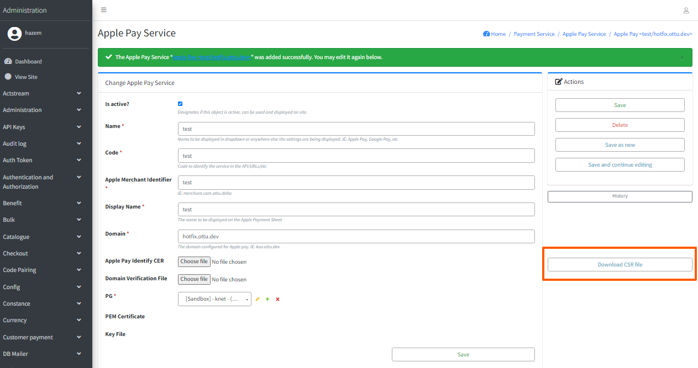<figcaption></figcaption></figure>

#### ****:digit\_one:****:digit\_seven:****[**Upload the CSR certificate that Ottu will provide under create certificate**](apple-pay.md#upload-the-csr-certificate-that-ottu-will-provide-under-create-certificate)****

.png>)

****:digit\_one:****:digit\_eight:**Click on Continue and then click download to get your .**CER **file**

#### ****:digit\_one:****:digit\_nine:****[**Download the Certificate**](apple-pay.md#download-the-certificate) &#x20;

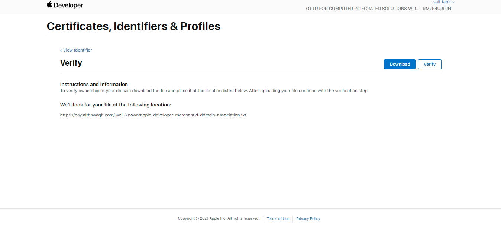

#### ****:digit\_two:****:digit\_zero:****[**Provide the certificate (.cer) file to Ottu**](apple-pay.md#provide-the-certificate-.cer-file-to-ottu)****

After logging into Ottu dashboard, you click on the three dots located at the right corner of the page which will lead you to the “Administration panel”. From the left pane in the “Administration panel” choose “Payment  Service”, then choose the same Apple Pay service  created in “[Step 16](apple-pay.md#ottu-will-provide-csr-certificate)”

<figure>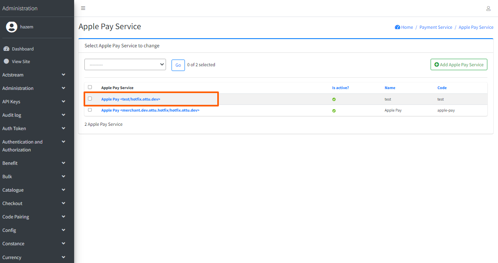<figcaption></figcaption></figure>

Then upload [.cer file](apple-pay.md#download-the-certificate) to “Apple Pay Identifier CER”, then click “Save”

<figure>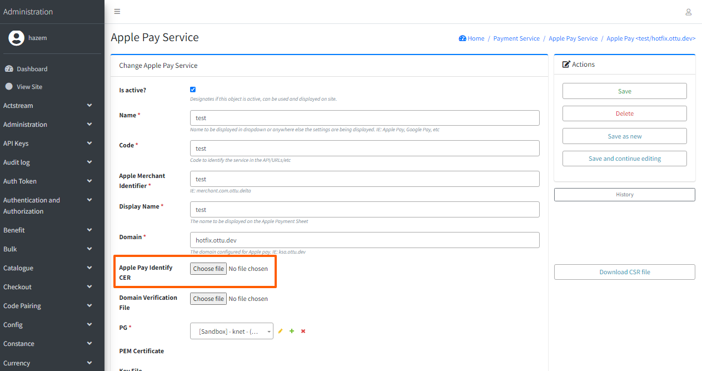<figcaption></figcaption></figure>

After saving, “PEM Certificate” & “Key File” would be generated automatically.&#x20;

<figure><figcaption></figcaption></figure>

## [Creating apple payment processing certificate:](apple-pay.md#creating-apple-payment-processing-certificate)

#### ****:digit\_two:****:digit\_one:****[**Login to MPGS portal, then go to Device Payments**](apple-pay.md#login-to-mpgs-portal-then-go-to-device-payments)****

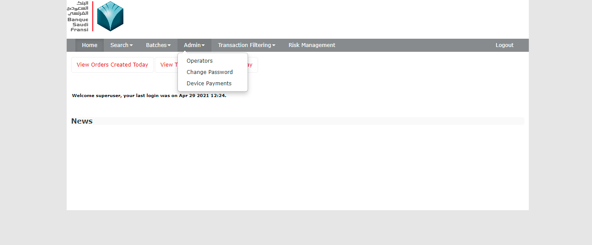

#### :digit\_two:****:digit\_two:****[**Click on Add new certificate**](apple-pay.md#click-on-add-new-certificate)****

#### ****:digit\_two:****:digit\_three:**Download the file- “Apple Pay Certificate Signing Request” file**

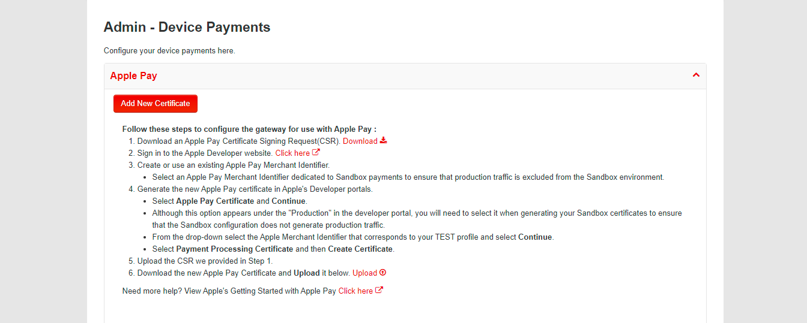

&#x20;:digit\_two:****:digit\_four:**Create a certificate**

**Login to Apple Pay developer account, go to Merchant ID that was created and create a certificate under Apple Pay Payment processing certificate.**

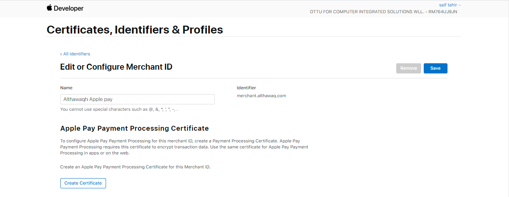

&#x20;**26. Click No on this page and continue.**

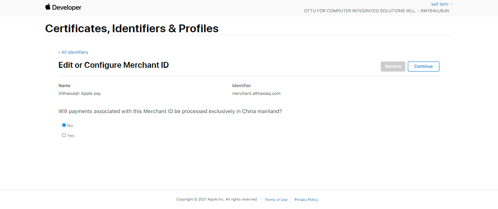

&#x20;**27. Upload the CSR file obtained from MPGS portal.**

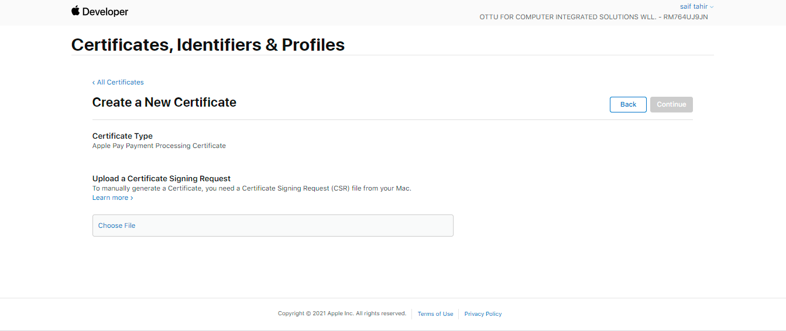

**28. Download the file**, **which is the Apple Pay Payment processing certificate file.** &#x20;

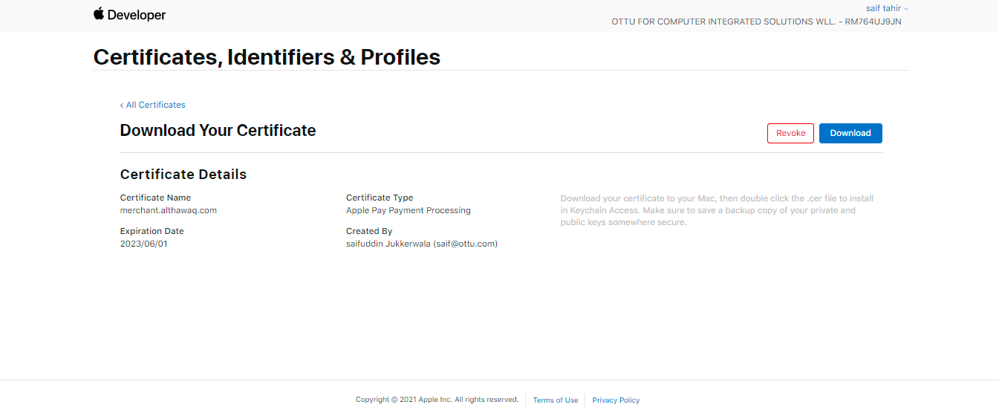

**29. Upload the file in MPGS portal.**

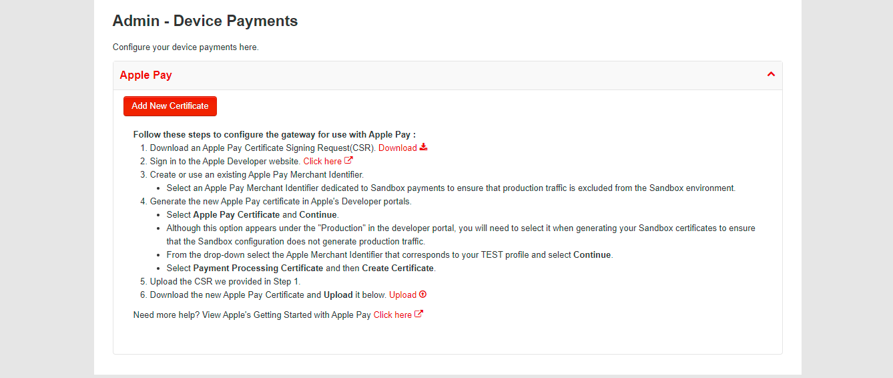
