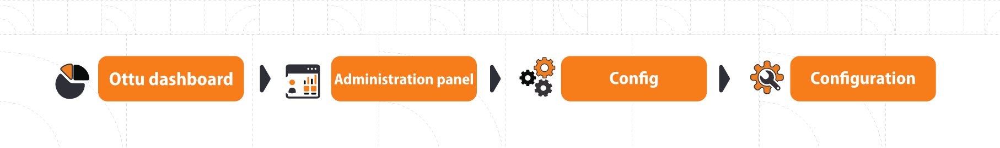
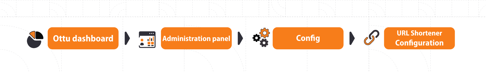
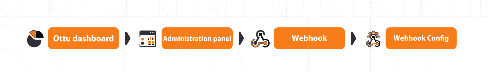

# Configuration

## [Global Configuration](configuration.md#global-configuration)

Ottu puts the power of configuration in the hands of merchants, ensuring a hassle-free experience. Our mission is to provide you with seamless configuration options, enabling you to take absolute control like never before! With Ottu, merchants can customize their dashboard, logo, favicon, website URL, email address, phone number, and more. Embrace the power of Ottu and unlock a world of possibilities for your business. Get ready to revolutionize your experience with our user-friendly tools and elevate your online presence to new heights!

## [Global Configuration Walkthrough](configuration.md#global-configuration-walkthrough)

The global settings can be reached from the Ottu Dashboard > Administration Panel > Config.

.png>)

### [Configuration](configuration.md#configuration)

**Fine-Tune Your Settings with Ottu's Configuration Options**\
**To access the configurations:** from the Ottu Dashboard > navigate to the Administration Panel > head to Config > then select Configuration.

<figure><figcaption></figcaption></figure>

<figure><figcaption></figcaption></figure>

**Here is a brief explanation of each field:**

#### **Merchant Identity - Stand Out in Style**

* **Merchant name or title:** Display your preferred name on the dashboard.
* **Merchant subheader:** Highlight vital information concisely to grab attention.

#### **Branding - Making Your Mark**

* **Logo:** Showcase your unique market logo.
* **Favicon:** Capture attention with an eye-catching icon next to your site's name in bookmarks and browser tabs.

#### **Connectivity - Stay in the Loop**

* **Merchant website URL:** The URL address of the merchant's website.
* **Email:** The email address that will receive the permission authorization request. Typically, this is the installation owner's email.
* **Merchant phone:** The merchant's contact phone number.

#### **Seamless Currency Exchange**

* **Fixer access key:** The fixer access key is used to get currency exchange rates from Fixer.io API. **Fixer.io** is an online service that provides real-time currency exchange rates. Obtain your Fixer Access Key by creating an account on their website.


For this service (i.e., Fixer.io) to be active, remember to enable the online conversion feature: from Ottu Dashboard > Administration Panel > Currency > Currency Exchange Configs \[set the field “Work as” to the value “Online”].


#### **Control Your Functionality**

* **Is paused:** Allows merchants to temporarily disable or freeze all their payment request links (i.e., freeze all payment transaction processes). This can be useful if the merchant is experiencing technical problems or if they are taking a break from accepting payments.
* **Enable 2FA:** Allows merchants to enable two-factor authentication for their dashboard logins.


In 2FA, An OTP (One-Time Passcode)—a single-use numerical passcode—will be sent to your email for every dashboard login. This adds an extra layer of security by requiring merchants to enter the code in addition to their password for each login action.


#### **Time-Sensitive**

* **Live date:** The date of the first live transaction.
* **Renewal date:** The renewal date is the date when the merchant's Ottu subscription will end. It is important for merchants who want to renew their subscriptions to keep using Ottu. It is specified in the contract signed between Ottu and the merchant.
* **Expire payment transaction:** If activated, an expiration date will be set for the customer to complete the payment through the payment request URL.


* When the expiration date passes, the payment will be transitioned to the Expired state, and the payment request URL will no longer be valid.
* By default, the expiration date is 24 hours, but it can be modified: From the Ottu Dashboard > Administration Panel > Payment Request > Payment Request Configuration \[Transaction Expiration Time]


#### **Customization and Extra Notes**

* **Notes:** A place for the merchant to write any additional configuration notes.

#### **Security and Efficiency**

* **SSL expiry date:** The SSL (Security Socket Layer) expiry date is the date when the merchant's SSL certificate will expire, and It is automatically populated based on the installation date. SSL guarantees the security of the merchant server.

#### **Effortless Management of Multiple Installations**

* **Reference prefix:** A unique prefix that can be used by the Ottu Operations Team to avoid duplicate track IDs for the PG ([Payment Gateway](payment-gateway.md)), as duplicating IDs can cause problems with tracking and reporting.


If you have multiple Ottu installations and one PG (Payment Gateway), one of the installations should have the Reference Prefix so that each installation has a unique track ID, even if they use the same PG.


#### **Fine-Tune User Experience**

* **Enable session timeout:** If checked, users who do not have refund/void permissions will be automatically logged out after passing the defined session timeout.
* **Enable URL shortener:** Activate the URL shortener for public links, making sharing links with others hassle-free. Check [URL Shortener Configuration](configuration.md#url-shortener-configurations) for more details.

Empower your online payment management with Ottu's remarkable configuration options. Let positive impressions, seamless transactions, and engaging experiences define your journey to success.

### [**URL Shortener Configurations**](configuration.md#url-shortener-configurations)

To configure the URL Shortener, go to the Ottu Dashboard > Administration Panel > Config > URL Shortener Configurations.

<figure><figcaption></figcaption></figure>

Next, click on `Add URL Shortener Configuration`.

<figure><figcaption></figcaption></figure>

#### **Description of Fields:**

* **URL shortening tool:** Specify the tool used to shorten URLs.
* **API URL:** The API endpoint link.
* **User & Password:** Enter the credentials for authentication.
* **Is global:** Check this option if you want this configuration to apply to all cases.

## [**Transaction Report Generation Configuration**](configuration.md#transaction-report-generation-configuration)

To access the Configuration of Transaction Report Generator, navigate to Ottu Dashboard > Administration Panel > Report > Periodic Transaction Report Config.

<figure><figcaption></figcaption></figure>

### [General](configuration.md#general)

<figure><figcaption></figcaption></figure>

#### **Description of Fields:**

* **Period:** Specify how often the report generation process should recur.
* **Report generation date/time:** Set the date and time when the report generation process should start.
* **Plugins:** Which plugin the report belongs to.
* **Send transaction report by email:** If this checkbox is checked, the report will be sent to the merchant's email address automatically.
* **Emails:** The email addresses to which the report should be sent.
* **Email notification template:** The template used for email notifications.
* **File name prefix:** The filename prefix can be used to specify the format in which reports are saved.

### [Periodic Transaction Report Fields](configuration.md#periodic-transaction-report-fields)

To include a new field in the report, navigate to the **Periodic Transaction Report Fields** tab.

<figure><figcaption></figcaption></figure>

#### Description of Fields:


Each field added here will be included in the report.



The required fields are categorized based on the source type from which the data is extracted. The categories are as follows: [**Config**](configuration.md#type-config-required-field-is-from-plugins-configuration), [**Static**](configuration.md#type-static-required-field-is-one-of-the-constant-fields), [**Gateway Response**](configuration.md#type-gateway-response-required-field-is-from-pg-response), and [**Common**](configuration.md#type-common-required-field-is-other-than-fields-from-pg-static-and-plugin-configuration.-such-as-pay), and each type requires different information.


<strong>Type:</strong> Config  (Required field is from Plugins configuration)

* **Is active:** If you check this box, the field will be used and displayed.
* **Field:** A pre-populated list of fields where the required field should be selected.
* **Label \[en]**: Create a custom label for the field in English, if needed.
* **Label \[ar]:** Create a custom label for the field in Arabic, if needed.
* **Name:** The name of the HTML field, which is used for backend validation. It will not be displayed anywhere.
* **Order:** The location of the field in the generated report

<strong>Type: Static</strong>   <strong>(Required field is one of the constant fields)</strong>

* **Is active:** If checked, the field will be used and displayed.
* **Label \[en]:** Create a custom label for the field in English, if needed.
* **Label \[ar]:** Create a custom label for the field in Arabic, if needed.
* **Name:** The name of the HTML field, which is used for backend validation. It will not be displayed anywhere.
* **Static value:** Assign a value to the constant field. It will be the same for all generated reports.
* **Order:** The location of the field in the generated report.

<strong>Type: Gateway response</strong>  <strong>(Required field is from PG response)</strong>

* **Is active:** If checked, the field will be used and displayed.
* **Label \[en]:** Create a custom label for the field in English, if needed.
* **Label \[ar]:** Create a custom label for the field in Arabic, if needed.
* **Name:** The name of the HTML field, which is used for backend validation. It will not be displayed anywhere.
* **Gateway response keys:** Since the PG (Payment Gateway) response is sent in a dictionary format, i.e., a set of key-value pairs {Key:Value}, so here you specify the keys of the values you need.
* **Order:** The location of the field in the generated report.

<strong>Type: Common</strong>  (Required field is other than fields from PG, static, and plugin configuration. Such as payment_date).

* **Is active:** If checked, the field will be used and displayed.
* **Label \[en]:** Create a custom label for the field in English, if needed.
* **Label \[ar]:** Create a custom label for the field in Arabic, if needed.
* **Name:** The name of the HTML field, which is used for backend validation. It will not be displayed anywhere.
* **Order:** The location of the field in the generated report.

## [**Webhook Configuration**](configuration.md#webhook-configuration)

A [webhook](../developer/webhooks/) is an HTTP endpoint that is used to receive notifications about events that occur in the Ottu system. For example, if a payment is created, Ottu can send a webhook notification to the merchant's server with the details of the payment. The merchant can then use this information to update their systems. Enhance your Ottu experience with our powerful Webhook Configuration. Take advantage of API payloads, SSL certificate verification options, error notifications, and more to optimize your webhook usage. Let's explore the exciting options you can customize:

To access the Webhook Configuration, navigate to Ottu Dashboard > Administration Panel > Webhook > Webhook Config

<figure><figcaption></figcaption></figure>

### [General](configuration.md#general-1)

<figure><figcaption></figcaption></figure>

#### **Description of Fields:**

* **HMAC key:** This key is used to [generate signatures](../developer/webhooks/signing-mechanism.md#signature-generation).
* **Ignore SSL:** If checked, the SSL certificate will not be verified when calling the [webhook URL](../developer/checkout-api.md#webhook\_url-string-optional).
* **Notify on Error:** If checked, an email will be sent if an error occurs while calling the [webhook URL](../developer/checkout-api.md#webhook\_url-string-optional).
* **Email List:** Specify the list of email addresses where the [webhook URL](../developer/checkout-api.md#webhook\_url-string-optional) error notification should be sent.
* **Timeout:** The amount of time that the Ottu server will wait for a response from the merchant server.
* **Retries:** The number of retry attempts the Ottu server will make to resend the request to the merchant server if the first attempt fails. Note that the **Enable retry webhook mechanism** option should be checked to activate this feature.
* **Backoff factor:** The amount of time the Ottu server will wait before retrying the request (i.e., the time between two attempts).

#### [Example:](configuration.md#example)&#x20;

Imagine a scenario where the merchant’s server experiences **downtime for 30 seconds**. If the **timeout is set to 20 seconds**, the **retries are set to 3**, and the **backoff factor is set to 5 seconds**, then the following will happen:\
Keep in mind that the merchant’s server will take 30 seconds to respond, and the number of attempts is 3.

* **First Try:**

1. Ottu's server will send a request to the merchant's server.
2. Ottu's server will wait 20 seconds for a response (timeout = 20), and this attempt will fail.
3. Then Ottu's server will wait 5 seconds for the backoff factor (backoff factor = 5).

**Note that the first attempt took 25 seconds.**

* **Second Try:**

1. Ottu's server will retry the request, i.e., send another request.
2. After 5 seconds, the merchant's server will respond since the server downtime will be over (30 seconds), and the request will be successful.

* **Version:** The version of the webhook API.
* **Enable webhook notifications:** If checked, webhook notifications will be activated.


**Redirect behavior:** The redirect behavior is determined by the [webhook URL](../developer/checkout-api.md#webhook\_url-string-optional) response to payment events and payment operations.

* If the webhook URL returns a status code of 200, the customer will be redirected to the [redirect\_url](../developer/checkout-api.md#redirect\_url-string-optional).
* If the webhook URL returns a status code of 201, the customer will be redirected to the **Ottu payment summary page**.
* If the webhook URL returns any other status code, the customer will be redirected to the **Ottu payment summary page**. \
  In this case, Ottu can send an email notification if the **Enable webhook notifications** option is checked.


* **Enable retry webhook mechanism**: If checked, Ottu will retry the request if the first attempt fails. See the [example scenario](configuration.md#example) above for further clarity.
* **Operations webhook\_url:** The URL where transaction data will be disclosed once an operation transaction flow is triggered. See [Operation Notification](../developer/webhooks/operation-notification.md).
* **Enable webhook notifications if transaction initiated from API:** If checked, [Payment Webhooks](../developer/webhooks/payment-webhooks.md) will be activated even if the transaction is created via the API.

### [Webhook Plugin Configs](configuration.md#webhook-plugin-configs)

In this tab, the merchant can define the desired webhook behavior for specific plugins.

<figure><figcaption></figcaption></figure>

**Description of Fields:**

* **Webhook plugin:** The plugin that the webhook works for. See [Plugins](plugins/)
* **Webhook UrL:** When a [payment event](../developer/webhooks/payment-webhooks.md) or [payment operation](../developer/webhooks/operation-notification.md) occurs, Ottu sends an HTTP request to this URL to disclose transactional data.
* **Enable transaction state webhook notifications:** If checked, webhook notifications will be sent for the defined Notification status.
* **Notification status:** Define the transaction status that will trigger the [Payment Webhook,](../developer/webhooks/payment-webhooks.md) including `paid`, `failed`, `authorized`, and `canceled`. Review the [payment transaction states](payment-tracking.md#states-of-parent-payment-transaction) for more information.
* **Delete:** Deletes the defined plugin webhook configuration.


The webhook\_Url specified in the [webhook plugin configuration](configuration.md#webhook-plugin-configs) serves as the endpoint for receiving notifications related to both [payments](../developer/webhooks/payment-webhooks.md) and [operations](../developer/webhooks/operation-notification.md). If we provide values for both the operation webhook\_url and the webhook\_Url in the plugin configuration, the system will transmit data to both URLs.


For more information about how and where webhook works in Ottu see [Webhooks](../developer/webhooks/).
