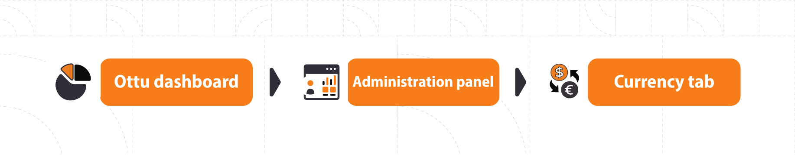

# Currencies

## [Introduction](currencies.md#undefined)

Ottu is a solution for multi-currency payment gateway. The options of currency in currency exchange enable the merchant to get a flexible way of accepting multi-currencies payment(s) with or without markup fees.

## [Currency configuration](currencies.md#currency-configuration)

Payment gateway has a built-in currency configuration, e.g., KPAY(PG) default currency is KWD (Kuwaiti Dinar).

## [Currency configuration page](currencies.md#currency-configuration-page)

After logging into Ottu dashboard, you click on the three dots located at the right corner of the page which will lead you to the “Administration panel”. From the left pane in the “Administration panel”, you have “Currency” tab.

There are three types of currency configuration: - [Currencies](currencies.md#currencies) - [Currency exchanges](currencies.md#currency-exchanges) - [Exchanges config](currencies.md#exchange-configuration).

### <mark style="color:blue;"></mark>[Currencies](currencies.md#currencies)

There is a list of available currencies in Ottu.

**To add a new currency, kindly follow these steps:**

#### [Step 1](currencies.md#undefined)

Click on “Add Currency” button to add a new currency

.png>)

#### [Step 2](currencies.md#undefined)

Tick active option, then click on “save”

.png>)

### <mark style="color:blue;"></mark>[Currency exchanges](currencies.md#currency-exchanges)

Sometimes, the merchant prefers to get their payment(s) in the local currency of their country, even if the customer is living abroad. Thus, currency exchange comes as a solution offered by Ottu to help both of the merchant and customer to achieve the process of payment easily.


Sometimes the bank mediated between the merchant and customer forces a markup fee in order to cover the currency exchange fee.


**To configure currency exchange, you have only to follow these three steps:**

#### [ Step 1](currencies.md#undefined)

Click on “Add Currency Exchange”

 (2).png>)

#### [Step 2](currencies.md#undefined)

Insert the required parameters

#### [Step 3](currencies.md#step-3)

&#x20;Then click on “save”

.png>)

### <mark style="color:blue;"></mark>[Exchange configuration](currencies.md#exchange-configuration)

Payment gateway settings are linked to exchange configuration, as it defines the currency rules that should be applied to payment(s).

**To add exchange configure, you have only to follow these two steps:**

#### [Step 1](currencies.md#undefined)

Click on “Add Exchange Config”

 (1).png>)

#### [Step 2](currencies.md#step-2)

Enter the required information and click on “save”

.png>)

#### [Required Parameters Descriptions](currencies.md#required-parameters-descriptions)

| <mark style="color:blue;">**Field**</mark> | <mark style="color:blue;">**Required info**</mark>                                                                                                                                                                                                                  |
| ------------------------------------------ | ------------------------------------------------------------------------------------------------------------------------------------------------------------------------------------------------------------------------------------------------------------------- |
| Name                                       | Identifying the exchange configuration                                                                                                                                                                                                                              |
| Default currency                           | Payment gateway currency                                                                                                                                                                                                                                            |
| Currencies                                 | The payment currency that the merchant(s) want(s) to deal with                                                                                                                                                                                                      |
| Fee type                                   | 
 <mark style="color:blue;"><strong>Fix fee:</strong></mark> Fixed markup amount on the payment <mark style="color:blue;"><strong>Percent fee:</strong></mark> An additional amount that will be added according to a certain percentage of the payment
 |
| Fees Description                           | Identification of the fee according to the merchant’s purposes                                                                                                                                                                                                      |
| Work as                                    | 
 <mark style="color:blue;"><strong>Online:</strong></mark> Utilizing online services to define exchange rate <mark style="color:blue;"><strong>Local:</strong></mark> The exchange rate will be defined manually by the merchant(s)
                    |
| Fix fee                                    | Fixed amount                                                                                                                                                                                                                                                        |
| Percentage fee                             | Dynamic amount                                                                                                                                                                                                                                                      |
| Charge default currency                    | When the event is activated, a fee will be added to the original amount even if the payment transaction is proceeded in the default currency                                                                                                                        |


[Operations](../developer/rest-api/operations/) are not working for foreign currencies.

