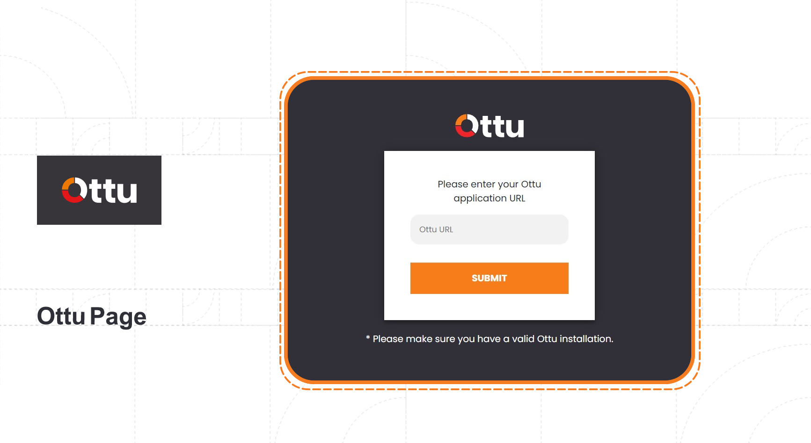
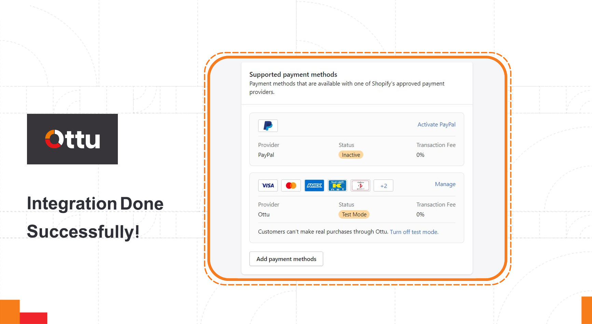
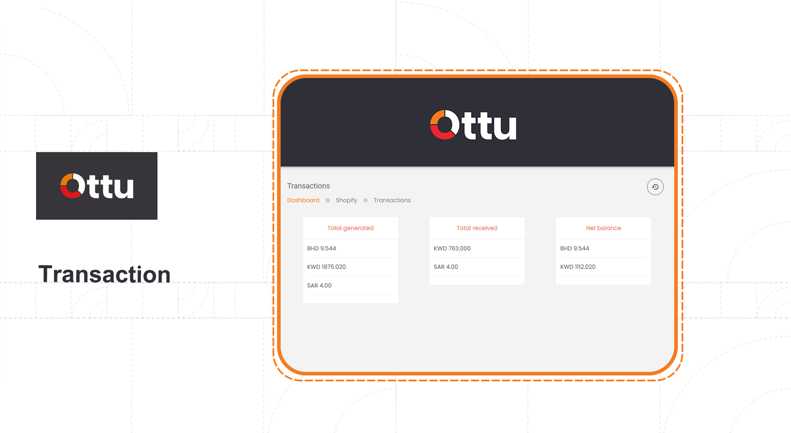

# Integration

## [Simplify Your E-Payments with Seamless Integrations](integration.md#simplify-your-e-payments-with-seamless-integrations)

Integrate your business with Ottu and discover the power of our advanced integration capabilities. Ottu is an exceptional and easy-to-use online payment management system (OPMS) that recognizes the importance of seamless integration with various e-commerce platforms. We understand the need for effective communication between merchants and their chosen e-commerce suites. With Ottu, you can quickly and easily set up secure and reliable payments for your customers, regardless of their location or preferred [payment method](payment-methods.md). No matter which integration option you choose, Ottu makes it easy to get started with secure and reliable payments for your business. Now, you can focus on growing your business while we take care of the payments!

### [Direct and smooth Payment Gateway Integration](integration.md#direct-and-smooth-payment-gateway-integration)

Ottu provides direct integration options for merchants with their bank accounts. Experience smooth and hassle-free [payment gateway](payment-gateway.md) integration with Ottu. This streamlined approach allows you to effortlessly manage your transactions and optimize your online payment processes.

### [Powerful API Integration](integration.md#powerful-api-integration)

Unlock the full potential of your [e-commerce ](plugins/#e-commerce)suites with Ottu's streamlined API integration. Our well-organized API documentation supports all types of direct integration, ensuring a seamless connection. With Ottu, you can easily harness the benefits of a fully connected payment ecosystem.

### [Effortless Plug-In Integration](integration.md#effortless-plug-in-integration)

Ottu makes it simple for merchants to add and connect plug-ins to their e-commerce suites. We provide easy-to-follow guidelines and a wide range of plug-ins designed for popular e-commerce platforms such as Shopify, WordPress - WooCommerce, PrestaShop, OpenCart, Magento, and NopCommerce. Seamlessly integrate with your preferred platform and elevate your online business.

## [Enhance Your Shopify Store with Ottu](integration.md#enhance-your-shopify-store-with-ottu)

If you are a Shopify merchant, Ottu, our advanced online payment management system (OPMS), is the ultimate choice for you. Experience the future of transaction management with Ottu Shopify integration. Boost your efficiency, gain valuable insights, and take control of your business's financial success! Shopify, a subscription-based software, empowers entrepreneurs to launch their online stores and sell their products effortlessly. You can even sell in physical locations using Shopify POS. With Ottu's Shopify plugin, you can take your business to the next level. Integrate your Shopify store with Ottu and unlock a host of exceptional features that will enhance your customers' shopping experience. Don't miss out on the opportunity to transform your business.

### [Install the Ottu Payment App for Shopify Merchants: Step-by-Step Guide](integration.md#install-the-ottu-payment-app-for-shopify-merchants-step-by-step-guide)

#### Step 1: Access the Ottu App Listing Page

Visit the [Ottu App Listing Page](https://apps.shopify.com/debit-credit-cards) and log in to your Shopify account.

.png>)

#### Step 2: Select Your Stores

Once logging in, select the stores where you want to install the payment app.

.png>)

#### Step 3: Install the Payment App

Click on `Add app` and then `Install app`.

.png>)

 (1).png>)

#### Step 4: Redirecting to Ottu's Page

Upon clicking `Install app`, you will be directed to the **Ottu’s Page**.

#### Step 5: Enter Your Ottu Installation URL

Enter your Ottu installation URL, which will be provided by the Ottu Onboarding team after signing the agreement. An example URL would be https://pay.yourdomain.com.

.png>)

#### Step 6: Select Preferred Payment Methods

From the list provided, select the [payment methods](payment-methods.md) that you want to display to your customers. Then, click on `Activate Ottu`.

 (2).png>)

#### Step 7: Ottu App Integration

Voilà! The Ottu App now appears in your payment settings.

Experience seamless payments with the Ottu Payment App for Shopify. Install it today and enhance your customers with a convenient and secure payment experience. Get started now!

### [Streamlined Transaction Interface for Shopify](integration.md#streamlined-transaction-interface-for-shopify)

With just a few clicks, you can access a world of valuable transaction insights for your Shopify stores. From the Ottu Portal > head to the Shopify Tab > and select the Transaction Option.

 (1).png>)

Gain a comprehensive overview of your business's financial performance with these key metrics:

* **Total Generated:** Track the total amount generated from your transactions.
* **Total Received:** Monitor the total funds successfully received from your transactions.
* **Net Balance:** Stay on top of your finances by keeping an eye on your net balance.

Dive deeper into your transaction details using the table located at the bottom of the page. This comprehensive overview not only displays information about each transaction process but also showcases the state of each transaction. The transaction states you may encounter include: Paid, failed, attempted, and created. See the [payment transaction states](payment-tracking.md#payment-transaction-state-and-payment-attempt-state) for more information.

.png>)

## [Payment request](plugins/#payment-request)

## [Bulk payment request](plugins/#bulk-payment-request)

## [E-commerce](plugins/#e-commerce)
