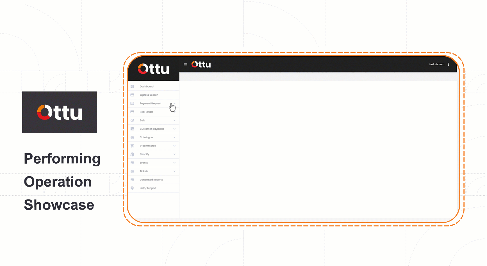

# Payment Gateway

## [Introduction](payment-gateway.md#undefined)

A payment gateway is a technology used by merchant(s) to accept debit or credit card purchases from customers. The term includes not only the physical card-reading devices found in retail stores, but also the payment processing portals found in online stores.

## [Configure payment gateway](payment-gateway.md#configure-payment-gateway-walkthrough)

The following tutorial will guide you through how to configure payment gateways using Ottu dashboard.

#### [Step 1](payment-gateway.md#step-1)

Log into Ottu dashboard and launch administration panel by clicking on the three dots located at page right corner.

#### [Step 2](payment-gateway.md#2)

Navigate to the gateway setting under gateway tab.

.gif>)

#### [Step 3](payment-gateway.md#undefined)

&#x20;Click on (Add Settings) and choose the required Payment gateway (PG).

.gif>)

#### [Step 4](payment-gateway.md#undefined)

&#x20;Fill the required fields, then click save.

.png>)

<table data-header-hidden><thead><tr><th width="150">Field</th><th>Required info</th></tr></thead><tbody><tr><td><mark style="color:blue;"><strong>Field</strong></mark></td><td><mark style="color:blue;"><strong>Required info</strong></mark></td></tr><tr><td>Gateway</td><td>Select the required Gateway.</td></tr><tr><td>Operation</td><td><mark style="color:blue;"><strong>Purchase:</strong></mark> Money deducted from card <mark style="color:blue;"><strong>Auth:</strong></mark> Money is just authorized and can be subsequently charged later from the card by another operation from Ottu.</td></tr><tr><td>Operations</td><td>This will display the available operations post saving payment gateway configurations, based on the selected operation(s).</td></tr><tr><td>Currency configuration</td><td>Define the required <a href="currencies.md#currency-configuration">currency configuration</a> which  determines the default currency for this PG, and how to work with foreign currency.</td></tr><tr><td>Type</td><td><mark style="color:blue;"><strong>Sandbox:</strong></mark> An intermediate environment built for testing purposes, will be excluded from the live reports. <mark style="color:blue;"><strong>Production:</strong></mark> live environment where the real action(s) going on.</td></tr><tr><td>Name</td><td>Give these configurations a name, i.e (myPG).</td></tr><tr><td>Code</td><td>Codes will be to identify PG in integration/API calls. See <a href="../developer/rest-api/checkout-api.md#pg_codes-list-required">pg_codes</a>.</td></tr><tr><td>Plugin</td><td>Where PG should be active.</td></tr><tr><td>Logo</td><td>Upload the PG logo, if not uploaded by merchant then the default logo will be there.</td></tr><tr><td>Displayable</td><td>Unchecking this option will hide the PG payment method from the customer end, so payment methods should be available to enable payment (Apple Pay, Samsung Pay, etc.).</td></tr><tr><td>Flags</td><td>These credentials depend on the PG type, and should be provided by the bank.</td></tr></tbody></table>

## [Available operations](payment-gateway.md#available-operations)&#x20;

Through Ottu, merchants can perform operations such as capture, refund, and void across different payment gateways.

There are conditions should be applied to perform operations, in addition, not all the payment gateways support all the operations.

### [Operation definitions and conditions](payment-gateway.md#operation-definitions-and-conditions)


Operations are not working for foreign currencies.


| Operation   | Definitions                                                                                                               | Conditions                                                                                                                                                                                                                                                                                                                                 | Availabe in                                                                                                                   |
| ----------- | ------------------------------------------------------------------------------------------------------------------------- | ------------------------------------------------------------------------------------------------------------------------------------------------------------------------------------------------------------------------------------------------------------------------------------------------------------------------------------------ | ----------------------------------------------------------------------------------------------------------------------------- |
| **Void**    | Process of rolling back an authorized payment transaction                                                                 | 
1- Payment transaction should be <strong>authorized</strong>. 2-  No capture operation performed. 
                                                                                                                                                                                                                               | <ul><li>MPGS</li></ul>                                                                                                        |
| **Capture** | Process of collecting a full or partial authorized amount and credited the captured amount on the merchant's bank account | 
1- Payment transaction should be <strong>authorized</strong>. 2- Authorized amount should be sufficient. 
                                                                                                                                                                                                                        | <ul><li>MPGS</li><li>Tabby</li></ul>                                                                                          |
| **Refund**  | Process of  deduction full or partial paid amount or captured amount and sending it back to the customer's bank account.  | <ul><li><strong>Payment transaction is authorized.</strong> 1- Capture should be performed before. 2-Captured amount should be <strong>sufficient</strong> against requested refund amount.</li><li><strong>Payment transaction is purchase.</strong> Paid amount should be sufficient against requested refund amount.</li></ul> | <ul><li>FSS </li><li>MPGS  </li><li>MyFatoorah </li><li>NGenius </li><li>PayU India  </li><li>QPay  </li><li>Tabby </li></ul> |

### [Performing operations via Ottu dashboard showcase](payment-gateway.md#performing-operations-via-ottu-dashboard-showcase)

Ottu dashboard >>  plugin Tab, here is payment request plugin >> transaction Tab >> required transaction raw >> perform the required operation as shown in below GIF.\

<figure><figcaption></figcaption></figure>
