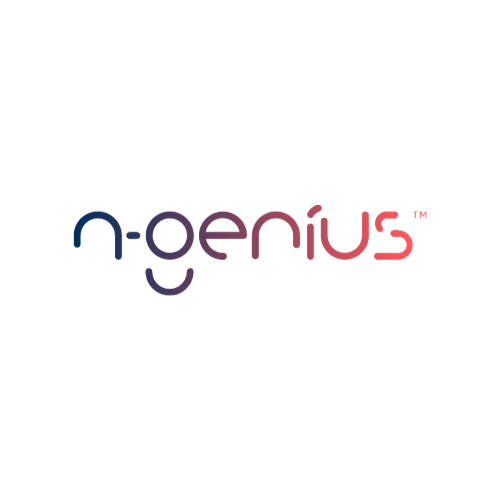
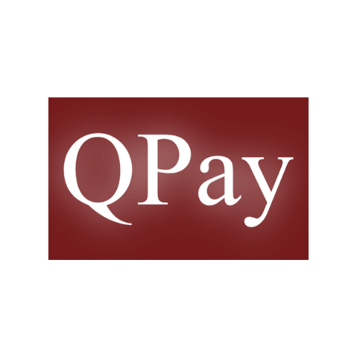
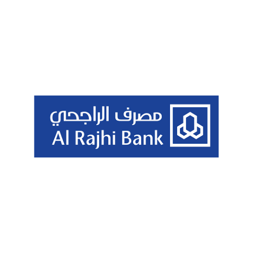
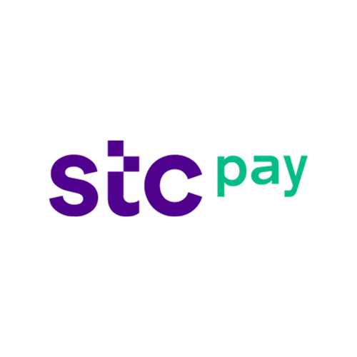
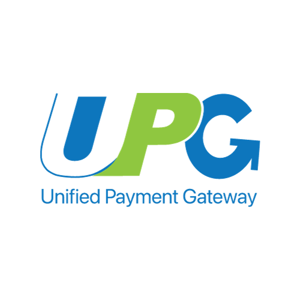
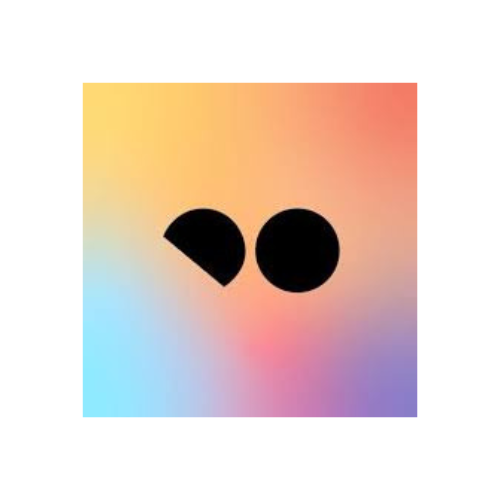

# Payment Gateway

## [Getting Started](payment-gateway.md#getting-started)

Now, let's explore the world of payment gateways. A payment gateway is an advanced technology utilized by merchants that enable them to effortlessly accept debit and credit card transactions from their customers, whether in physical retail stores (e.g., physical card readers typically found in retail establishments) or online portals (e.g., user-friendly online payment processing portals integrated into e-commerce platforms). Elevate your business to a new height of convenience and customer satisfaction with our state-of-the-art Online Payment Management System (OPMS). Experience hassle-free transactions and seamless integration, empowering you to expand your customer base and boost your sales. Leave your competitors in the dust as you unleash the full potential of _Ottu's_ exceptional prowess in seamlessly connecting and tuning the payment gateway. Ignite your business's success by harnessing the power of our meticulously optimized online payment management system (OPMS), meticulously crafted to meet the dynamic needs of today's thriving businesses. Discover a new era of convenience, efficiency, and growth with _Ottu_ at your side.

## [Operations Clauses](payment-gateway.md#operations-clauses)

With _Ottu_, merchants gain the power to seamlessly carry out essential operations, including capture, refund, and void, across various payment gateways. It's important to note that specific conditions must be met to execute these operations successfully. Furthermore, it's worth mentioning that not all payment gateways support every operation. Choosing _Ottu_ means an exceptional online payment management experience that keeps your business secure, streamlined, and successful. &#x20;

Operations don't support foreign [currencies](currencies.md). If a customer pays using a different currency than the MID (e.g., MID is KWD but payment is in USD via Ottu's [currency exchange](currencies.md#currency-exchanges)), [operations](../developer/operations.md#external-operations) won't work. They only function when the payment currency matches the MID currency.

### [Capture](payment-gateway.md#capture)

Collecting a full or partial authorized amount and crediting it to the merchant's bank account. It’s applicable under following conditions:

1. The payment transaction must be authorized.
2. The authorized amount must be sufficient.

### [Refund](payment-gateway.md#refund)

Returning the full or partial amount paid (or captured) to the customer's bank account. It’s applicable under following conditions:

There are different requirements for refunding payments based on the type of payment transaction (i.e., operation):

* **For Auth transactions:**

1. A capture operation must be done before refunding.
2. The captured amount must be enough to cover the refund amount.

* **For Purchase transactions:**

The paid amount must be sufficient for the requested refund.

### [Void](payment-gateway.md#void)

Canceling or rolling back an authorized payment transaction. It’s applicable under following conditions:

1. The payment transaction must be authorized.
2. No capture operation was performed.

## [Payment Gateway Features Summary](payment-gateway.md#payment-gateway-features-summary)

Below is a summary of key features and specifications for various payment gateways. This table provides information on the origin country, default currency, applicable modules, whether it supports redirect or wallet functionality, purchase/authorize options, auto inquiry time in minutes, and the level of operation support offered. This comparison aims to assist in evaluating different payment gateways and selecting the one that best aligns with your business needs. Please note that the information provided is subject to change, and it is advisable to review the official documentation of each payment gateway for the most up-to-date details.&#x20;

To understand what the auto-inquiry feature is and why it's crucial for ensuring transaction reliability, please check [Automatic Inquiry](../developer/payment-status-inquiry.md#automatic-inquiry). It offers a detailed explanation of how this feature safeguards your transactions from unforeseen disruptions.

<table data-header-hidden data-full-width="true"><thead><tr><th width="146" align="center"></th><th width="100" align="center"></th><th width="107" align="center"></th><th width="119" align="center"></th><th width="122" align="center"></th><th width="111" align="center"></th><th width="97" align="center"></th><th align="center"></th></tr></thead><tbody><tr><td align="center"><mark style="color:orange;"><strong>Payment Gateway</strong></mark></td><td align="center"> <mark style="color:orange;"><strong>Country</strong></mark></td><td align="center"> <mark style="color:orange;"><strong>Currency</strong></mark></td><td align="center"><mark style="color:orange;"><strong>Applicable Modules</strong></mark></td><td align="center"><mark style="color:orange;"><strong>RedirectPG</strong></mark>  <mark style="color:orange;"><strong>or</strong></mark> <mark style="color:orange;"><strong>Wallet</strong></mark></td><td align="center"><mark style="color:orange;"><strong>Purchase or Authorize</strong></mark></td><td align="center"><mark style="color:orange;"><strong>Auto Inquiry Minutes</strong></mark></td><td align="center"><mark style="color:orange;"><strong>Refund</strong></mark> <mark style="color:orange;"><strong>Void</strong></mark> <mark style="color:orange;"><strong>Capture</strong></mark></td></tr><tr><td align="center"><strong>Amazon Pay</strong> </td><td align="center">Global 🌎</td><td align="center">AED</td><td align="center">All</td><td align="center">Redirect</td><td align="center">Purchase</td><td align="center">6</td><td align="center">❌</td></tr><tr><td align="center"><strong>Bambora</strong> </td><td align="center">Canada 🇨🇦</td><td align="center">USD</td><td align="center">All</td><td align="center">Redirect</td><td align="center">Purchase</td><td align="center">N/A</td><td align="center">❌</td></tr><tr><td align="center"><strong>Benefit</strong> </td><td align="center">Bahrain 🇧🇭</td><td align="center">BHD</td><td align="center">All</td><td align="center">Redirect</td><td align="center">Purchase</td><td align="center">8</td><td align="center">Refund</td></tr><tr><td align="center"><strong>Benefit Pay</strong> </td><td align="center">Bahrain 🇧🇭</td><td align="center">BHD</td><td align="center">All</td><td align="center">Wallet</td><td align="center">Purchase</td><td align="center">8</td><td align="center">❌</td></tr><tr><td align="center"><strong>Beyon Money</strong> </td><td align="center">Bahrain 🇧🇭</td><td align="center">BHD</td><td align="center">All</td><td align="center">Redirect</td><td align="center">Purchase</td><td align="center">8</td><td align="center">Refund</td></tr><tr><td align="center"><strong>Bookey</strong> </td><td align="center">Kuwait 🇰🇼</td><td align="center">KWD</td><td align="center">All</td><td align="center">Wallet</td><td align="center">Purchase</td><td align="center">8</td><td align="center">❌</td></tr><tr><td align="center"><strong>CBK</strong> </td><td align="center">Kuwait 🇰🇼</td><td align="center">KWD</td><td align="center">All</td><td align="center">Redirect</td><td align="center">Purchase</td><td align="center">8</td><td align="center">❌</td></tr><tr><td align="center"><strong>CCAvenue</strong> </td><td align="center">Global 🌎</td><td align="center">AED</td><td align="center">All</td><td align="center">Redirect</td><td align="center">Purchase</td><td align="center">N/A</td><td align="center">❌</td></tr><tr><td align="center"><strong>Cybersource</strong> </td><td align="center">GCC </td><td align="center">Country ٍٍ Specific</td><td align="center">All</td><td align="center">Redirect</td><td align="center">Purchase</td><td align="center">N/A</td><td align="center">Refund</td></tr><tr><td align="center"><strong>FSS</strong> </td><td align="center">GCC </td><td align="center">Country Specific</td><td align="center">All</td><td align="center">Redirect</td><td align="center">Purchase</td><td align="center">8</td><td align="center">Refund</td></tr><tr><td align="center"><strong>Hesabe</strong> </td><td align="center">Kuwait 🇰🇼</td><td align="center">KWD</td><td align="center">All</td><td align="center">Redirect</td><td align="center">Purchase</td><td align="center">10</td><td align="center">❌</td></tr><tr><td align="center"><strong>HyperPay</strong> </td><td align="center">Iraq 🇮🇶</td><td align="center">IQD</td><td align="center">All</td><td align="center">Redirect</td><td align="center">Purchase</td><td align="center">31</td><td align="center">❌</td></tr><tr><td align="center"><strong>KNET</strong> </td><td align="center">Kuwait 🇰🇼</td><td align="center">KWD</td><td align="center">All</td><td align="center">Redirect</td><td align="center">Purchase</td><td align="center">8</td><td align="center">Refund</td></tr><tr><td align="center"><strong>MiGS</strong> </td><td align="center">GCC  </td><td align="center">Country Specific</td><td align="center">All</td><td align="center">Redirect</td><td align="center">Purchase</td><td align="center">N/A</td><td align="center">❌</td></tr><tr><td align="center"><strong>MPGS</strong> </td><td align="center">GCC </td><td align="center">Country Specific</td><td align="center">All</td><td align="center">Redirect</td><td align="center">Purchase &#x26; Authorize</td><td align="center">11</td><td align="center">✔</td></tr><tr><td align="center"><strong>MyFatoorah</strong> </td><td align="center">GCC </td><td align="center">Country Specific</td><td align="center">All</td><td align="center">Redirect</td><td align="center">Purchase</td><td align="center">8</td><td align="center">Refund</td></tr><tr><td align="center"><strong>NBO</strong> </td><td align="center">Oman 🇴🇲</td><td align="center">OMR</td><td align="center">All</td><td align="center">Redirect</td><td align="center">Purchase</td><td align="center">10</td><td align="center">❌</td></tr><tr><td align="center"><strong>nGenius</strong> </td><td align="center">UAE 🇦🇪</td><td align="center">AED</td><td align="center">All</td><td align="center">Redirect</td><td align="center">Purchase</td><td align="center">8</td><td align="center">Refund</td></tr><tr><td align="center"><strong>OmanNet</strong> </td><td align="center">Oman 🇴🇲</td><td align="center">OMR</td><td align="center">All</td><td align="center">Redirect</td><td align="center">Purchase</td><td align="center">8</td><td align="center">❌</td></tr><tr><td align="center"><strong>PayPal</strong> </td><td align="center">Global 🌎</td><td align="center">USD</td><td align="center">PR|Ecomm|Shopify| Custom payments</td><td align="center">Redirect</td><td align="center">Purchase</td><td align="center">N/A</td><td align="center">❌</td></tr><tr><td align="center"><strong>PayU India</strong> </td><td align="center">India 🇮🇳</td><td align="center">INR</td><td align="center">Ecomm|PR</td><td align="center">Redirect</td><td align="center">Purchase</td><td align="center">15</td><td align="center">Refund</td></tr><tr><td align="center"><strong>QPay</strong> </td><td align="center">Qatar 🇶🇦</td><td align="center">QAR</td><td align="center">All</td><td align="center">Redirect</td><td align="center">Purchase</td><td align="center">20</td><td align="center">Refund</td></tr><tr><td align="center"><strong>AlRajhi</strong> </td><td align="center">KSA 🇸🇦</td><td align="center">SAR</td><td align="center">All</td><td align="center">Redirect</td><td align="center">Purchase &#x26; Authorize</td><td align="center">8</td><td align="center">✔</td></tr><tr><td align="center"><strong>SmartPay</strong> </td><td align="center">Oman 🇴🇲</td><td align="center">OMR</td><td align="center">All</td><td align="center">Redirect</td><td align="center">Purchase</td><td align="center">16</td><td align="center">❌</td></tr><tr><td align="center"><strong>STC Pay</strong> </td><td align="center">KSA 🇸🇦</td><td align="center">SAR</td><td align="center">All</td><td align="center">Wallet</td><td align="center">Purchase</td><td align="center">8</td><td align="center">Refund</td></tr><tr><td align="center"><strong>Tabby</strong> </td><td align="center">GCC  </td><td align="center">Country Specific</td><td align="center">All</td><td align="center">Redirect</td><td align="center">Purchase</td><td align="center">30</td><td align="center">Refund</td></tr><tr><td align="center"><strong>UPG</strong> </td><td align="center">Egypt 🇪🇬</td><td align="center">EGP</td><td align="center">All</td><td align="center">Redirect</td><td align="center">Purchase</td><td align="center">N/A</td><td align="center">❌</td></tr><tr><td align="center"><strong>Tamara</strong> </td><td align="center">GCC </td><td align="center">Country Specific</td><td align="center">All</td><td align="center">Redirect</td><td align="center">Purchase</td><td align="center">8</td><td align="center">Refund</td></tr></tbody></table>
