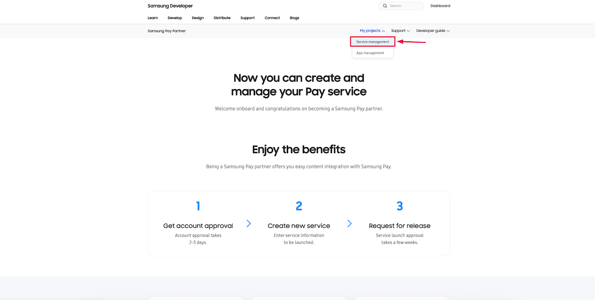

# Samsung Pay

Samsung Pay allows your customers to complete online payments quickly and securely using their Samsung Wallet.

To enable Samsung Pay on **the** web checkout page, you will:

* [Create a Samsung Developer account](samsung-pay.md#create-your-samsung-developer-account)
* [Set up a Samsung Pay service inside the Developer Portal](samsung-pay.md#create-your-samsung-developer-account)
* [Request approval from Samsung](samsung-pay.md#request-service-approval-from-samsung)
* [Share your Service ID with Ottu for final configuration](samsung-pay.md#share-your-service-id-with-ottu)

This guide explains every step clearly and includes screenshots for easy navigation.

## [Create Your Samsung Developer Account](samsung-pay.md#create-your-samsung-developer-account)

1. Visit the Samsung Pay Developer Portal:\
   [**https://pay.samsung.com/developer**](https://pay.samsung.com/developer)
2. Register for a Samsung developer membership.
3. When asked about company registration:
   * **If you’re the first Samsung Pay member:**\
     Select **“I am the first Samsung Pay member of my company.”**
   * **If your company already has a Partner ID:**\
     Select **“My company is already registered”** and enter your Partner ID.
4. Contact your Samsung Pay relationship manager to approve your membership.
5. After approval, log in again:\
   [**https://pay.samsung.com/developer**](https://pay.samsung.com/developer)

## [Create a Samsung Pay Service](samsung-pay.md#create-a-samsung-pay-service)

1.  Navigate to:\
    **My Projects → Service Management**

    \
    &#xNAN;_&#x53;ervice Management section in the Samsung Pay Developer Portal_ 

    <figure><figcaption></figcaption></figure>
2.  Click **Create New Service**.

    \
    &#xNAN;_&#x43;lick "_**Create New Service**_" to begin setup_ 

    <figure><figcaption></figcaption></figure>
3.  Choose **Web Online Payment** as the service type. 

    <figure><figcaption></figcaption></figure>
4.  Fill in the required fields:

    * **Service Name**
    * **Service Country**
    * **Payment Gateway**
    * **CSR File** — upload the file provided by Ottu
    * **Service Domain** — your Ottu installation domain

    \
    &#xNAN;_&#x55;pload the CSR file and enter your service domain_ 

    <figure><figcaption></figcaption></figure>
5. Click **Save and Next**.
6. Leave debugging fields empty → click **Done**.


Your service is now created.


## [Request Service Approval From Samsung](samsung-pay.md#request-service-approval-from-samsung)

1. Return to the **Service Management** page.
2. Find the service you created.
3.  Click **Request** in the Status column.

    \
    &#xNAN;_&#x55;se the Request button to submit your service for review_\
     

    <figure><figcaption></figcaption></figure>

**Message Template for Approval**

I would like to request the registration and activation of the Samsung Pay service having the \[service id] within the Samsung Developer Portal. Please assist in enabling the required service permissions.

**Replace \[service id] with your actual ID.**

## [Share Your Service ID With Ottu](samsung-pay.md#share-your-service-id-with-ottu)

1. Open your **Service Details** page.
2. Copy the **Service ID**.
3.  Share it with the Ottu team. 

    <figure><figcaption></figcaption></figure>

Once provided, Ottu will finalize the configuration.

## [Completion](samsung-pay.md#completion)

After Ottu finishes linking your Service ID, Samsung Pay will be active and ready for use on your online checkout.


Your customers can now enjoy smooth and secure Samsung Pay payments.

