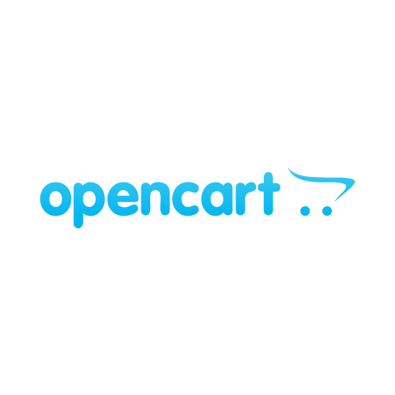
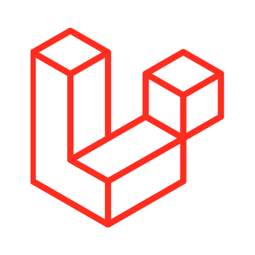
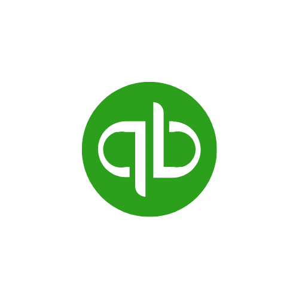
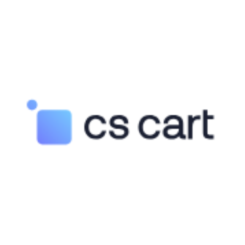
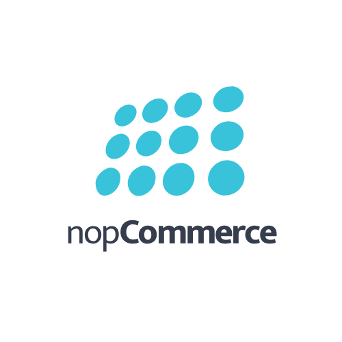

# Plugins

Ottu is the ultimate plugin-based online payment management system (OPMS) designed to revolutionize your business. We provide an extensive array of valuable services aimed at enhancing the capabilities, adaptability, and trustworthiness of merchant businesses. We empower you with enhanced automation, unparalleled flexibility, and unwavering credibility. Unlock the full potential of your business with Ottu and take your success to new heights!

## [Available Plugins](./#available-plugins)

[Payment Request](payment-request.md)

[E-commerce](e-commerce.md)

[Bulk payment request](bulk-payment-request.md)

[Shopify](../integration.md#enhance-your-shopify-store-with-ottu)

Event

Easily incorporate, customize, or remove plugins to suit your business needs.

### [Adding or Removing Plugins](./#adding-or-removing-plugins)

Unlock the full potential of your Ottu experience with seamless plugin management. With just a few clicks, you can add or remove plugins to tailor your dashboard to your exact needs. Let us guide you through the simple process:

* Access the Ottu Dashboard by logging in and launching the **Administration Panel**. Simply click on the three dots in the right corner of the page, and the **Administration Panel** will appear.

<figure><figcaption></figcaption></figure>

* Navigate to the **Plugins Tab**. Click on the `Installed Plugins` section to view your current plugins.

<figure><figcaption></figcaption></figure>

* To add a plugin, click on the Section `Plugins` area. A comprehensive list of available plugins will be displayed, giving you the flexibility to choose the plugins that best suit your requirements.
* If you wish to remove any unwanted plugins, simply locate the `X` mark displayed in the figure below and click on it.

<figure><figcaption></figcaption></figure>

By following these steps, you can easily customize your OPMS and optimize its functionalities for improved performance. Take control of your dashboard today and unleash its full potential with our easy plugin management feature.

## [Ottu Plugins Details](./#ottu-plugins-details)

The below table presents vital information, including plugin names, supported versions, hosted checkout availability, wallet support, and the currently active payment gateways. \
Gain a comprehensive understanding of Ottu's capabilities and offerings to empower your business in the dynamic landscape of online payment processing.

<table data-header-hidden data-full-width="true"><thead><tr><th width="163" align="center">Plugins</th><th align="center">Supported Version</th><th align="center">Hosted Checkout</th><th align="center">Wallet</th><th></th></tr></thead><tbody><tr><td align="center"><mark style="color:orange;"><strong>Plugins</strong></mark></td><td align="center"><mark style="color:orange;"><strong>Supported</strong></mark>  <mark style="color:orange;"><strong>Version</strong></mark></td><td align="center"><mark style="color:orange;"><strong>Hosted</strong></mark>  <mark style="color:orange;"><strong>Checkout</strong></mark></td><td align="center"><mark style="color:orange;"><strong>Wallet</strong></mark>  <mark style="color:orange;"><strong>Support</strong></mark></td><td>      <mark style="color:orange;"><strong>Active</strong></mark>      <mark style="color:orange;"><strong>Payment</strong></mark>                        <mark style="color:orange;"><strong>Gateway</strong></mark></td></tr><tr><td align="center"> </td><td align="center">
<strong>WordPress</strong>  V-5.9

<strong>WooCommerce</strong>

V-6.2
</td><td align="center">✔️</td><td align="center">✔️</td><td><ul><li>MiGS</li><li>FSS</li><li>MPGS</li><li>OmanNet</li><li>Cybersourc</li><li>Benefit</li></ul></td></tr><tr><td align="center">  </td><td align="center">V-2.4+</td><td align="center">✔️</td><td align="center">✔️</td><td><ul><li>MiGS </li><li>FSS </li><li>MPGS</li><li>OmanNet</li><li>Cybersourc</li><li>Paybylink</li></ul></td></tr><tr><td align="center"> </td><td align="center">V-3.0</td><td align="center">✔️</td><td align="center">✔️</td><td><ul><li>MPGS</li><li>Benefit</li></ul></td></tr><tr><td align="center"></td><td align="center">V-5.5.48</td><td align="center">✔️</td><td align="center">N/A</td><td><ul><li>MPGS</li></ul></td></tr><tr><td align="center"> </td><td align="center">N/A</td><td align="center">✔️</td><td align="center">✔️</td><td><ul><li>MPGS</li></ul></td></tr><tr><td align="center"> </td><td align="center">N/A</td><td align="center">N/A</td><td align="center">N/A</td><td><ul><li>Paybylink</li></ul></td></tr><tr><td align="center"></td><td align="center">V-4.13.1 sp 1</td><td align="center">✔️</td><td align="center">N/A</td><td><ul><li>MPGS</li></ul></td></tr><tr><td align="center"></td><td align="center">N/A</td><td align="center">✔️</td><td align="center">N/A</td><td><ul><li>Cybersource</li></ul></td></tr><tr><td align="center"> </td><td align="center">V-15.0</td><td align="center">✔️</td><td align="center">N/A</td><td><ul><li>MPGS</li><li>OmanNet</li><li>Cybersource </li></ul></td></tr><tr><td align="center"></td><td align="center">V-4.20</td><td align="center">✔️</td><td align="center">N/A</td><td><ul><li>MPGS</li></ul></td></tr></tbody></table>
