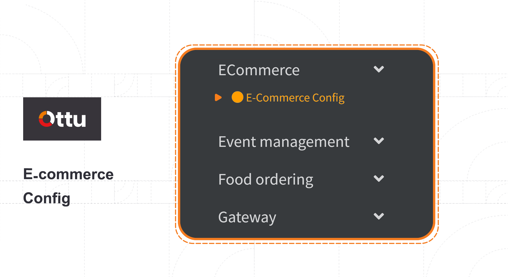
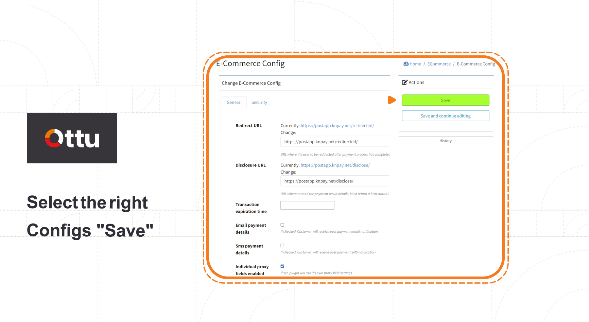
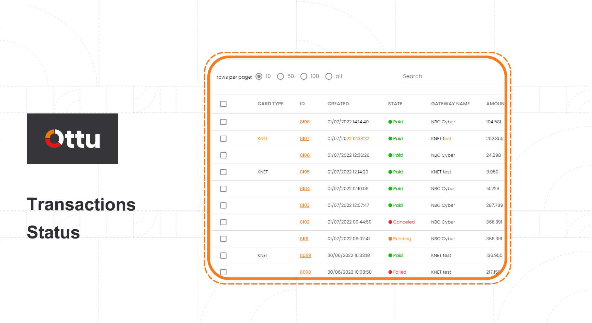

# Plugins

## <mark style="color:blue;"></mark>[Ottu plugins](./#ottu-plugins)

Ottu is a plugins based platform, offering a wide range of useful services to empower merchant business toward more automations, flexibility, and credibility.

## <mark style="color:blue;"></mark>[Available plugins](./#available-plugins)

[Payment request](./#payment-request)

[Bulk payment request](./#bulk-payment-request)

[E-commerce](./#e-commerce)

[Shopify](../integration.md#shopify-plugin)

Catalog

Event

Food ordering

Plugins can be easily added, configured or removed to adopt a merchant business case.

## [Adding / Removing plugins](./#adding-removing-plugins)

Log into Ottu dashboard and launch administration panel by clicking on the three dots located at page right corner, then go to Plugins tab.

.png>)

Go to the plugins tab and click on installed plugin tab.

.png>)

Adding required plugins, by clicking inside “**section plugins**” a list of the available plugins will be shown, where to choose the required plugins.\
Removing the unwanted plugins, could be easily performed by clicking on “**x**” mark as showing on below figure.

 (2).png>)

## [Ottu plugins walkthrough](./#ottu-plugins-walkthrough)

### [Payment request](./#payment-request)

Ottu payment request is:&#x20;

1- Simple to [create](../../#creating-payment-request).&#x20;

2- There are not too many details and information needed to fill out the payment request form.&#x20;

3-Ottu places a high priority on security and confidentiality.

4-Ottu provides different options  of payment gateways.

5-The process will be conducted via a sharable link generated by payment gateways.&#x20;

6-The transaction can be tracked and monitored easily.

### <mark style="color:blue;"></mark>[Bulk payment request](./#bulk-payment-request)

Ottu bulk payment request is a plugin empowers the merchant to send a payment request for group of customers at the same time, with the possibility to resend the request periodically not only for one time.

#### [Create bulk payment request](./#create-bulk-payment-request)

From Ottu dashboard select “**Bulk**” tab then click on “**upload**”.

.png>)

Click on the example file to download the required format.\

#### [Available formats](./#available-formats)

* **Required fields.**
* **All fields.**
* **\[Recurrence] required fields.**
* **\[Recurrence] all fields.**

 (1).png>)

Enter customer details in the list (i.e, CSV) file as shown in the below figure, amount, currency code, language, customer email, and the required mode of  SMS notification as (TRUE to enable SMS notification)

.png>)


**In the recurring file format, start-end dates should be defined.**


.png>)

After creating a CSV file with a list of customers, click the import button, choose a predefined list.

 (1).png>)

Click on the imported file, then check the generated list to avoid errors, if any. In case there are any errors, click on the error report or download the error file. Rectify the error as mentioned and again import the file.&#x20;

.png>)

In the files window, click on the three dots located up the right corner of the files windows. Click on Dispatch button. This will automatically generate payment links and also schedule recurring payments.&#x20;

.png>)

### <mark style="color:blue;"></mark>[E-Commerce](./#e-commerce)

Ottu portal offers the merchant's ecommerce plugin, which empowers merchants business and facilitates the payments against the products, in addition you can create your own ecatalogue via Ottu portal.

#### [Ottu ecommerce key features:](./#ottu-ecommerce-key-features)

1. Tracking all ecommerce business transactions.
2. Create a full payment integration with a number of well known ecommerce suites.
3. Ottu ecatalogue: small ecommerce suite embedded in Ottu dashboard, easy to configure and let the merchants engage with their online business in a timely manner.
4. White-label: merchants will take the advantage of adding their branding to customers in checkout-page, redirection-url.
5. Risk Compliant, settlement directly to a merchant bank account without third-party involvement.
6. Direct Integration, Ottu operational team will fully support the merchants with the plug-ins and guidelines based on their confirmed ecommerce platform.

#### <mark style="color:blue;"></mark>[E-commerce plugin configuration](./#e-commerce-plugin-configuration)

Log into Ottu dashboard and launch administration panel by clicking on the three dots located at page right corner, then go to Ecommerce tab

.png>)

ECommerce plugin > E-commerce config.

#### [Step 3](./#step-3-1)

Select the right configs “save”.

* **Redirect URL:** the page an end user will be redirected to, after payment is done.
* **Disclosure URL:** payment transaction report shows all available status for the transaction.
* **Transaction expiration time:** time of transaction till expired.
* **Email payment details:** merchants opt this option in case he needs more details on the current transaction(s).
* SMS **payment details:** merchants opt for this option in case he requires transaction(s) details via SMS.
* **Individual proxy fields enabled:** only used when merchants have proxy setup.&#x20;

#### <mark style="color:blue;"></mark>[Ottu ecommerce transactions](./#ottu-ecommerce-transactions)

Merchant can easily track all preceding transactions:

* Total generated.
* Total received.
* Net balance.

.png>)

.png>)


The following figure: shows details about each transaction(s), as well as the status of each one.


| _<mark style="color:blue;">**State**</mark>_ | _<mark style="color:blue;">**Description**</mark>_ |
| -------------------------------------------- | -------------------------------------------------- |
| Paid                                         | Transaction done.                                  |
| Canceled                                     | Transaction terminated.                            |
| Pending                                      | Transaction proceeding.                            |
| Failed                                       | Transaction not completed.                         |
