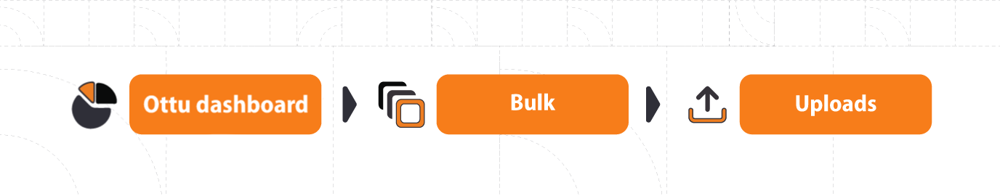

# Bulk payment request

## [Introduction](https://app.gitbook.com/o/QvpaILbKwb9WBfHGe5bZ/s/iUKrMb9zLt5ZzGPUYDsK/\~/changes/616/user-guide/plugins/bulk-payment-request#introduction)

Enhance your experience with Ottu's innovative bulk payment request plugin. Now, you can effortlessly send [payment requests](bulk-payment-request.md#payment-request) to a group of customers simultaneously, with the added convenience of recurring requests that gives you the possibility to resend the request periodically and not just once. No more manual effort! No more limitations!

## [**Create bulk payment request**](bulk-payment-request.md#create-bulk-payment-request)

Creating a bulk payment request is a breeze. Just follow these simple steps:

1. From Ottu's user-friendly Dashboard, navigate to the **Bulk Tab**.
2. Click on `Upload` to initiate the process.

<figure><figcaption></figcaption></figure>

To ensure accuracy, we provide sample files that you can download (i.e., the example file). They contain the required format for your convenience. We offer various formats to choose from.

**Available Formats:**

* Required fields.
* All fields.
* \[Recurrence] required fields.
* \[Recurrence] all fields.

<figure><figcaption></figcaption></figure>

Once you've selected the appropriate format, it's time to enter customer details in the provided list `CSV` file. The figure below serves as a helpful reference for the required information, including the amount, currency code, language, customer email, and SMS notification preferences (enable SMS notification by setting it to TRUE).

<figure><figcaption></figcaption></figure>

If you are using the recurring file format, make sure to specify the start and end dates.

<figure><figcaption></figcaption></figure>

**Importing and Verifying the Customer List:**

Once you have created a `CSV`file with the list of customers, click the `IMPORT` button and choose a predefined list.

<figure><figcaption></figcaption></figure>

To ensure accuracy, click on the imported file and carefully review the generated list to ensure there are no errors. In case any errors are detected, don't worry. Ottu provides an error report and allows you to download the error file for easy rectification. Simply make the necessary corrections and import the file again.

<figure><figcaption></figcaption></figure>

**Dispatching Payment Links:**

Once you're satisfied with your file; from the files window, click on the three dots in the top-right corner, and select the Dispatch button. This action will automatically generate payment links and schedule recurring payments, simplifying your workflow.

<figure><figcaption></figcaption></figure>

Experience the ease and efficiency of Ottu's [Bulk Payment Request](bulk-payment-request.md#bulk-payment-request) plugin today. Streamline the payment process, save time, and enhance your customer experience. Start maximizing your business potential now.
