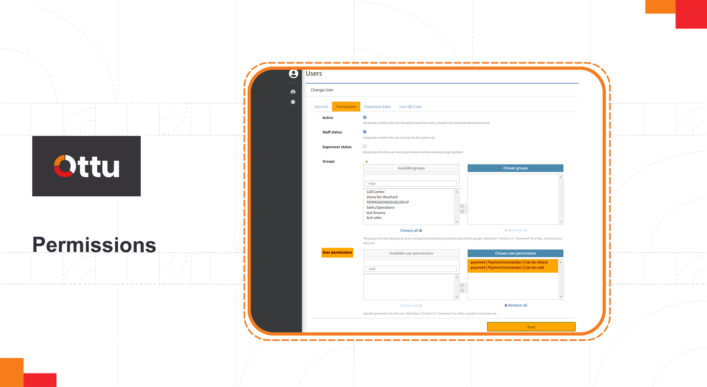
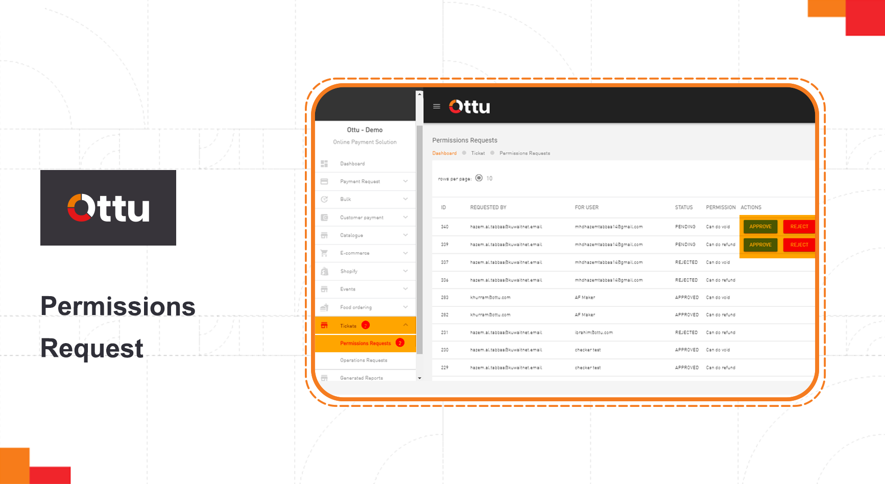

# Permission approval process

To perform [operation requests](two-step-refund-and-void-authorization.md), a Staff user must obtain approval for **do refund/void permissions**. Conversely, a Super user is not subject to this permission flow and can perform operation requests without requiring approval for **do refund/void permissions**.


This feature will be activated by adding permissions approval plugin\
Ottu dashboard> administration panel > Plugins > installed plugin



* Authorization to approve or reject **do refund/void permission** requests through the [Permissions Request table](permission-approval-process.md#permissions-requests-table) should be restricted to a single user.
* After passing the expiration time, by default 48 hrs and could be defined from backend, the state of the request should be turned to canceled.


### [**Permission approval process walkthrough**](permission-approval-process.md#permission-approval-process-walkthrough)

Ottu dashboard> administration panel> user> users.

<figure><figcaption></figcaption></figure>

Choose the targeted user, here is “**Example**” user.

<figure><figcaption></figcaption></figure>

In the permission tab, scroll down to user permissions, from **Available user permissions window** select:\
— **payment | Payment transaction | Can do refund**\
— **payment | Payment transaction | Can do void**\
Move them to **Chosen user permissions,** click **save**

<figure><figcaption></figcaption></figure>

#### [Permissions requests table](permission-approval-process.md#permissions-requests-table)

A permission request will be sent to the authorized user, listed in the **Permissions Request** table under **Tickets** tab in the Ottu dashboard.\
Through the permission request table, the authorized user can perform approve/reject, as shown below.\

<figure><figcaption></figcaption></figure>

