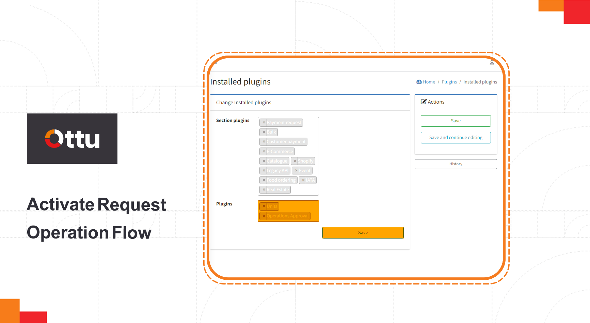
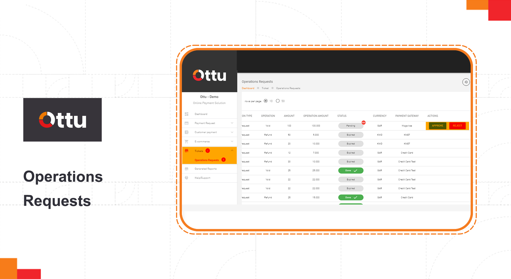

# Two-Step Refund & Void Authorization

Ottu introduces the Two-Step Refund & Void Authorization feature. With this feature, merchants gain the power to grant permissions to multiple users for conducting refund or void operations. Once authorized, users can seamlessly carry out these approved operations either through the user-friendly dashboard or via the API. Empower your team by assigning specific permissions, ensuring only authorized individuals can initiate these critical operations.

## [Definition of Maker and Checker](https://app.gitbook.com/s/iUKrMb9zLt5ZzGPUYDsK/\~/changes/407/user-guide/plugins/features/two-step-refund-and-void-authorization#definition-of-maker-and-checker)

**Maker:** The user who has the required permissions (i.e., Can do refund / Can do void) to submit a request to check for refund/void operation. See the [Refund & Void Access Control](refund-and-void-access-control.md) for more information.\
**Checker:** The user who has the authority to approve or reject a submitted request.


A merchant may have multiple makers, but there is only one checker.\
The checker has the authority to proceed directly with the refund or void operations.


## [Key Features of Two-Step Refund & Void Authorization](https://app.gitbook.com/s/iUKrMb9zLt5ZzGPUYDsK/\~/changes/407/user-guide/plugins/features/two-step-refund-and-void-authorization#key-features-of-two-step-refund-and-void-authorization)

* To activate the Two-Step Refund & Void Authorization feature, you need to add the Operations Approval Plugin. From the Ottu Dashboard > Access the Administration Panel > Navigate to the Plugins section. > Locate the Installed Plugins.

<figure><figcaption></figcaption></figure>

Then, add the Operation Approval to the Plugins window.&#x20;

<figure><figcaption></figcaption></figure>

* Only one authorized user can assign a checker user. \
  **To assign a checker:** From the Ottu Dashboard > locate the Administration Panel > then navigate to the Operations Approval Plugin > and select Operations Approval Plugin Config.

<figure><figcaption></figcaption></figure>

* A void, or a refund operation request, will remain `Pending` until the checker makes his decision of `approval` or `rejection`. Then the operation request will transit to `Rejected` state or `Done` state. Within the `Approved` state, any user with permission could trigger an attempt by `Retry` button until it is succeeded or turns to `Expired` state once the expiration time gets passed.
* Any operation request in the `Pending` state can be canceled by all users except the checker from the [operation request table](two-step-refund-and-void-authorization.md#operation-request-table).

The operation request table is automatically synced and updated.


[Operation request table](two-step-refund-and-void-authorization.md#operation-request-table) should be **auto-synced updated**.


* Another operation request can't be submitted if there is a `Pending` operation request for the same transaction.\
  The below message should be displayed\
  **(Requested {Operation} is pending for approval).**
* If the checker somehow approves a `Canceled` request, an error message will be returned indicating that the request has been `Canceled`
* Once the checker approves the request, the operation will be executed automatically, and the state will transition to the `Done` state. If the execution fails, the state will change to `Manual Action Required` state, and the maker will be **notified** that manual action is required.
* If the state transitioned to `Manual Action Required`, and no changes are made within the specified expiration time, the transaction state will transition to the `Expired` state.


The default time will be 48 hrs, defined from backend.


* Once the operation request has transitioned to the `Done` state, a refund or void request is not allowed for the same transaction unless there are remaining funds. In that case, only a refund request can be processed.
* The user who is authorized to assign a checker can add whitelisted users. This can be done through the Administration Panel > by navigating to the Operations Approval Plugin > and selecting Operations Approval Plugin Config.
* Upon completion of the process, an email notification will be triggered.
  * If the transaction transitioned to the `Manual Action Required` state, the maker will be notified.
  * If the refund or void operation transitioned to the `Done` state, an email will be sent to the customer. The maker can also receive this email by enabling the required configuration—to enable this configuration: go to the Ottu Dashboard > Administration Panel > Unit > Unit Configs, then scroll down to the BCC initiator checkbox and check it.
  * If the refund or void operation transitioned to the `Rejected` state, an email will only be sent to the maker.

## [**Operation request table**](two-step-refund-and-void-authorization.md#operation-request-table)

Seamlessly manage and track this feature, with the option to `approve` or `reject` them for the checker role and `cancel` them for the maker role. Get access to comprehensive transaction histories, all in one central location. Discover our advanced Operations Request Table under the **Tickets** Tab. To make it easier to find specific requests, we have implemented an intelligent filter based on the following criteria: state, operations, date, payment gateway (pg), and currency.

\

<figure><figcaption></figcaption></figure>

| Header           | Description                                                                                                   |
| ---------------- | ------------------------------------------------------------------------------------------------------------- |
| ID               | The identification number of the operation request.                                                           |
| DATE             | The date when the request was created.                                                                        |
| REQUESTED BY     | The person who initiated the request.                                                                         |
| FOR TRANSACTION  | The original transaction ID. By clicking on this field, a popup will display the payment transaction details. |
| OPERATION        | Indicates whether the operation is a refund or a void.                                                        |
| AMOUNT           | The total amount of the payment transaction.                                                                  |
| OPERATION AMOUNT | The specific amount requested for the operation.                                                              |
| STATUS           | The current state of the operation request (Pending, Approved, Rejected, Manual Action Required, or Expired). |
| CURRENCY         | The currency of the payment transaction.                                                                      |
| PAYMENT GATEWAY  | The payment gateway involved in the transaction.                                                              |
| ACTION           | 
For checker: Approve, Reject, or Retry. For maker: Cancel or Retry.
                           |

##
